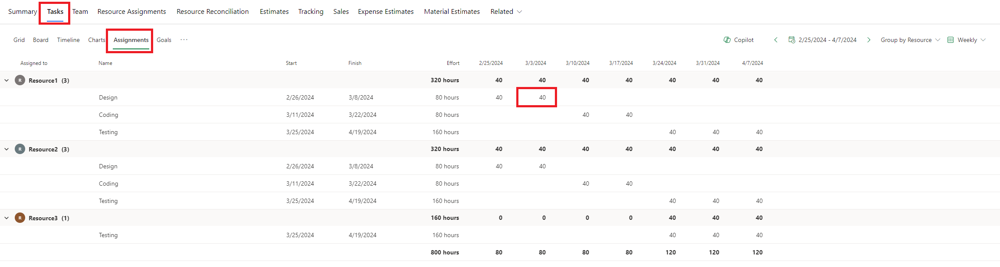
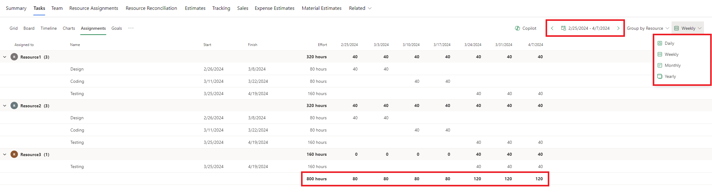

# Create resource assignments

_**Applies To:** Project Operations Integrated with ERP, Project Operations Core._

A resource assignment is the direct association of a project team member to a leaf node task. This article provides information about the different ways to assign resources.

## Create a generic team member through task assignment

When you create a generic team member through task assignment, you create a placeholder or generic resource. This generic resource describes the characteristics of the named resource that you ultimately want to work on the tasks. You then generate a requirement, or you submit a request by using the requirement that is used to search for and book the named resource.

1. On the Schedule grid for a task, select the Resource icon in the **Resource** cell.
1. Type a name to serve as the placeholder resource's name. For example, Program Manager.
1. Select **Create**, and in the **Quick Create Project Team Member** field, set the role for the generic resource.
1. Assign tasks as needed to this placeholder resource by selecting the resource on the **Resource Selector** for the task. The resources listed under **Team Members**.
1. When you're finished assigning the generic resource, on the **Team** tab, select the generic resource, and then select **Generate Requirement** to create a resource requirement for the generic resource.
1. Select **Book** for the generic resource and then use the Schedule board to find and book a real resource. You can also submit the requirement for fulfillment by a Resource Manager.
1. When the generic resource is fully fulfilled with a named resource, the generic resource is removed from the team. (Partial resource requirement fulfillment doesn't result in a resource assignment.) The task assignments for the generic resource are assigned to the named resource that fulfilled the generic resource's resource requirement.

## Assign a named resource from the list of all bookable resources

You can use the search box in the **Resource Picker** to search all active bookable resources and assign them to any leaf node task. Resources assigned this way are added to the team without any bookings. This is similar to adding a team member and selecting **None** as the allocation method. The resource is displayed on the **Team**, **Resource Assignment**, and **Reconciliation** tabs as resources with only assignments and a booking deficit. Book them if you want to use their availability.

1. From the task grid, board, or timeline, navigate to the **Assigned To** cell.
1. In the search box, start typing a name. The search results for the name are displayed in the **Resource Selector** under **Other Resources**.
1. Select the resource that you want to assign to the task or select the name of the resource under **Other Team Resources**.

## Editing resource assignment contours

By default, when resources are assigned to a task in the schedule, their effort is linearly distributed to each resource, based upon that resource's working hours and the project's schedule mode. A project manager can use the resource assignment grid to refine the effort estimates of each resource assigned to one or many tasks across the different time scales. This feature helps project managers produce more accurate cost and sales estimates driven by the resource assignment contours that are generated when a resource is assigned to a task. Additionally, project managers can more easily reflect the resource demand required to build the demand in a resource requirement.

### Navigation

To access the contour editing grid, the project manager first selects the **Tasks** tab on the project main page and then selects the **Assignments** tab.

The grid supports two methods for grouping: **group by resource** and **group by task**. Unlike in the grid view, columns aren't configurable. The only visible columns are **Assigned To**, **Task Name**, **Assignment Start**, **Assignment Finish**, and **Assignment Effort**.

The contour editing grid has been enhanced to include the ability to group contours by week, month, and year. It was also added **previous** and **next** controls to support quickly changing periods in the current view. Lastly, a grand total row was added.

When the grid is initially rendered, it starts at the earliest assignment contour. If your schedule doesn't contain any assignments that have effort, the grid is blank and won't render anything. The minimum value of a resource contour is zero, and the maximum value permitted is 9,999,999.

If you want to view your contours and different time scales, the read-only resource assignment grid and resource reconciliation grid are also available.

### Resource calendars

The ability to edit a contour for a specific day is governed by the resource's working days, as reflected in their calendar. If a cell is disabled for a given resource, that resource doesn't have working days during that period.

A resource's contours can extend beyond the assigned task's current start and end dates. If a contour is updated so that it's after the latest end date of a task or the earliest start date of a task, the task's end date or start date is changed as appropriate. However, if a contour is updated so that it's earlier than the start date of a task linked to a predecessor, the update fails because the assignment triggers the task to start before its predecessor is completed, and that behavior isn't currently supported.

### Coauthoring

Changes to the resource assignment grid are automatically reflected in any associated views, including the chart, timeline, board, and grid views. If multiple users are reviewing the project at the same time, any changes that one user makes are reflected in the grid. Conversely, any changes that are made in the resource assignment grid are shown to all other users who are viewing the project in the same session.

## Unassigned assignment

In Project Operations, an unassigned assignment is an assignment that is assigned to a NULL team member and a NULL resource. Unassigned assignments can occur in a couple of scenarios:

1. If a task is created but not assigned to any team member, an unassigned assignment is always created.
2. If all assignees on a task are removed, an unassigned assignment is re-created for that task.

The contour expresses hours of unassigned effort based on the project's calendar.

[!INCLUDE[footer-include](../includes/footer-banner.md)]
