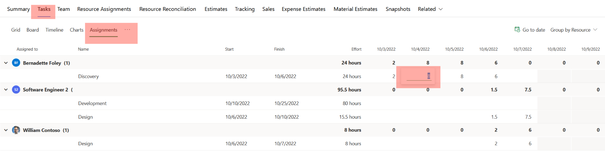

# Create resource assignments

_**Applies To:** Project Operations for resource/non-stocked based scenarios, Lite deployment - deal to proforma invoicing_

A resource assignment is the direct association of a project team member to a leaf node task. This article provides information about the different ways to assign resources.

## Create a generic team member through task assignment

When you create a generic team member through task assignment, you create a placeholder or generic resource. This generic resource describes the characteristics of the named resource you ultimately want to work on the tasks. You then generate a requirement, or submit a request using the requirement, that is used to search for and book the named resource.

1. On the Schedule grid for a task, select the Resource icon in the **Resource** cell.
2. Type a name to serve as the placeholder resource’s name. For example, Program Manager.
3. Select **Create**, and in the **Quick Create Project Team Member** field, set the role for the generic resource.
4. Assign tasks as needed to this placeholder resource by selecting the resource on the **Resource Selector** for the task. The resources listed under **Team Members**.
5. When you’re finished assigning the generic resource, on the **Team** tab, select the generic resource, and then select **Generate Requirement** to create a resource requirement for the generic resource.
6. Select **Book** for the generic resource and then use the Schedule board to find and book a real resource. You can also submit the requirement for fulfillment by a resource manager.
7. When the generic resource is fully fulfilled (partial resource requirement fulfillment will not result in a resource assignment) with a named resource, the generic resource is removed from the team. The task assignments for the generic resource are assigned to the named resource that fulfilled the generic resource’s resource requirement.

## Assign a named resource from the list of all bookable resources

You can use the search box in the **Resource Picker** to search all active bookable resources and assign them to any leaf node task. Resources assigned this way are added to the team without any bookings. This is similar to adding a team member and selecting **None** as the allocation method. The resource is displayed on the **Team**, **Resource Assignment**, and **Reconciliation** tabs as resources with only assignments and a booking deficit. Book them if you want to use their availability.

1. From the task grid, board, or timeline, navigate to the **Assigned To** cell.
2. In the search box, start typing a name. The search results for the name are displayed in the **Resource Selector** under **Other Resources**.
3. Select the resource that you want to assign to the task or select the name of the resource under **Other Team Resources**.

## Editing Resource Assignment Contours
By default, when resources are assigned to a task in the schedule, their effort is linearly distributed between each resource based upon their respective working hours and the project’s schedule mode. The resource assignment grid provides a project manager with the ability to refine the effort estimates of each individual resource assigned to one or many tasks across the varying timescales.
This feature enables project managers to produce more accuracy cost and sales estimates which are driven by the resource assignment contours generated when a resource is assigned to a task. Additionally, project managers can more easily reflect the resource demand needed to build the demand in a resource requirement.

### Navigation
To access the contour editing grid, the project manager will first navigate to the **Tasks** Tab in the **Project Main Form**, then select the **Assignments** tab. 

 
The grid supports two methods of grouping, **group by resource** and **group by task**.  Unlike the Grid view, columns are not configurable, the only visible columns are **Assigned To, Task Name, Assignment Start, Assignment Finish and Assignment Effort**.
When the grid is initiated rendered, it will start at the earliest assignment contour.  Please note, if your schedule does not contain any assignments with effort, the grid will be blank and will not render anything.  

 
To view your contours and varying time scales, the read only resource assignment grid and resource reconciliation grids are also available.

### Resource Calendars
The ability to edit a contour for a specific day is governed by the resource’s working days reflected in their calendar. If a cell is disabled for a given resource, it is because that resource does not have working days during that period. 
A resource’s contours can extend beyond the assigned task’s current start and finish dates. When an update is made to a contour that is greater than the latest finish date of a task or the earliest start date of a task, the task’s finish date or start date will change respectively.  However, assignments contours updated before the start date of a task linked to a predecessor will fail because the assignment will trigger the task to start before its predecessor finishes which currently not supported.

### Co-Authoring
When changes are made to the resource assignment grid. They will be automatically reflected in any associated views, including the chart, timeline, board or grid views. If multiple users are reviewing the project at the same time, any changes made by a single user will also be reflected in the grid and conversely, any changes made in the resource assignment grid will be displayed to any other users viewing the project in the same session.

[!INCLUDE[footer-include](../includes/footer-banner.md)]
