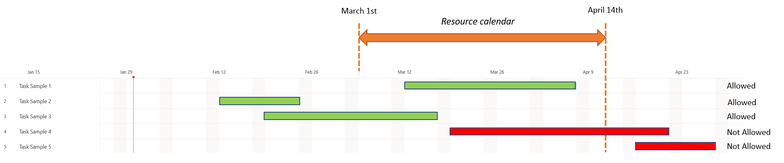

--- 

title: Create a work breakdown structure 
description: This article explains how to create a work breakdown structure (WBS) inclusive of the basic controls in the new scheduling interface.
author:  abriccetti
ms.date: 11/27/2023  
ms.topic: how-to
ms.custom: bap-template
ms.reviewer: johnmichalak
ms.author: abriccetti
--- 

# Create a work breakdown structure (WBS)

A project schedule communicates what work must be completed, which resources do the work, and the timeframe in which the work must be completed. The schedule reflects all the work associated with delivering the project on time. In Dynamics 365 Project Operations, you create a project schedule by:

- Breaking down the work into manageable tasks.
- Estimating the time that is required to do each task.
- Setting task dependencies.
- Setting task durations.
- Estimating the generic resources that complete the tasks. 

The project schedule is created on the **Schedule** tab on the **Project** page.

## Tasks

The first step in creating a project schedule is to break down the work into manageable portions. The schedule in Project Operations supports the following features:

- Summary or container tasks
- Leaf node tasks

### Summary tasks

Summary tasks can store other summary tasks or leaf node tasks. They have no work effort or cost of their own. Instead, their work effort and cost are a rollup of the work effort and cost of their container tasks. The start date of the summary task is the start date of the container tasks, and the end date is the end date of the container tasks. The name of a summary task can be edited, but scheduling properties, including effort, dates, and duration, can't be edited. If you delete a summary task, you also delete all its container tasks.

### Leaf node tasks

Leaf node tasks represent the most granular work on the project. They have an estimated effort, resources, planned start and end dates, and a duration.

## Create a task hierarchy

### Add a task

Complete the following steps to add one or more tasks.

1. Go to **Projects** and select and open the project record for which you want to create a schedule. 
2. Select the **Tasks** tab. 
3. Select **Add new task**, enter a name for the task, and then press Enter.
4. Enter another task name and press Enter again until you have a full list of tasks.

### Manage hierarchy of a task

When a task is indented, it becomes a child of the task that is directly above it. The schedule ID of the task is then recalculated so that it's based on the schedule ID of its new parent and follows the outline numbering scheme. The parent task is now a summary task. Therefore, it becomes a rollup of its child tasks. When a task is promoted, it's no longer a child of the task that was its parent. The schedule ID is then recalculated so that it reflects the task's updated depth and position in the hierarchy. The effort, cost, and dates of the previous parent task are recalculated so that they don't include this task.

Complete the following steps to indent or promote a task.

1. On the **Project** page, on the **Tasks** tab, under **Summary tasks**, select the three vertical dots by the task name, and then select **Make subtask**. 
2. Select the task to indent or promote. To select more than one task, select a task, select and hold the **Ctrl** key, and then select more tasks.
3. Select **Indent** or **Promote subtask** to move tasks under or out from under summary tasks.

### Move tasks up and down

Tasks can be moved to any level in the work breakdown structure in one of two ways:

- Select one or more tasks, and drag them to the desired location.
- Select one or more tasks, right-click and select **Cut**, select the destination cell in the schedule, and then right-click and select **Paste**.

## Task attributes

A task's name describes the work that must be completed. In Project Operations, the attributes associated with a task describe the schedule of the task and its staffing requirements.

## Schedule attributes

The **Effort**, **Start date**, **End date**, and **Duration** attributes define the schedule for the task.

The following table shows more schedule attributes.

| Final display name | Final description |
| --- | --- |
| Effort Completed (Hours) | Completed work for the task in hours. |
| Duration | Displays the duration in days for the task. |
| Total Effort | Total work for the task in hours. |
| Finish | Finish date and time. |
| % Complete | The percentage of the task that is complete. |
| Project Bucket | The task board can be grouped by bucket. Therefore, each bucket has its own column. |
| Effort Remaining (Hours) | The remaining work for the task in hours. |
| Start | Start date and time. |
| Name | The name of the task. |
| ID | The ID of the task in the work breakdown structure. |

As an administrator, you can define custom fields on the task entity. However, the fields can't be displayed on the schedule grid. To see your custom fields, add them to the **Project Task** details page.

## Staffing attributes

Staffing attributes are accessed through the **Resources** field in the schedule. You can either search for an existing resource, or select **Create**, and in the **Quick Create** pane, add a project team member as a new resource. When you search for a resource using the resource picker in the task grid, board view, or Gantt, the search returns either existing project team members or active bookable resources.

The **Role**, **Resourcing Unit**, and **Position Name** fields are used to describe the staffing requirements for the task. These staffing attributes, together with the task schedule, are used to find available resources to do this task.

- **Role** – Specify the type of resource that is required to do the task.
- **Resourcing unit** – Specify the unit that resources for the task should be assigned from. This attribute affects the cost and sales estimate for the task if the cost and bill rate for the resource are set based on resourcing units.
- **Position name** – Enter a name for the generic resource that serves as a placeholder for the resource that ultimately completes the work.

The **Resources** field holds the position name of the generic resource or named resource when one is found.

The **Category** field holds the values that indicate a broader type of work that the task can be grouped into. This field doesn't affect scheduling or staffing. Instead, the field is used only for reporting.

## Task dependencies

You can use the schedule in Project Operations to create predecessor relationships between tasks. The **Predecessor** field uses one or more values to indicate the tasks that a task depends on. When predecessor values are assigned to a task, the task can start only after all of the predecessor tasks have been completed. Because of the dependency, the planned start date of the task is reset to the date when the predecessor tasks are completed.

The task mode has no effect on updates that are made to the start and end dates of predecessor/dependent tasks.

## Task labels

You can apply labels on tasks and use this capability to quickly see what they have in common, to sort or filter. To learn more, see [Use labels to sort tasks in Microsoft Project for the web.](https://support.microsoft.com/office/use-labels-to-sort-tasks-in-microsoft-project-for-the-web-32dfc732-7bbc-48f0-9d17-672ddcd1905c)

## Understanding the impacts of duration, resource calendars, and project calendars on tasks

A task's duration is defined as the number of working hours between the start time of the start date and end time of the finish date of the task. By default, Project for the Web defines duration units of measure as follows.

| Measure of duration | Quantity |
|---------------------|----------|
| Hours per day | 8 |
| Hours per week | 40 |
| Days per month | 20 |

These duration conversions can be edited at the project level to support users in regions where work hours are defined differently than these default durations. Zero isn't a valid quantity for hours or days.

> [!NOTE]
> These durations (whether default or customized) are used to convert to hours only when effort on a task is defined.

Unassigned tasks are scheduled by using the project's calendar. However, upon initial resource assignment, the scheduling of a task is updated so that it respects the resource's calendar. Subsequent changes to a task that has an assignment is governed by the [scheduling mode](scheduling-modes.md) of the project. To learn more about the influence of calendars on tasks, see [Resource Calendars in Project for the web](https://techcommunity.microsoft.com/t5/project-blog/resource-calendars-in-project-for-the-web/ba-p/3269686) and [Task Start Times & Your Projects!](https://techcommunity.microsoft.com/t5/project-blog/task-start-times-amp-your-projects/ba-p/3269665)

> [!NOTE]
> Project for the Web does not respect business closures that are defined in the resource or project calendars.

It's important to note that a resource assignment can be created only when the end of the resource's calendar rule overlaps the task's end date. Therefore, if your calendar rule ends before the end of the task, the assignment isn't scheduled, because there isn't enough time in the schedule for the resource to perform the task.

For example, a resource calendar begins on Wednesday March 1, 2023, but ends on Friday, April 14, 2023. In the project where this resource is added, tasks that are assigned to this resource can't end later than April 14, 2023. Otherwise, they aren't scheduled, because they exceed the last day of the resource's calendar.

The screenshot above shows, in green color, which tasks can be scheduled because they end before the last day of the resource availability, and in red color, which ones aren't allowed.

## Accessibility and keyboard shortcuts

The **Schedule** grid is fully accessible and can be used with screen readers such as Narrator, JAWS, or NVDA. You can move through the grid area by using arrow keys (as in Microsoft Excel), you can use the Tab key to advance through the interactive user interface elements, and you can use the Down arrow key, the Enter key, or the Spacebar to select and open the drop-down menus.

## Planning a project in sprints

You can also use sprints and plan your project based on agile project management. To learn more, see [Plan a project in sprints in Project for the web.](https://support.microsoft.com/office/plan-a-project-in-sprints-in-project-for-the-web-7536fbef-0ece-47bf-beae-6a8ac2c69955)

[!INCLUDE[footer-include](../includes/footer-banner.md)]
