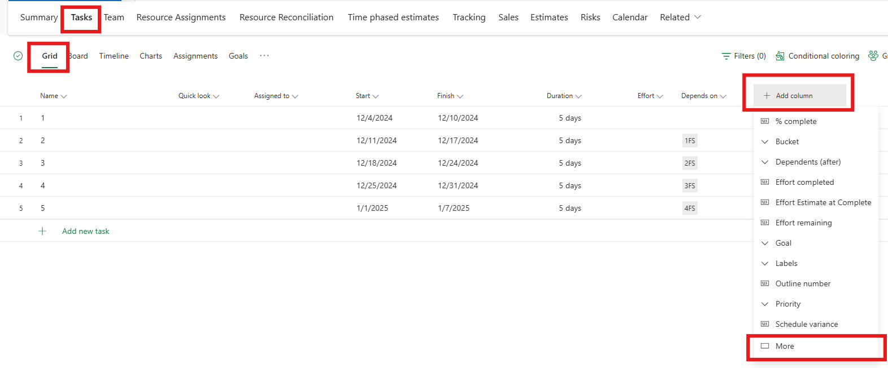
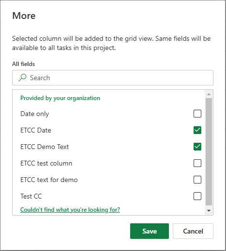
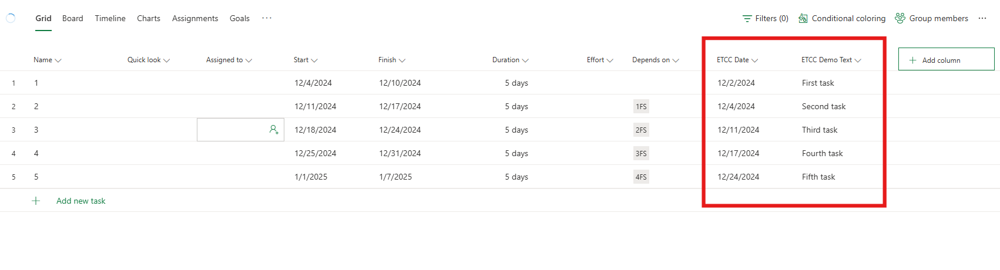

# Add custom columns to the grid view

_**Applies To:** Project Operations for resource/non-stocked based scenarios, Lite deployment - deal to proforma invoicing_

A default set of columns that is available in Microsoft Project for the web provides the relevant data for task scheduling. In addition, users can add columns from the Project Tasks table in Dataverse to the grid view on the **Tasks** tab of a project.

## Add a new column

Before you can add a new column to the grid view, you must add a custom column to the Project Tasks table in Dataverse. Default columns from the Project Tasks table can't be selected for display, even if the columns aren't available for display in the grid view. Learn how to add a column to a table in [How to create and edit columns](/power-apps/maker/data-platform/create-edit-fields).

To add a new column to the grid view, follow these steps.

1. After the custom column is created, select the **Tasks** tab of a project, open the grid view, select **Add column**, and then select **More** on the menu.

    

1. In the **More** dialog box, select one or more columns to add to the grid view, and then select **Save**.

    

The custom columns are added to the grid view, and any data in them is shown.

## Edit data in a custom column

You can modify custom columns directly in the task grid. Additionally, data can be updated through Dataverse, by using an API, or via the Power Apps interface. Custom columns can also be added to the **Project Task** page in Dynamics 365 apps. There, the data can also be edited.

## Custom column limitations

The following types of columns can be added as custom columns in the grid view:

- **Text**
- **Number**
- **Date** – The columns must be date-only columns, not date, and time columns.
- **Choice** – The columns must be choice columns, not yes/no columns.

> [!IMPORTANT]
> - A maximum of 10 custom columns can be added to a single project.
> 
> - Only 2-25 options in a **Choice** type are supported. Although a custom column of type **Choice** with more than 25 options can be created on the Project Tasks table in Dataverse, it isn't supported for display on the task grid.

[!INCLUDE[footer-include](../includes/footer-banner.md)]
