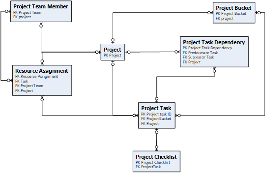

---
# required metadata
title: External scheduling
description: This article provides information about external scheduling. 
author: ruhercul
ms.date: 10/31/2022
ms.topic: article
ms.reviewer: johnmichalak
ms.author: ruhercul
---

# External scheduling

_**Applies To:** Project Operations for resource/non-stocked based scenarios, Lite deployment - deal to proforma invoicing_

The external scheduling mode lets you natively create, update, and delete data in tables that are related to work breakdown structures (WBSs), but without the current limits that are enforced by Microsoft Project for the Web. It also provides limited validation. This mode should be used only by the following customers:

- Customers who have the tools that are required to define a WBS outside the scheduling logic that is provided by Project Operations
- Customers who have to manage schedule hierarchy, dependencies, or task duration

> [!IMPORTANT]
> Data that isn't correctly entered in the WBS–related tables might not be rendered in the resource reconciliation grid, estimates grid, tracking grid, or resource assignment grid.

## Configuration

This feature is enabled by default. However, on the out-of-box main page for projects, the related column isn't visible by default. To enable the column, in the Maker portal, open the main page for the project entity, select the **Scheduling Engine** column, and then change the column to **Visible by Default**. If you don't use the out-of-box project main page, edit your existing page, and add the **Scheduling Engine** column to it.

## Settings

To use the external scheduling mode, you must first create a new project and select the **Externally Scheduled** scheduling engine in the drop-down list on the project main page. After this mode has been set up for a project, it can't be changed.

## Viewing the WBS

If a project is externally scheduled, access to Project for the Web is restricted for that project. To view the WBS, you must go to the tracking grid, where the full WBS is shown.

## Creating and editing the WBS

If external scheduling is enabled for a project, you must define the data for all WBS–related tables, including tasks, team members, resource assignments, and dependencies.

The following illustration shows the data model for project planning.

## Functional limitations

The following operations aren't permitted on externally scheduled projects.

### Copilot functionality
- Copilot functionality to create tasks, risks and issues and generate status reports is not available on Externally scheduled projects. 

### Project planning

- **Copy project** – This operation isn't supported on externally scheduled projects.
- **Move project** – Changes to the start date of a project won't move the start of tasks or resource assignments in the WBS.
- **Updating the Project Manager** – Changes to the project manager on the project main page won't automatically create a new project team member until the project has been converted.
- **Updating the project's work hour template** – Changes to the project's work hour template won't recalculate the project's schedule.
- **Resource Assignment Contours** – The creation of resource assignments won't automatically update the **mdyn\_PlannedWork** column. This column is used to store contours for resource assignment effort. If you show time-phased effort in the resource assignment grid or the resource reconciliation grid, you must define valid resource assignment contours. These contours must be correctly formatted so that they trigger the calculation of both cost contours and sales price contours. We recommend that you create a test project that is scheduled by Project for the Web, and then review the associated data to confirm the requirements and formatting.

### Resource management

- **Generic resource fulfillment** – Generic resource fulfillment isn't supported for externally scheduled projects. Attempts to fulfill active open requirements will create new project team members, but it won't delete the generic team member or replace the generic team member on any existing resource assignments.
- **Delete Team Member** – Deletion of a team member won't automatically delete resource assignments.
- **Experiences on the Resouce reconciliation grid** – Resource reconciliation grid that shows discrepancies between bookings and assignments will have limited functionality with the operations supported.

### Quoting and contracting

- **Importing Quote Line and Contract Line details** – When quote or contract line details are imported from a project, the application has been tested to support a maximum of only 500 tasks in the WBS, based on a limit of 20 assignments per task.

### Actuals and invoicing

- Although there are no changes to existing validations between the WBS and financial transactions, it's important that you conform to the out-of-box data model, to ensure that all downstream transactions run as expected.
