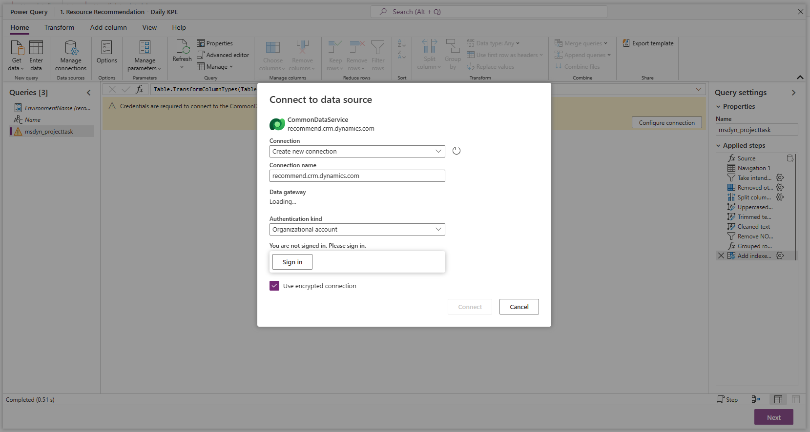
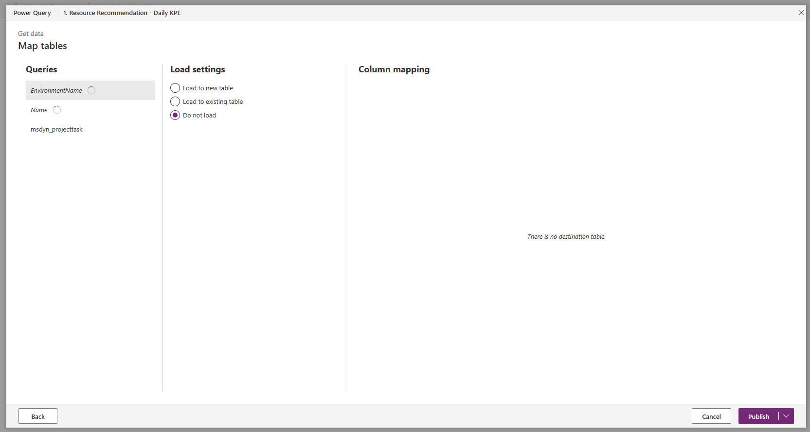
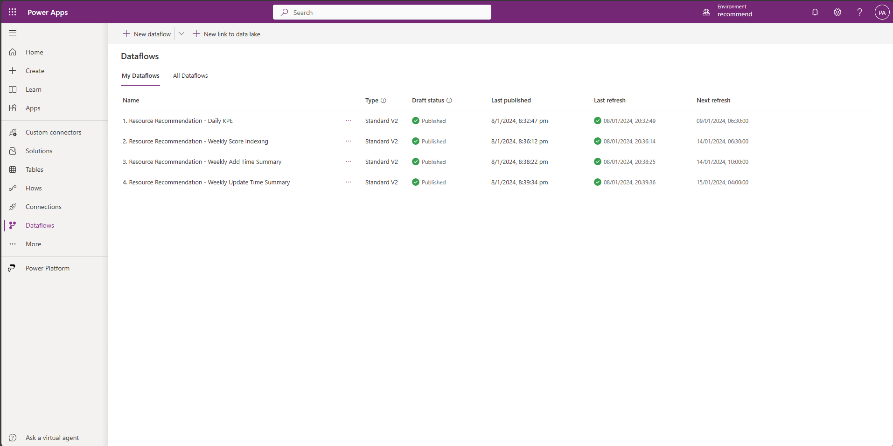

---
# required metadata

title: Enable resource recommendations for a project team member
description: This article provides information about steps to be completed in order to use the resource recommendations feature for the first time.
author: mohitmenon
ms.date: 1/10/2024
ms.topic: article
ms.reviewer: johnmichalak
ms.author: mohitmenon
---

# Prerequisites to use resource recommendations

_**Applies To:** Project Operations for resource/non-stocked based scenarios, Lite deployment - deal to proforma invoicing_

## Enabling the resource recommendations feature

To enable resource recommendations, first follow these steps:

1.	Sign in to Microsoft **Dynamics 365 Project Operations**.
2.	In the left navigation, change the area to **Settings**.
3.	In the **General** section, select **Parameters**.
4.	You should see a list of organization units. Double-tap (or double-click) the Organization Units row for the columns that aren't links.
5.	On the **Project Parameters** page, in the **Feature Control** field, select Feature Control.
6.	Select **Enable Resource Recommendation Engine Feature**, then click OK.

## Get system administrator to activate dataflows 

Once you have completed this step, you must now activate 4 [dataflows](https://learn.microsoft.com/power-apps/maker/data-platform/create-and-use-dataflows) with the help of your System Administrator. This is a mandatory, one-time step that must be completed for every new environment on which this feature is to be enabled. These workflows prepare the data infrastructure that is required to generate optimal recommendations for any new project team member.

To activate these dataflows, have your System Administrator complete the following steps:

1. Sign in to your Microsoft **Dynamics 365 Project Operations** environment as System Administrator.
2. Within the same window, open a new tab and sign in to the [**Power Apps Portal**](https://make.powerapps.com) as System Administrator. For more information on the Power Apps portal, please refer to [this page](https://learn.microsoft.com/power-apps/maker/canvas-apps/sign-in-to-power-apps).
3. In the **Environments** section on the top-right, ensure that the environment you are logged into is selected. 
    - To view your environment name, navigate to your environment, select the profile icon and copy the environment name from top-left of the dialog that appears.
4. Now use the left navigation pane, to select **Dataflows**. If this is not directly visible, then select **More** and then Dataflows.
5. Select the **My Dataflows** tab, this should display a list of 4 dataflows. Each Dataflow has a number as prefix, this is to indicate the order in which they need to be activated.
6. Start with the first dataflow, **1. Resource Recommendation - Daily KPE**. Click the overflow icon (three dots) and select **Edit**.
7. This navigates you to a Power Query page, with details for the selected dataflow. Select the **_EnvironmentName_ parameter** and enter the URL of the environment being used **without https**. _(Eg: recommend.crm.dynamics.com)_ within the space provided for **Current Value**, replacing the placeholder text _({{envName}})_.
8. On the left pane known as **Queries** select the first item after _EnvironmentName_ and _Name_, this must have a warning (exclamation) icon next to it. _(In the case of the 1st dataflow, this item is msdyn_projecttask)_.
    -  An error will appear that says _"Credentials are required to connect to the CommonDataService source.."_, click **Configure Connection**.
9. If you are doing this step for the first time, a dialog box appears named **Connect to a data source** with Connection as _Create a new connection_, Connection Source as the name of your environment and Authentication Kind as _Organizational account_ _(refer to the image shown below for reference)_. Click **Sign in** and enter your (System Administrator) user credentials once again.
    - Once sign in is complete, click **Connect** _(if you receive any other errors at this step, just hit "Refresh" from the tool bar above)_
    - If this isn't the first time you're going through this step, directly click **Connect**.

10. Then, click **Next**. You will see a new page, where the **Publish** button may take up to 2 minutes to be active.
11. Once active, click **Publish** and you will be redirected back to the dataflows page _(refer to the image shown below for reference)_. 

12. Repeat **Steps 6 to 11** for the remaining dataflows, in order of their numbering.
13. Once all the workflows have a green tick in their **Last refresh** column, you have completed the pre-requisites to use this feature _(refer to the image below for reference)_.   
    - _Depending on the number of projects and tasks in your environment, it could take **up to 24 hours** for all dataflows to complete their refresh_.

14. In case any of these dataflows fails to refresh with an error, please raise a support ticket or ICM to receive immediate assistance from our engineering team.

    >[!NOTE]
    > If the System Administrator user account that was used to activate these dataflows for the first time is deleted or deactivated, these steps must be repeated again using new, active System Administrator credentials.

15. Please refer to **Next Section** for more details on how to use the feature.

