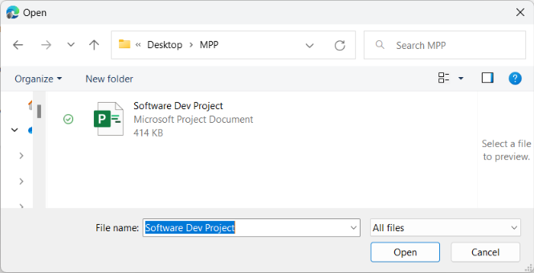

# Importing Projects from Micrsoft Project Desktop Client

_**Applies To:** Project Operations for resource/non-stocked based scenarios, Lite deployment - deal to proforma invoicing_

Project Operations allows Project Managers the ability to import their Project Deskto Files (.MPP) to create projects.  

## Importing a file to create a new Project
To import a new project from a Project Desktop Client file:
1. Navigate to the **Projects** view.

2. From the ribbon, select **Import > Import from MPP**.

3. Update the required **Work Hour Template**, **Project Manager** and **Schedule Mode**.

4. From the dialog, select **Choose File** to choose a file to import.
5. Browse to the .mpp file you want to import, and then select Open.

6. Once a file has been chosen, select **Import** to start the import process.
7. After the Project has been successfully created, review the validation summary.  It will summarize any of the items in the file that have been excluded from the import based on items outlined below.

8. Select **Go to Project** to view the project.

## Unsupported Desktop Client Capabilities in the Import
Project for the web is great for most projects, but it isn't a complete replacement for Project desktop. The following features aren't supported, and can't be migrated. Before you begin, you should evaluate your project and make sure it doesn't rely on these features.

> [!NOTE] This list may not be exhaustive. If your new Project for the web project is missing elements or data, they may rely on an unsupported feature that is not listed.

[Move your project from Project desktop to Project for the web > Features that don't migrate](https://support.microsoft.com/en-us/office/move-your-project-from-project-desktop-to-project-for-the-web-143ab391-002e-451a-aedb-3b6fa1f6ab8b#:~:text=1%20Download%20the%20required%20PowerShell%20commands.%202%20Find,Your%20instance%20ID%20with%20the%20ID%20you%20looked)

## Work breakdown structure (WBS) Limits
In addition to the unsupported capabilities above, the WBS must conform to the existing limits described [here](https://learn.microsoft.com/en-us/dynamics365/project-operations/project-management/create-wbs#project-limitations).

## Handling Project Custom Fields
For customers who have cusotmized the project main form with required fields, it is important that these fields all have default values to avoid errors when importing files to create new projects.  Customization of the import form is currently not supported.
