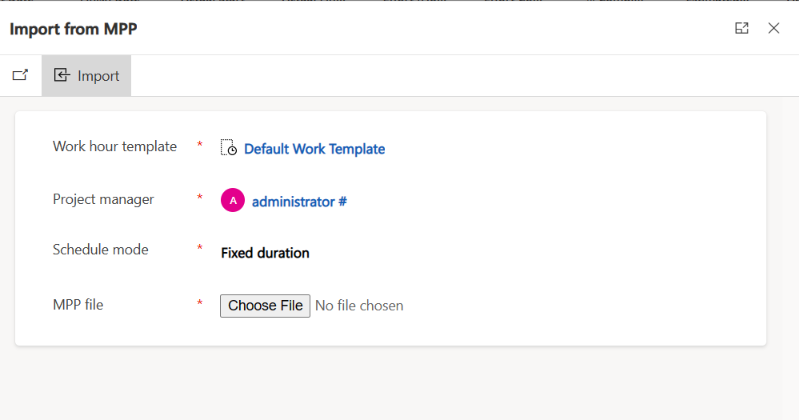

# Import projects from the Microsoft Project desktop client

_**Applies To:** Project Operations Integrated with ERP, Project Operations Core_

Microsoft Dynamics 365 Project Operations lets project managers import their Microsoft Project desktop client files (.mpp files) to create projects.

## Import a file to create a new project

To import a new project from a Project desktop client file, follow these steps.

1. Open the **Projects** view.
1. On the toolbar, select **Import \> Import from MPP**.

    

1. Update the **Work hour template**, **Project manager**, and **Schedule mode** fields as required.

    

1. Select **Choose File**, browse to the .mpp file that you want to import, and then select **Open**.
1. Select **Import** to start the import process.
1. After the project is successfully created, review the validation summary. The summary indicates whether any items in the file excluded from the import. For example, the following screenshot shows an example where nine resources were removed from the importation.

    

1. Select **Go to project** to view the project.

## Limitations
The following sections describe limitations of Import from MPP. 

### Unsupported desktop client capabilities in the import

Project for the web is great for most projects, but it isn't a complete replacement for Project desktop. Some features aren't supported and can't be migrated. Therefore, before you begin, you should evaluate your project and make sure it doesn't rely on them. For a list of these features, see [Features that don't migrate](https://support.microsoft.com/office/move-your-project-from-project-desktop-to-project-for-the-web-143ab391-002e-451a-aedb-3b6fa1f6ab8b#bkmk_featuresthatdontmigrate).

> [!NOTE]
> This list might not be exhaustive. If your new Project for the web project is missing elements or data, they might rely on an unsupported feature that isn't listed.

### Work breakdown structure limits

In addition to the unsupported capabilities that are described in the previous section, the work breakdown structure (WBS) must conform to the [existing limits](project-and-task-limitations.md).

### Project custom fields

If you've customized the project main page by adding required fields, those fields must have default values. Otherwise, errors occur when files are imported to create new projects. Customization of the import dialog box isn't currently supported.
