---
# required metadata

title: Navigating the user interface
description: This article provides information about Project management in Dynamics 365 Project operations. 
author: ruhercul
ms.date: 10/05/2020
ms.topic: concept-article
ms.reviewer: johnmichalak
ms.author: ruhercul

---

# Navigating the user interface

_**Applies To:** Project Operations for resource/non-stocked based scenarios, Lite deployment - deal to proforma invoicing_

## Overview

The main project form is separated into several tabs. Each tab represents a different level of detail within the project.

- **Summary**: Provides a description of the project and aggregates both the planned and actual project performance.

    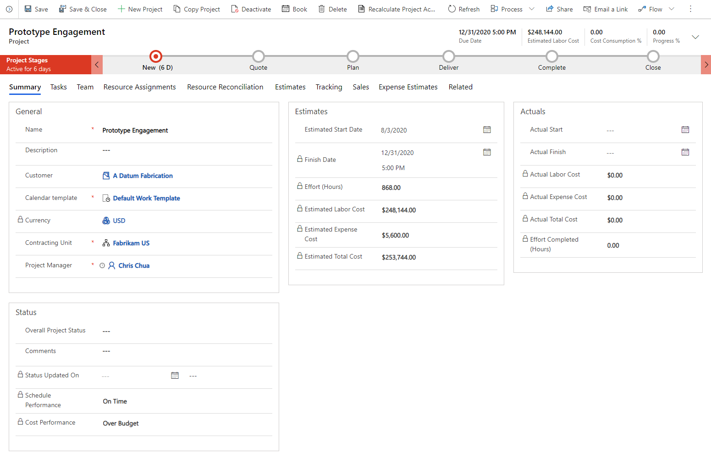

- **Tasks**: Provides the details regarding the work breakdown structure represented by a grid view, board view, and a gantt.

    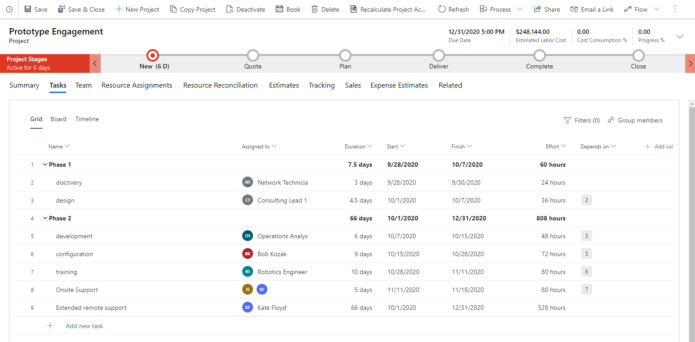

- **Team**: Provides details regarding the project participants. The assigned effort of each team member is also summarized in this view.

    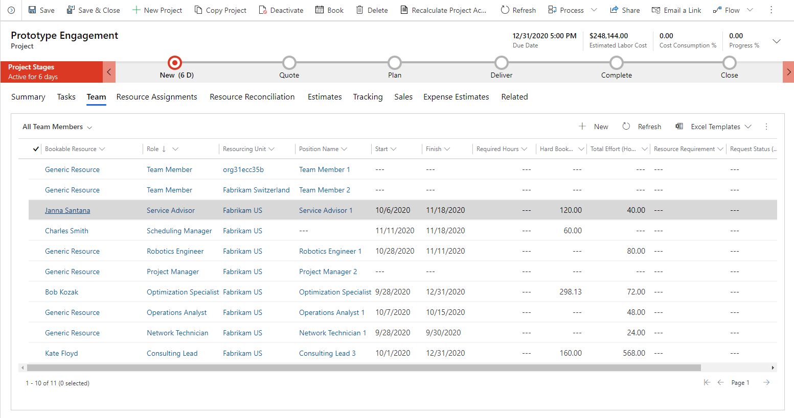

- **Resource assignments**: Provides a time-phased view of the effort for each resource on a project.

    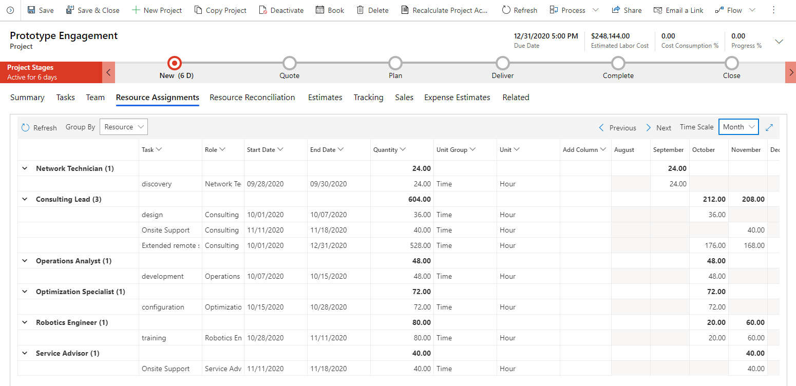

- **Resource reconciliation**: Provides a time-phased view of the differences between the assignments of each named resource and their bookings.

    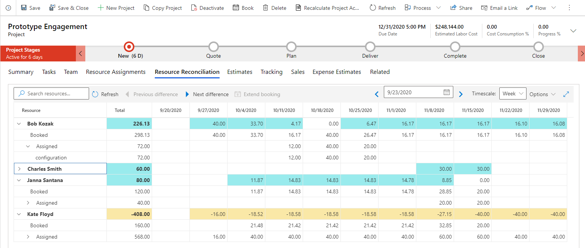

- **Estimates**: Provides a time-phased view of the cost and sales estimates of a project.

    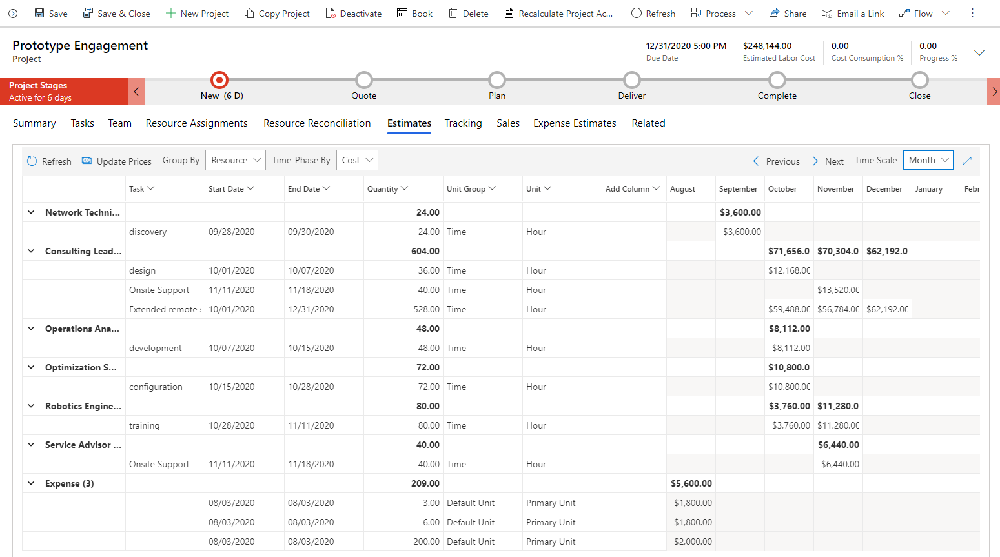

- **Tracking**: Provides a view that shows the progress of tasks in the work breakdown structure for effort, cost, and sales.

    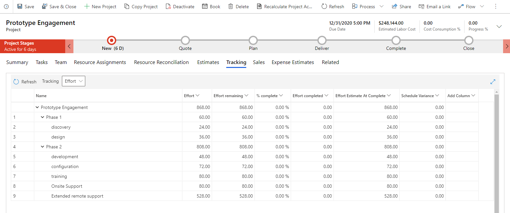

- **Sales**: Provides deep links to quotes and contracts associated with the project.

- **Expense Estimates**: Provides a grid that defines project expenses based upon organizational expense categories.

    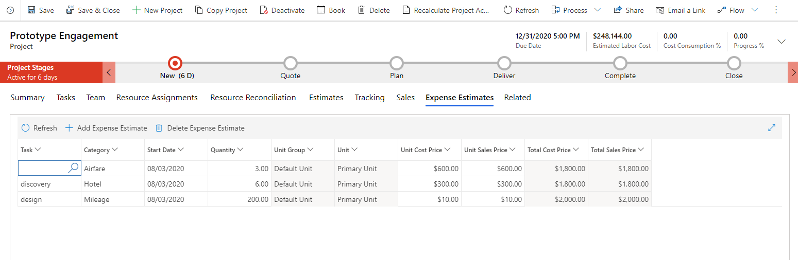

## Grid controls

The follow is a brief overview of the typical controls found on the various project planning tabs.

### Refresh

**Refresh**: Retrieves the latest data from the server if any changes occurred after the grid was loaded.

### Group by

**Group by**: Updates the grouping of the rows in the grid to reflect either resources, roles, or categories based on the user's needs.

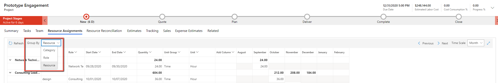

### Previous/Next

**Previous**/**Next**: Update the visible time periods on the time-phased grids.

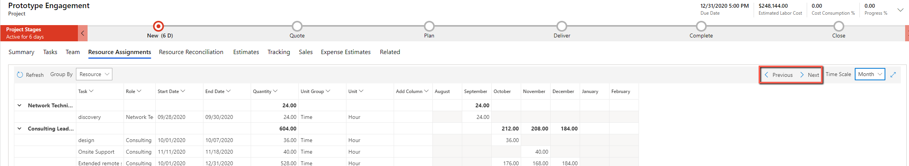

### Timescale

**Timescale**: Change the aggregation of the time-phased data between days, weeks, months, and years.

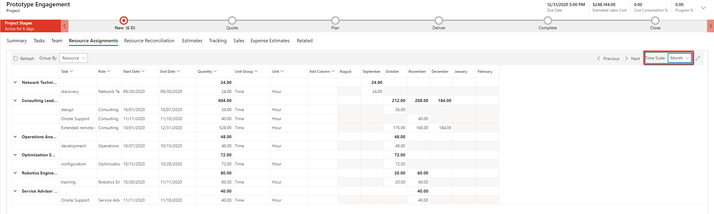

### Expand

**Expand**: Render the visible grid to full screen providing more ability to see additional roles.

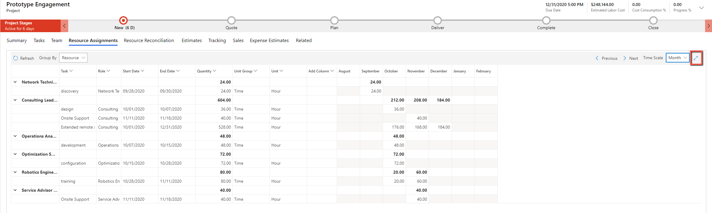

### Time-phase by

**Time-phase by**: Update the grouping of the rows in the grid to reflect cost estimates for sales estimates. This control also applies to the estimate script and the tracking grid.

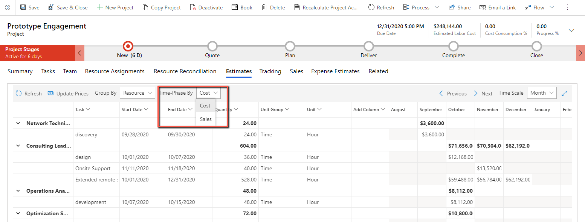

### Add column

**Add column**: Allows the user to define the visible columns in the grid. Only out-of-the-box columns can be added to the grids in the **Project Planning** form.

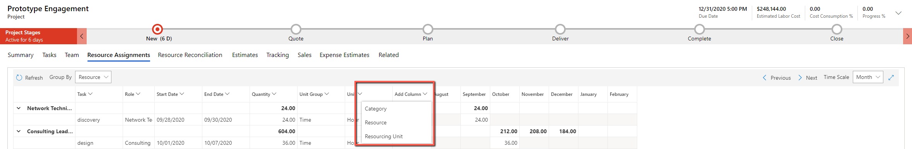

[!INCLUDE[footer-include](../includes/footer-banner.md)]
