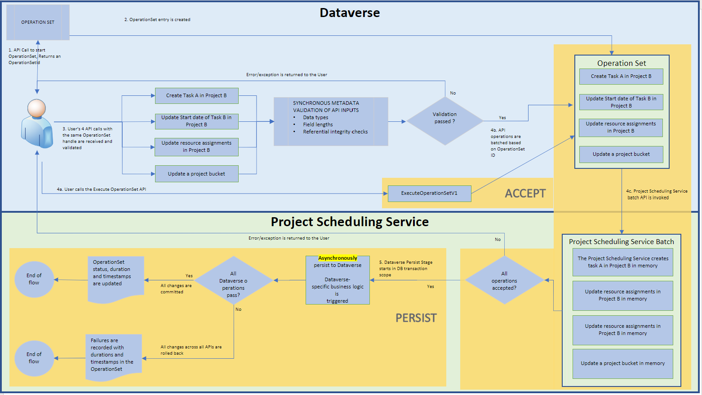

# Project schedule API performance

_**Applies To:** Project Operations Integrated with ERP, Project Operations Core, Project for the web_

This article provides information about the performance benchmarks of the Project schedule application programming interfaces (APIs) and identifies the best practices for optimizing usage.

## Project Scheduling Service
The Project Scheduling Service is a multi-tenant service that runs in Microsoft Azure. It's designed to improve interaction by providing a fast and fluid experience when users work on projects. This improvement is achieved by accepting change requests, processing them, and then immediately returning the result. The service asynchronously persists to Dataverse and doesn't block users from performing other operations.

The Project schedule APIs rely on the Project Scheduling Service to run requests that are described in more detail in later sections of this article.

The Project schedule APIs are designed to work with the following work breakdown structure (WBS) entities:

  - Project
  - Project Task
  - Project Task Dependency
  - Project Team Member
  - Resource Assignment
  
Both out-of-box fields and custom fields are supported. Unless otherwise noted, all common operations are supported, such as create, update, and delete. For more information, see [Use Project schedule APIs to perform operations and scheduling entities](schedule-api-preview.md).

As part of the Project schedule APIs, a unit-of-work pattern is added. This pattern is known as an OperationSet, and it can be used when several requests must be processed in a single transaction.

The following illustration shows the flow that a partner experiences when this feature is used.

**Step 1**: A client makes an API call to an Open Data Protocol (OData) endpoint ExecuteOperationSetV3. This call does the following actions:
1.	Creates an OperationSet.
2.	Loads the OperationSet with Project schedule API requests.
3.	Sends all the changes to Project Scheduling Service in one batch.
   
The Project Scheduling Service runs its own validations on requests in the batch. Any validation failures undo the batch and return an exception to the caller. If the batch is successfully accepted by the Project Scheduling Service, the OperationSet status is updated to reflect the fact that the OperationSet is being processed by the Project Scheduling Service.

**Step 2**: This step represents the PERSIST phase. The Project Scheduling Service asynchronously writes the batch to Dataverse in a transaction. If the write operation is successful, the OperationSet is marked as **Completed**. Any errors roll back the transaction and the batch, and the OperationSet is marked as **Failed**.

## Performance methodology
All operations run a combined 2,280 times, and the P90 execution time measurements are reported. Single-record and bulk operations are measured.

For a single-record operation, the OperationSet contains one request. For bulk operations, it contains 20, 50, or 100 requests. Each bulk size is reported separately.

These operations run on a UR58 Project Operations Core distributed across North America, EMEA, and APAC. 

## Results
### Single-record operations
The following table shows the execution times for the creation, update, and deletion of a single record. The times are in seconds.

**Schedule API Duration**: Time taken by ExecuteOperationSetV3

**Total Duration**: Schedule API duration + Project Save Service time + time taken to sync to Dataverse

<table class="tg">
<thead>
  <tr>
    <th class="tg-0lax" rowspan="2">Operation</th>
    <th class="tg-0lax" rowspan="2">Record type</th>
    <th class="tg-0lax" colspan="2">Schedule API Duration</th>
    <th class="tg-0lax" colspan="2">Total Duration</th>
  </tr>
  <tr>
    <th class="tg-0lax">Required fields</th>
    <th class="tg-0lax">All supported fields</th>
    <th class="tg-0lax">Required fields</th>
    <th class="tg-0lax">All supported fields</th>
  </tr>
</thead>
<tbody>
  <tr>
    <td class="tg-0lax" rowspan="4">Create</td>
    <td class="tg-0lax">Project</td>
    <td class="tg-0lax">2.18</td>
    <td class="tg-0lax">2.41</td>
    <td class="tg-0lax">2.18</td>
    <td class="tg-0lax">2.41</td>
  </tr>
  <tr>
    <td class="tg-0lax">Task</td>
    <td class="tg-0lax">1.67</td>
    <td class="tg-0lax">1.73</td>
    <td class="tg-0lax">7.86</td>
    <td class="tg-0lax">12.63</td>
  </tr>
  <tr>
    <td class="tg-0lax">Assignment</td>
    <td class="tg-0lax">1.46</td>
    <td class="tg-0lax">2.03</td>
    <td class="tg-0lax">10.86</td>
    <td class="tg-0lax">12.81</td>
  </tr>
  <tr>
    <td class="tg-0lax">Dependency</td>
    <td class="tg-0lax">1.43</td>
    <td class="tg-0lax">1.55</td>
    <td class="tg-0lax">9.07</td>
    <td class="tg-0lax">10.35</td>
  </tr>
  <tr>
    <td class="tg-0lax" rowspan="3">Update</td>
    <td class="tg-0lax">Project</td>
    <td class="tg-0lax">1.56</td>
    <td class="tg-0lax">1.59</td>
    <td class="tg-0lax">7.91</td>
    <td class="tg-0lax">11.00</td>
  </tr>
  <tr>
    <td class="tg-0lax">Task</td>
    <td class="tg-0lax">1.51</td>
    <td class="tg-0lax">1.72</td>
    <td class="tg-0lax">7.79</td>
    <td class="tg-0lax">18.72</td>
  </tr>
  <tr>
    <td class="tg-0lax">Team Member</td>
    <td class="tg-0lax">1.94</td>
    <td class="tg-0lax">1.92</td>
    <td class="tg-0lax">10.71</td>
    <td class="tg-0lax">9.37</td>
  </tr>
  <tr>
    <td class="tg-0lax" rowspan="4">Delete</td>
    <td class="tg-0lax">Task</td>
    <td class="tg-0lax">1.53</td>
    <td class="tg-0lax">1.55</td>
    <td class="tg-0lax">7.92</td>
    <td class="tg-0lax">9.68</td>
  </tr>
  <tr>
    <td class="tg-0lax">Assignment</td>
    <td class="tg-0lax">1.44</td>
    <td class="tg-0lax">1.44</td>
    <td class="tg-0lax">7.89</td>
    <td class="tg-0lax">9.36</td>
  </tr>
  <tr>
    <td class="tg-0lax">Dependency</td>
    <td class="tg-0lax">1.23</td>
    <td class="tg-0lax">1.44</td>
    <td class="tg-0lax">8.88</td>
    <td class="tg-0lax">8.40</td>
  </tr>
  <tr>
    <td class="tg-0lax">Team Member</td>
    <td class="tg-0lax">1.41</td>
    <td class="tg-0lax">1.49</td>
    <td class="tg-0lax">9.91</td>
    <td class="tg-0lax">10.97</td>
  </tr>
</tbody>
</table>

> [!NOTE] 
> 1.	**Team Member** entity isn’t included in create operation, because Team Member can be created directly in Dataverse.
> 2.	Update operations on the **Resource Assignments** and **Project Task Dependency** entities aren't supported.
> 3.	Delete operation on the **Project** entity isn't supported.

### Bulk operations
The following table shows the execution times for the creation, update, and deletion of many records. Specifically, Microsoft measured the execution times for the creation of 20, 50, and 100 records in a single OperationSet. The times are in seconds.

**Schedule API Duration**: Time taken by ExecuteOperationSetV3

**Total Duration**: Schedule API duration + Project Save Service time + time taken to sync to Dataverse

<table class="tg">
<thead>
  <tr>
    <th class="tg-0lax" rowspan="2">Operation</th>
    <th class="tg-0lax" rowspan="2">Record type</th>
    <th class="tg-0lax" rowspan="2">No. of Records</th>
    <th class="tg-0lax" colspan="2">Schedule API Duration</th>
    <th class="tg-0lax" colspan="2">Total Duration</th>
  </tr>
  <tr>
    <th class="tg-0lax">Required fields</th>
    <th class="tg-0lax">All supported fields</th>
    <th class="tg-0lax">Required fields</th>
    <th class="tg-0lax">All supported fields</th>
  </tr>
</thead>
<tbody>
  <tr>
    <td class="tg-0lax" rowspan="9">Create</td>
    <td class="tg-0lax" rowspan="3">Task</td>
    <td class="tg-0lax">20</td>
    <td class="tg-0lax">1.88</td>
    <td class="tg-0lax">2.81</td>
    <td class="tg-0lax">9.57</td>
    <td class="tg-0lax">32.75</td>
  </tr>
  <tr>
    <td class="tg-0lax">50</td>
    <td class="tg-0lax">2.41</td>
    <td class="tg-0lax">3.17</td>
    <td class="tg-0lax">12.82</td>
    <td class="tg-0lax">36.96</td>
  </tr>
  <tr>
    <td class="tg-0lax">100</td>
    <td class="tg-0lax">4.14</td>
    <td class="tg-0lax">3.97</td>
    <td class="tg-0lax">15.96</td>
    <td class="tg-0lax">47.55</td>
  </tr>
  <tr>
    <td class="tg-0lax" rowspan="3">Assignment</td>
    <td class="tg-0lax">20</td>
    <td class="tg-0lax">2.61</td>
    <td class="tg-0lax">1.98</td>
    <td class="tg-0lax">12.51</td>
    <td class="tg-0lax">26.62</td>
  </tr>
  <tr>
    <td class="tg-0lax">50</td>
    <td class="tg-0lax">2.49</td>
    <td class="tg-0lax">2.73</td>
    <td class="tg-0lax">18.49</td>
    <td class="tg-0lax">62.40</td>
  </tr>
  <tr>
    <td class="tg-0lax">100</td>
    <td class="tg-0lax">3.85</td>
    <td class="tg-0lax">4.04</td>
    <td class="tg-0lax">35.43</td>
    <td class="tg-0lax">68.69</td>
  </tr>
  <tr>
    <td class="tg-0lax" rowspan="3">Dependency</td>
    <td class="tg-0lax">20</td>
    <td class="tg-0lax">1.71</td>
    <td class="tg-0lax">1.92</td>
    <td class="tg-0lax">8.91</td>
    <td class="tg-0lax">19.92</td>
  </tr>
  <tr>
    <td class="tg-0lax">50</td>
    <td class="tg-0lax">2.38</td>
    <td class="tg-0lax">2.58</td>
    <td class="tg-0lax">18.72</td>
    <td class="tg-0lax">39.73</td>
  </tr>
  <tr>
    <td class="tg-0lax">100</td>
    <td class="tg-0lax">3.45</td>
    <td class="tg-0lax">4.80</td>
    <td class="tg-0lax">41.29</td>
    <td class="tg-0lax">83.41</td>
  </tr>
  <tr>
    <td class="tg-0lax" rowspan="6">Update</td>
    <td class="tg-0lax" rowspan="3">Task</td>
    <td class="tg-0lax">20</td>
    <td class="tg-0lax">2.03</td>
    <td class="tg-0lax">5.36</td>
    <td class="tg-0lax">8.82</td>
    <td class="tg-0lax">20.42</td>
  </tr>
  <tr>
    <td class="tg-0lax">50</td>
    <td class="tg-0lax">3.72</td>
    <td class="tg-0lax">11.97</td>
    <td class="tg-0lax">30.37</td>
    <td class="tg-0lax">64.36</td>
  </tr>
  <tr>
    <td class="tg-0lax">100</td>
    <td class="tg-0lax">5.94</td>
    <td class="tg-0lax">20.21</td>
    <td class="tg-0lax">69.37</td>
    <td class="tg-0lax">155.52</td>
  </tr>
  <tr>
    <td class="tg-0lax" rowspan="3">Team Member</td>
    <td class="tg-0lax">20</td>
    <td class="tg-0lax">2.17</td>
    <td class="tg-0lax">3.86</td>
    <td class="tg-0lax">15.01</td>
    <td class="tg-0lax">12.61</td>
  </tr>
  <tr>
    <td class="tg-0lax">50</td>
    <td class="tg-0lax">3.88</td>
    <td class="tg-0lax">6.33</td>
    <td class="tg-0lax">17.89</td>
    <td class="tg-0lax">21.84</td>
  </tr>
  <tr>
    <td class="tg-0lax">100</td>
    <td class="tg-0lax">6.39</td>
    <td class="tg-0lax">12.40</td>
    <td class="tg-0lax">30.23</td>
    <td class="tg-0lax">31.85</td>
  </tr>
  <tr>
    <td class="tg-0lax" rowspan="12">Delete</td>
    <td class="tg-0lax" rowspan="3">Task</td>
    <td class="tg-0lax">20</td>
    <td class="tg-0lax">1.62</td>
    <td class="tg-0lax">1.66</td>
    <td class="tg-0lax">13.40</td>
    <td class="tg-0lax">24.33</td>
  </tr>
  <tr>
    <td class="tg-0lax">50</td>
    <td class="tg-0lax">2.25</td>
    <td class="tg-0lax">2.46</td>
    <td class="tg-0lax">33.75</td>
    <td class="tg-0lax">54.92</td>
  </tr>
  <tr>
    <td class="tg-0lax">100</td>
    <td class="tg-0lax">3.20</td>
    <td class="tg-0lax">3.28</td>
    <td class="tg-0lax">73.90</td>
    <td class="tg-0lax">110.70</td>
  </tr>
  <tr>
    <td class="tg-0lax" rowspan="3">Assignment</td>
    <td class="tg-0lax">20</td>
    <td class="tg-0lax">1.55</td>
    <td class="tg-0lax">1.58</td>
    <td class="tg-0lax">8.69</td>
    <td class="tg-0lax">13.98</td>
  </tr>
  <tr>
    <td class="tg-0lax">50</td>
    <td class="tg-0lax">2.06</td>
    <td class="tg-0lax">2.38</td>
    <td class="tg-0lax">15.87</td>
    <td class="tg-0lax">23.17</td>
  </tr>
  <tr>
    <td class="tg-0lax">100</td>
    <td class="tg-0lax">3.04</td>
    <td class="tg-0lax">3.62</td>
    <td class="tg-0lax">39.27</td>
    <td class="tg-0lax">54.76</td>
  </tr>
  <tr>
    <td class="tg-0lax" rowspan="3">Dependency</td>
    <td class="tg-0lax">20</td>
    <td class="tg-0lax">1.57</td>
    <td class="tg-0lax">1.80</td>
    <td class="tg-0lax">11.49</td>
    <td class="tg-0lax">13.73</td>
  </tr>
  <tr>
    <td class="tg-0lax">50</td>
    <td class="tg-0lax">2.24</td>
    <td class="tg-0lax">2.53</td>
    <td class="tg-0lax">19.40</td>
    <td class="tg-0lax">45.26</td>
  </tr>
  <tr>
    <td class="tg-0lax">100</td>
    <td class="tg-0lax">3.31</td>
    <td class="tg-0lax">3.73</td>
    <td class="tg-0lax">31.56</td>
    <td class="tg-0lax">48.14</td>
  </tr>
  <tr>
    <td class="tg-0lax" rowspan="3">Team Member</td>
    <td class="tg-0lax">20</td>
    <td class="tg-0lax">2.05</td>
    <td class="tg-0lax">2.19</td>
    <td class="tg-0lax">13.67</td>
    <td class="tg-0lax">15.09</td>
  </tr>
  <tr>
    <td class="tg-0lax">50</td>
    <td class="tg-0lax">3.35</td>
    <td class="tg-0lax">3.16</td>
    <td class="tg-0lax">20.62</td>
    <td class="tg-0lax">22.58</td>
  </tr>
  <tr>
    <td class="tg-0lax">100</td>
    <td class="tg-0lax">4.18</td>
    <td class="tg-0lax">5.15</td>
    <td class="tg-0lax">25.49</td>
    <td class="tg-0lax">36.66</td>
  </tr>
</tbody>
</table>

> [!NOTE] 
> 1.	Bulk create operations on the Project and Team Member entities aren't included in this table, because the runtime for those operations resembles the runtime when the API for creating a single record is called multiple times. These APIs are run immediately in Dataverse.
> 2.	Update operations on the Resource Assignments and Project Task Dependency entities aren't supported.
> 3.	Delete operations on the Project entity aren't supported.

## Best practices
Based on the preceding scenario results, the APIs perform better in the following conditions:

  - Use the latest versions of the Schedule APIs as they're optimized for better performance.
  - Group as many operations together as possible. The average runtime for bulk operations is better than the average runtime for single-record operations. The smaller the number of OperationSets in use, the faster the average execution time is.
  - Set only the minimum attributes that are required to accomplish your scenario. Be selective about the types of nonrequired fields included in an OperationSet request. Fields that contain foreign keys or rollup fields negatively affect performance.
