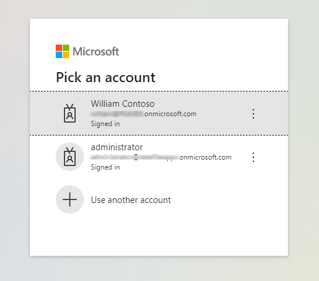
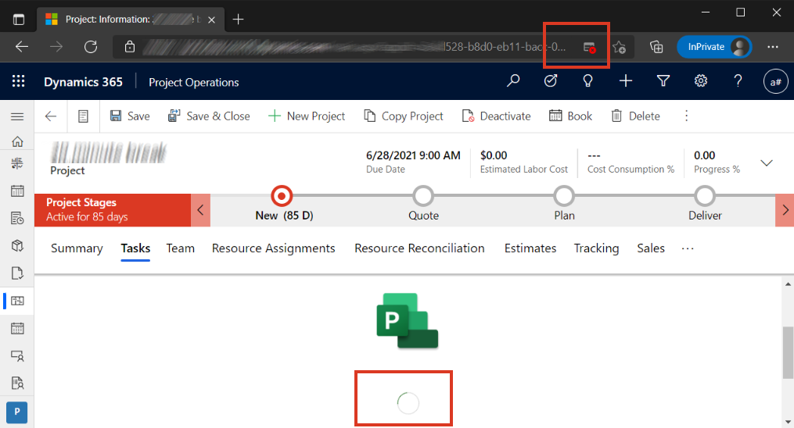
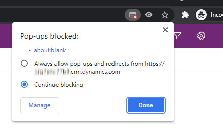
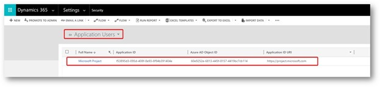
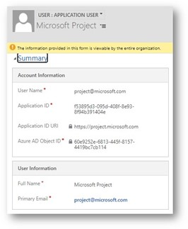

# Troubleshoot working in the Task grid 

_**Applies To:** Project Operations for resource/non-stocked based scenarios, Lite deployment - deal to proforma invoicing, Project for the web_

The Task grid used by Dynamics 365 Project Operations is a hosted iframe within Microsoft Dataverse. As a result of this use, specific requirements must be met to ensure authentication, and authorization are functioning correctly. This article outlines the common issues that can impact the ability to render the grid or manage tasks in the work breakdown structure (WBS).

Common issues include:

- The **Task** tab on the Task grid is empty.
- When opening the project, the project doesn't load and the user interface (UI) is stuck on the spinner.
- Administration of privileges for **Project for the Web**.
- Changes aren't saved when you create, update, or delete a task.

## Issue: The Task tab is empty

### Mitigation 1: Enable cookies

Project Operations requires that third-party cookies be enabled to render the work breakdown structure. When third-party cookies aren't enabled, instead of seeing tasks, you'll see a blank page when you select the **Tasks** tab on the **Project** page.

For Microsoft Edge or Google Chrome browsers, the following procedures outline how to update your browser setting to enable third-party cookies.

#### Microsoft Edge

1. Open your Edge browser.
2. In the upper-right corner, select the **ellipsis** (...), and then select **Settings**.
3. Under **Cookies and site permissions**, select **Cookies and site data**.
4. Turn off **Block third-party cookies**.
5. Refresh your browser. 

#### Google Chrome

1. Open your Chrome browser.
2. In the upper-right corner, select the three vertical dots, and then select **Settings**.
3. Under **Privacy and security**, select **Cookies and other site data**.
4. Select **Allow all cookies**.
5. Refresh your browser. 

> [!NOTE]
> If you block third-party cookies, all cookies and site data from other sites will be blocked, even if the site is allowed on your exceptions list.

### Mitigation 2: Validate the PEX Endpoint has been correctly configured

Project Operations requires that a project parameter reference the PEX Endpoint. This endpoint is required to communicate with the service that's used to render the work breakdown structure. If the parameter isn't enabled, you'll receive the error, "The project parameter isn't valid". To update the PEX Endpoint, complete the following steps.

1. Add the **PEX Endpoint** field to the **Project Parameters** page.
2. Identify the product type that you're using. This value is used when the PEX Endpoint is set. Upon retrieval, the product type is already defined in the PEX Endpoint. Keep that value.
3. Update the field with the following value: `https://project.microsoft.com/<lang>/?org=<cdsServer>#/taskgrid?projectId=<id>&type=2`. The following table provides the type parameter that should be used based on the product type.

      | **Product type**                     | **Type parameter** |
      |--------------------------------------|--------------------|
      | Project for the Web on Default org   | type=0             |
      | Project for the Web on CDS named org | type=1             |
      | Project Operations                   | type=2             |

4. Remove the field from the **Project Parameters** page.

### Mitigation 3: Sign in to project.microsoft.com
In your browser, open a new tab, go to project.microsoft.com, and sign in with the user role that you're using to access Project Operations.   Note, it's important that only one user is signed in to a Microsoft product within the browser.  The "login.microsoftonline.com refused to connect." error message occurs most often when more than one user is logged in, as shown in the image below:

   

## Issue: The project doesn't load and the UI is stuck on the spinner

For the purposes of authentication, pop-ups must be enabled for the Task grid to load. If pop-ups aren't enabled, the screen will be stuck on the loading spinner. The following graphic shows the URL with a blocked pop-up label in the address bar, which is resulting in the spinner getting stuck trying to load the page. 

   

### Mitigation 1: Enable pop-ups

When your project is stuck on the spinner, it's possible that pop-ups aren't enabled.

#### Microsoft Edge

There are two ways to enable pop-ups in your Edge browser.

1. In your Edge browser, select the notification in the upper-right of the browser.
2. Select **Always allow popups and redirects from** the specific Dataverse environment.
 
     

Alternatively, you can complete the following steps.

1. Open your Edge browser.
2. In the upper-right corner, select the **ellipsis** (...), and then select **Settings** > **Site permissions** > **Pop-ups and redirects**.
3. Toggle **Pop-ups and redirects** off for blocking pop-ups, or toggle on to allow pop-ups on your device.
4. After you enable pop-ups, refresh your browser. 

#### Google Chrome
1. Open your Chrome browser.
2. Navigate to a page where pop-ups are blocked.
3. In the address bar, select **Pop-up blocked**.
4. Select the link for the pop-up you want to see.
5. After you enable pop-ups, refresh your browser. 

> [!NOTE]
> To always see pop-ups for the site, select **Always allow pop-ups and redirects from [site]** and then select **Done**.

## Issue 3: Administration of privileges for Project for the Web

Project Operations relies on an external scheduling service. The service requires a user have several roles assigned that allows them to read and write to entities related to the WBS. These entities include project tasks, resource assignments, and task dependencies. If a user can't render the WBS when they navigate to the **Tasks** tab, it's probably because **Project** for **Project Operations** hasn't been enabled. A user might receive either a security role error, or an error related to a denial of access.

### Mitigation 1: Validate the application user and end-user security roles

1. Go to **Setting** > **Security** > **Users** > **Application Users**.  

   
   
2. Double-click the application user record to verify:

     - The user has access to the project. You can do this by verifying that the user has the **Project Manager** security role.
     - The Microsoft Project application user exists and is configured correctly.
 
3. If this user doesn't exist, create a new user record. 
4. Select **New Users**, change the entry form to **Application User**, and then add the **Application ID**.

   

## Issue 4: Changes aren't saved when you create, update, or delete a task

When you make one or more updates to the WBS, the changes fail and aren't saved. An error occurs in the schedule grid with a message that says, "Recent change you’ve made couldn’t be saved".

### Mitigation 1: Validate the license assignment

1. Verify that the user has been assigned the correct license and that the service is enabled in the service plans details of the license.  
2. Verify that the user can open **project.microsoft.com**.
    
### Mitigation 2: Validation configuration of the Project application user
1. Verify that the Project application user has been created.
2. Apply the following security roles to the user:
  
  - Dataverse User or Base User
  - Project Operations System
  - Project System
  - Project Operations Dual-write System. This role is required for the resource/non-stocked based deployment scenario of Project Operations.

[!INCLUDE[footer-include](../includes/footer-banner.md)]
