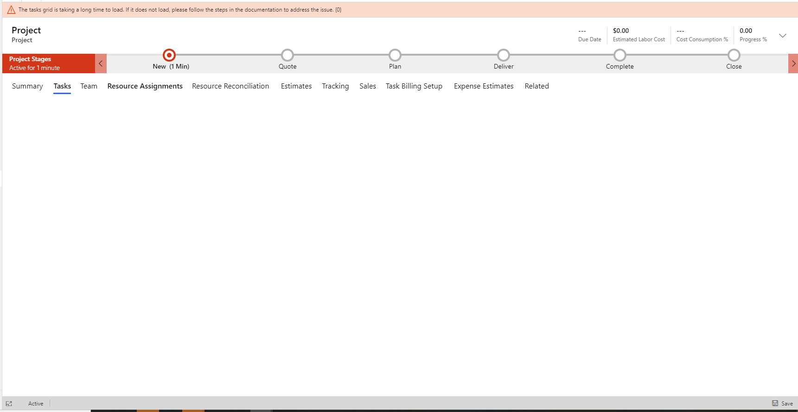
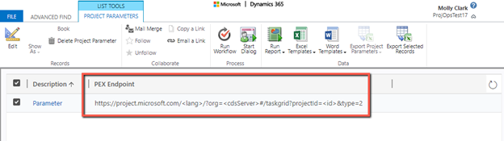

# Troubleshoot working in the Task grid 

_**Applies To:** Project Operations for resource/non-stocked based scenarios, Lite deployment - deal to proforma invoicing_

This topic describes how to fix issues that you might encounter while working with cost management.

## Enable cookies

Project Operations requires that third-party cookies be enabled in order to render the work breakdown structure. When third-party cookies aren't enabled, instead of seeing tasks, you will see a blank page when you select the **Tasks** tab on the **Project** page.

### Workaround
For Microsoft Edge or Google Chrome browsers, the following procedures outline how to update your browser setting to enable third-party cookies.

#### Microsoft Edge

1. Open your Edge browser.
2. In the upper-right corner, select the **ellipsis** (...), and then select **Settings**.
3. Under **Cookies and site permissions**, select **Cookies and site data**.
4. Turn off **Block third-party cookies**.

#### Google Chrome

1. Open your Chrome browser.
2. In the upper-right corner, select the three vertical dots, and then select **Settings**.
3. Under **Privacy and security**, select **Cookies and other site data**.
4. Select **Allow all cookies**.

> [!IMPORTANT]
> If you block third-party cookies, all cookies and site data from other sites will be blocked, even if the site is allowed on your exceptions list.

## PEX Endpoint

Project Operations requires that a project parameter reference the PEX Endpoint. This endpoint is required to communicate with the service used to render the work breakdown structure. If the parameter isn't enabled, you will receive the error, "The project parameter is not valid". 

### Workaround
 

1. Add the **PEX Endpoint** field to the **Project Parameters** page.
2. Update the field with the following value: `https://project.microsoft.com/<lang>/?org=<cdsServer>#/taskgrid?projectId=\<id>&type=2`
3. Remove the field from the **Project Parameters** page.

## Privileges for Project for the Web

Project Operations relies on an external scheduling service. The service requires that a user have several roles assigned to read and write to entities related to the work breakdown structure. These entities include project tasks, resource assignments, and task dependencies. If a user can't render the work breakdown structure when they go to the **Tasks** tab, it's probably because Project for Project Operations hasn't been enabled. A user might receive either a security role error, or an error related to a denial of access.

## Workaround

1. Go to **Setting > Security > Users > Application Users**.  

   
   
2. Double-click the application user record to verify the following:

 - The user has access to the project. This verification is typically done by ensuring that the user has **Project Manager** security role.
 - The Microsoft Project application user exists and is configured correctly.
 
3. If this user doesn't exist, you can create a new user record. Select **New Users**. Change the entry form to **Application User**, and then add the **Application ID**.

   

4. Verify that the user has been assigned the correct license and that the service is enabled in the service plans details of the license.
5. Verify that the user can open project.microsoft.com.
6. Verify through the project parameters that the system is pointing to the correct project endpoint.
7. Verify that the project application user is created.
8. Apply the following security roles to the user:

  - Dataverse User
  - Project Operations System
  - Project System

## Error when updating the work breakdown structure

When one or more updates are made to the work breakdown structure, the changes eventually fail and aren't saved. An error occurs in the schedule grid noting that “Recent change you’ve made couldn’t be saved.”

### Workaround

1. Verify that the user has been assigned the correct license and that the service is enabled in the service plans details of the license.
2. Verify that the user can open project.microsoft.com.
3. Verify that the system is pointing to the correct project endpoint,.
4. Verify that the Project Application user has been created.
5. Apply the following security roles to the user:
  
  - Dataverse user or Base user
  - Project Operations System
  - Project System
  - Project Operations Dual Write System (This role is required if you are deploying the resource/non-stocked based scenario of Project Operations.)
