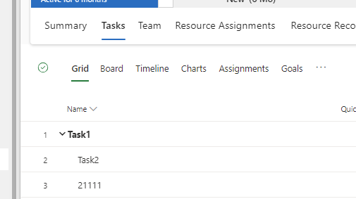
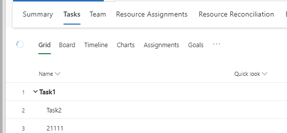
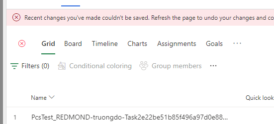

--- 
title: Saving changes to a project's work breakdown structure 
description: This article explains how changes made the work breakdown structure are saved to Dataverse.
author:  abriccetti
ms.date: 03/11/2024  
ms.topic: conceptual
ms.custom: bap-template
ms.reviewer: johnmichalak
ms.author: abriccetti
--- 

# Saving changes to a project's work breakdown structure

[!INCLUDE[banner](../includes/banner.md)]

_**Applies To:** Project Operations for resource/non-stocked based scenarios, Lite deployment - deal to proforma invoicing._

Microsoft Dynamics 365 Project Operations embeds Microsoft Project for the web inside the tasks tab of a project entity. When edits are made to the work breakdown structure (WBS) the UI immediately shows the changes; however, an asynchronous save process is triggered to update the relevant fields in Dataverse. The amount of time this asynchronous save takes depends on the size of the changes. If a change requires updates to many entities (for example, adjusting dates on a task that many other tasks depend on), it takes longer than a change that updates few entities.

## Save Status

An icon in the top right corner of the Project for the web UI indicates the save status. The save status icon has three states.

A green check mark indicates there isn't a pending save, and Dataverse and Project for the web are in sync. This icon indicates that project data in Dataverse, which is calculated from the work breakdown structure, is up-to-date with all changes (for example, data in the summary, estimates, and tracking tabs).

A blue spinner indicating that a save is currently in progress.

A red x indicates the save to Dataverse failed, and the project reverts to the previous state upon reload (this reload shows a warning banner and requires a page refresh to revert the failed save and continue editing).

[!INCLUDE[footer-include](../includes/footer-banner.md)]
