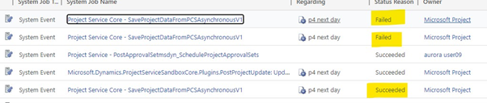

# Troubleshoot project scheduling errors in the task grid

[!INCLUDE[banner](../includes/banner.md)]

_**Applies To:** Project Operations for resource/non-stocked based scenarios, Lite deployment - deal to proforma invoicing_

When you work in the task grid, sometimes changes to the Work Breakdown Structure (WBS) don't get saved. An error message appears saying, "Recent change you’ve made couldn’t be saved." This article explains the common reasons for these errors.

## Project task due date can't be earlier than task start date

After you update the project calendar, you see a save error when opening the **Tasks** tab. The PSS Error Log shows this message: 
"Project Task end/due date can't be earlier than task start date."

### Mitigation

To fix this issue, your administrator needs to run a script. Contact your administrator for assistance. To run the script, follow these steps.

1. Open the Developer console using Ctrl + Shift + I.
1. Copy and paste the following script into the Developer console. Modify the script to add the task IDs for the tasks listed in the the PSS Error Log that are causing the errors. After the script runs, the resource assignments for the tasks with errors are shown.
1. Delete these resource assignments using the [Delete schedule API](schedule-api-preview.md). Deleting these assignments allows the project to be opened correctly, and then you can re-create the assignments.

Use the following script to get the list of assignments.

 ```JS
    const listOfTasks = ["TASK IDS HERE"];
    /*
    * @params: listOfTasks: List of Tasks to retrieve associated Resource Assignments
    * @returns: Returns an array of associated Resource Assignments
    */
    async function getResourceAssignmentsAssociatedWithListOfTasks(listOfTasks) {
        let distinctAssignments = new Set();
     
        for (let i = 0; i < listOfTasks.length; i++) {
            let fetchXml = `?fetchXml=<fetch mapping="logical">
                                <entity name="msdyn_resourceassignment">
                                    <attribute name="msdyn_resourceassignmentid" />
                                    <filter>
                                        <condition attribute="taskid" operator="eq" value="${listOfTasks[i]}" />
                                    </filter>
                                </entity>
                            </fetch>`;
     
            let results = await Xrm.WebApi.retrieveMultipleRecords('msdyn_resourceassignment', fetchXml);
     
            for (let j = 0; j < results.entities.length; j++){
                distinctAssignments.add(results.entities[j].msdyn_resourceassignmentid);
            }
        }   
        return Array.from(distinctAssignments);
    }
        
    // Call the async function and log the results
    getResourceAssignmentsAssociatedWithListOfTasks(listOfTasks).then(assignments => {
        console.log(assignments);
    }).catch(error => {
        console.error(error);
    });
```

## Revision token doesn’t match between xRM and PSS

When trying to make changes in the task grid, sometimes the edits revert after a while or a save error appears. The PSS error log shows "Revision Token doesn't match between xRM and PSS."

This can happen because:

1. A long save process timed out after 2 hours. PSS times out and reverts the edits, but CDS continues and finishes the save, causing a revision mismatch.
  
1. The ReadMpp request returns empty for the revision token. This means the MPP file is either deleted or not created on CDS, resulting in the loss of all project data.

### Mitigation 1

Contact your administrator for help with resetting the revision token for the current project using these steps. To run the script, follow these steps.

1. Open the Developer console using Ctrl + Shift + I
1. Copy and paste the following script into the Developer console. Modify the script and enter the project ID and the org URL. This script resets both the Project and Document Header revision tokens.

```JS
    // Things to update here:
    let projectId = "YOUR PROJECT ID HERE";
    let orgUrl = "YOUR ORG URL HERE"; // Update the orgUrl and verify this value (Example: abc.crm.dynamics.com)
     
    // Do not update these:
    let projectParameterId = "";
    let newRevisionToken = "msxrm_" + orgUrl + "_" + projectId + "_0000000001";
     
    Xrm.WebApi.online.retrieveMultipleRecords("msdyn_projectparameter")
    .then(response => setProjectParameterTestMode(response.entities[0].msdyn_projectparameterid, true))
    .then(() => Xrm.WebApi.retrieveRecord("msdyn_project", projectId, "?$select=msdyn_globalrevisiontoken,_msdyn_msprojectdocument_value"))
    .then(retrievedProject => resetRevisionTokensOnDocumentHeaderAndProject(retrievedProject))
    .then(() => setProjectParameterTestMode(projectParameterId, false))
    .then(() => console.log("Revision Tokens Successfully Reset."))
    .catch(error => console.log(error));
     
    // Private functions
    function setProjectParameterTestMode(passedProjectParameterId, newTestMode){
        console.log("Updating Project Parameter...");
        projectParameterId = passedProjectParameterId;
        let updatedParameter = {
            "msdyn_testmode": newTestMode
        };
     
        return Xrm.WebApi.updateRecord("msdyn_projectparameter", projectParameterId, updatedParameter);
    }
     
    function setProjectRevisionToken(projectId, newRevisionToken){
        console.log("Updating Project...");
        let updatedProject = {
            "msdyn_globalrevisiontoken": newRevisionToken
        };
        return Xrm.WebApi.updateRecord("msdyn_project", projectId, updatedProject);
    }
     
    function setDocumentRevisionToken(documentHeaderId, newRevisionToken){
        console.log("Updating Document Header...");
        let updatedDocumentHeader = {
            "msdyn_revisiontoken": newRevisionToken
        };
        
        return Xrm.WebApi.updateRecord("msdyn_documentheader", documentHeaderId, updatedDocumentHeader);
    }
     
    function resetRevisionTokensOnDocumentHeaderAndProject(retrievedProject){
        let documentHeaderId = retrievedProject["_msdyn_msprojectdocument_value"];
        let resetDocumentHeaderRevisionPromise = setDocumentRevisionToken(documentHeaderId, newRevisionToken);
        let resetProjectRevisionPromise = resetDocumentHeaderRevisionPromise.then((res) => setProjectRevisionToken(projectId, newRevisionToken));
        return Promise.all([resetProjectRevisionPromise, resetDocumentHeaderRevisionPromise]);
    }
```

### Mitigation 2

If the first mitigation doesn’t work, then delete the current project and create a new one. In case that isn’t a preferred option contact support.

## Entity doesn't contain attribute

After you update the project calendar, the user sees a save error when opening the tasks tab. The PSS Error Log shows a message saying the entity doesn't contain an attribute. This is the error message received:
\<EntityName\> entity doesn't contain attribute with Name = \<AttributeName\> and NameMapping = `Logical`

### Mitigation

The user uses custom pricing dimensions, and the likely cause of the issue is that the custom dimension isn't linked to the affected Project Service Pricing entity. To fix this, follow the public documentation to correctly add the custom dimension to all required Pricing entities or remove the custom dimension. Here's the associated public doc: [Entity-based custom pricing dimensions](../pricing-costing/add-custom-fields-price-setup-transactional-entities.md#entity-based-custom-pricing-dimensions)

## Unable to delete a task

When the user tries to delete a task from the Tasks tab, it reappears after a few minutes. They might also see a save error and be unable to make any edits on the tasks grid.

### Mitigation

This can happen if the "Microsoft Project or Microsoft Portfolios" app user doesn't have the right permissions or if there's data corruption.
Contact your administrator to assign the correct permissions to the "Microsoft Project or Microsoft Portfolios" app user. If this doesn’t mitigate the issue, then the likely cause is data corruption, in this case contact support.

1. Go to [Power Platform Admin Center](https://admin.powerplatform.microsoft.com/).
1. Select the environment.
1. Select all users on the right-side panel.
1. Select app users list.
1. Select Microsoft Project/Microsoft Portfolios and select **Edit security roles**.
1. Ensure that the Project System and Project Operations System security roles are checked.

## System job has an error

When the user creates new tasks, a save error message appears on the task grid after some time. In the System Jobs, there will be a successful instance of Project Service Core - SaveProjectDataFromPCSAsynchronousV1, followed by one or more failed instances for the same project, as shown in the following screenshot.



On inspecting the system job, the following error appears:
“Revision Token doesn't match between xRM and PSS.”

### Mitigation 1

If the root cause is that "Project Application" user doesn't have the "Project System Role" then ask you administrator to assign the "Basic User" and "Project System" role to project app user. If it's Project Operations, assign "Project Operations System" role too.

### Mitigation 2

If the root cause is that "Project Application" user is moved to a child business unit other than the default business unit, then ask you administrator to move the "Project Application" user back to the default business unit. It must be in the default business unit.

### Mitigation 3

If the root cause is that some optimization is broken because of an org moving from having a single business unit to multiple business units, then ask administrator to apply the mitigation for Revision token doesn’t match between xRM and PSS. If the issue persists, contact support. 


[!INCLUDE[footer-include](../includes/footer-banner.md)]
