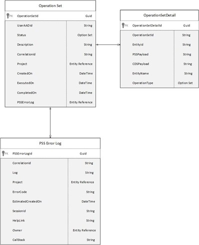

# Use Project Scheduling Logs to track Failures related to Project Scheduling Service and Project Scheduling APIs

_**Applies To:** Project Operations for resource/non-stocked based scenarios, Lite deployment - deal to proforma invoicing_, _Project for the Web_

Dynamics 365 Project Operations uses [Project for the Web](https://support.microsoft.com/en-us/office/what-is-project-for-the-web-c19b2421-3c9d-4037-97c6-f66b6e1d2eb5) as its primary scheduling engine. Instead of using the standard Microsoft Dataverse Web APIs, Project Operations uses the new Project Scheduling APIs to create, update, and delete project tasks, resource assignments, task dependencies, project buckets, or project teams members. However, when executing create, update, or delete operations on work breakdown structure entities programmatically, errors may occur. To track the errors and history of operations, two new administrative logs have been implemented: **Operation Sets** and **Project Scheduling Service (PSS)**. You can access these logs by going to **Settings** > **Schedule Integration**.

  

## Operation Set log

The Operation Set log tracks the execution of an operation set which is issued to batch one or many create, update or delete operations on the **Projects, Project Tasks, Resource Assignments, Task Dependencies, Project Buckets or Project Team Members**. The overall status of the Operation Set is tracked in the **Operation in Status** field. The details of the Operation Set payload are captured in the related Operation Set detail records.

### Operation Set
The fields in the following table are related to the Operation Set entity.

| **SchemaName**        | **Description**                                                          | **DisplayName**        |
|-----------------------|--------------------------------------------------------------------------|------------------------|
| msdyn_completedon     | Datetime the operationSet completed or failed.                           | CompletedOn            |
| msdyn_correlationid   | Request correlationId.                                                   | CorrelationId          |
| msdyn_description     | The description of the operationSet.                                     | Description            |
| msdyn_executedon      | The datetime this record was executed.                                   | Executed On            |
| msdyn_operationsetId  | Unique identifier for entity instances.                                   | OperationSet           |
| msdyn_Project         | Project related to the operation set.                                    | Project                |
| msdyn_projectid       | Request projectId.                                                        | ProjectId (Deprecated) |
| msdyn_projectName     | N/A                                                                      | N/A                    |
| msdyn_PSSErrorLog     | Unique identifier for the PSS Error Log associated with the OperationSet.        | PSS Error Log          |
| msdyn_PSSErrorLogName | N/A                                                                      | N/A                    |
| msdyn_status          | OperationSet status.                                                      | Status                 |
| msdyn_statusName      | N/A                                                                      | N/A                    |
| msdyn_useraadid       | The Azure Active Directory Object ID of the user this request belongs to. | UserAADID              |

### Operation Set detail
The fields in the following table are related to the Operation Set Detail entity.

| **SchemaName**             | **Description**                                                                      | **DisplayName**       |
|----------------------------|--------------------------------------------------------------------------------------|-----------------------|
| msdyn_cdspayload           | Serialized Dataverse fields for request.                                                    | CdsPayload            |
| msdyn_entityname           | The name of the entity for this request.                                             | EntityName            |
| msdyn_httpverb             | The request method.                                                                   | HTTPVerb (Deprecated) |
| msdyn_httpverbName         | N/A                                                                                  | N/A                   |
| msdyn_operationset         | Unique identifier for the operationSet this record belongs to.                        | OperationSet          |
| msdyn_operationsetdetailId | Unique identifier for entity instances.                                               | OperationSet Detail   |
| msdyn_operationsetName     | N/A                                                                                  | N/A                   |
| msdyn_operationtype        | Operation type of the operation set detail.                                          | OperationType         |
| msdyn_operationtypeName    | N/A                                                                                  | N/A                   |
| msdyn_psspayload           | Serialized Project Scheduling Service fields for request.                                                    | PssPayload            |
| msdyn_recordid             | The identified for request record.                                                    | Record ID             |
| msdyn_requestnumber        | An auto-generated number used to identify the order in which requests where received. | Request Number        |

## Project Scheduling Service error logs
Fields related to the Schedule Service Error log entity.

The Project Scheduling Service error logs capture failures when a **Save** or **Open** operation is attempted by the Project Scheduling Service. There are three supported scenarios where the logs are generated.

- User-initiated actions that critically fail. For example, being unable to create an assignment because of missing privileges.
- Programmatically, the Project Scheduling Service can't create, update, delete, or perform any other cascading operation on an entity.
- Errors experienced by the user when failing to open a record. For example opening a project or refreshing a team member's information.

### Project Scheduling Service log
The fields in the following table are included in the Project Scheduling Service log.

| **SchemaName**      | **Description**                                                                 | **DisplayName** |
|---------------------|---------------------------------------------------------------------------------|-----------------|
| msdyn_CallStack     | The call stack of the exception.                                                | Call Stack      |
| msdyn_correlationid | The correlation ID of the error.                                                | CorrelationId   |
| msdyn_errorcode     | Used to store the Dataverse error code or the http error code.                                 | Error Code      |
| msdyn_HelpLink      | Link to the public help documentation.                                          | Help Link       |
| msdyn_log           | The log from the Project Scheduling Service.                                                                | Log             |
| msdyn_project       | The project associated with the error log.                                          | Project         |
| msdyn_projectName   | The name of the project when the payload of the operation set will be persisted. | N/A             |
| msdyn_psserrorlogId | Unique identifier for entity instances.                                          | PSS Error Log   |
| msdyn_SessionId     | The project session ID.                                                             | Session Id      |

## Error log cleanup

Both Project Scheduling Service error logs and Operation Set logs can be cleaned up every 90 days by default. Any records older than 90 days will be deleted. However, by modifying the value of the **msdyn_StateOperationSetAge** field on the **Project Parameters** page, administrators can adjust the cleanup range between 1 and 120 days. This can be done using one of the following methods.

1. Customize the **Project Parameter** entity by creating a custom page and adding the **Stale Operations Set Age** field.
2. Use Client code using the [WebApi SDK](/powerapps/developer/model-driven-apps/clientapi/reference/xrm-webapi/updaterecord).
3. Use Service SDK code using the Xrm SDK updateRecord (Client API reference) in model-driven apps. Power Apps includes description and supported parameters for the **updateRecord** method.

```C#
Xrm.WebApi.retrieveMultipleRecords('msdyn_projectparameter').then(function (response) {
	parameter = response.entities[0];
	var staleOperationValue = prompt("All records older than (x) days will be deleted, please enter X between 1 to 90 days", 1)
	var newData = {};
	newData.msdyn_projectparameterid = parameter.msdyn_projectparameterid;
	newData.msdyn_staleoperationsetage = parseInt(staleOperationValue);
	Xrm.WebApi.updateRecord("msdyn_projectparameter", parameter.msdyn_projectparameterid, newData).then(
		function success(result) {
			console.log("Project Parameter: Stale Operation Expiry is set to: " + newData.msdyn_staleoperationsetage);
			// perform operations on record update
			Xrm.WebApi.retrieveMultipleRecords('msdyn_projectparameter')
			.then(function (response2) { console.log("Confirmed Project Parameter: Stale Operation Expiry is set to: " + response2.entities[0].msdyn_staleoperationsetage) });
		},
		function (error) {
			console.log("Failed to Update Project Ednpoint with error: " + error.message);
		// handle error conditions
		}
	);
});
```


