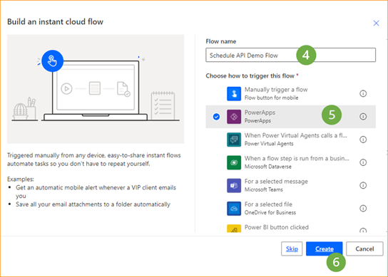
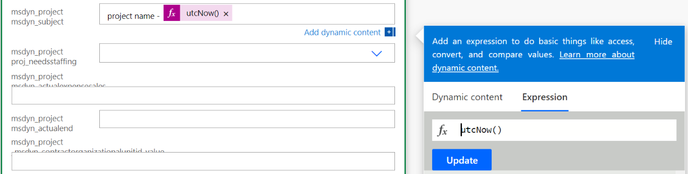
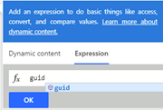

# Use Project schedule APIs wtih Power Automate

_**Applies To:** Project Operations for resource/non-stocked based scenarios, Lite deployment - deal to proforma invoicing_

Overview
========

This topic provides information about how to create a complete project plan by
using Power Automate.

This topic also provides information about how to create an Operation Set and
update an entity.

The steps in the flow are broken down into 3 phases which can be used
independently.

-   Create a Project

-   Create Project team members

-   Create Operation Set

-   Create Project tasks and Resource assignments

-   Update Project Tasks

-   Execute Operation Sets

The following is a complete list of the steps documented in the sample flow:

1.  Create PowerApps trigger

2.  Create Project

3.  Init Team Member

4.  Create Team Member

5.  Create Operation Set

6.  Create Project Buckets

7.  Init Linkstatus

8.  Init Number of tasks

9.  Init ProjectTaskID

10. Do Until

11. Set Project Task

12. Create Project Task

13. Create Resource Assignment

14. Decrement Variable

15. Execute Operation Set

Assumptions
===========

This topic assumes that you have a basic knowledge of the Microsoft Dataverse
platform, Cloud Flows, and the Schedule API. For more information, see the
**References** section later in the topic.

Flow Creation
=============

Select an environment
---------------------

You can author the power automate flow on your environment.

1.  Go to https://flow.microsoft.com and log in with your administrator
    credentials.

2.  In the upper right corner, select **Environments**.

3.  From the list, select the environment that has Dynamics 365 Project
    Operations installed.

Create a solution
-----------------

Complete the following steps to create a [solution aware
flow](https://docs.microsoft.com/en-us/power-automate/overview-solution-flows).
The solution aware flow makes it easier to export the flow to use in the future.

1.  In the navigation pane, select **Solutions**.

2.  On the **Solutions** page, select **New Solution.**

3.  On the **New solution** pane, fill in the required fields, and then select
    **Create**.

Step 1: Create a new Flow and Power Automate trigger
=========================

1.  On the **Solutions** page, select the solution you created.

2.  Select **New**.

3.  In the left pane, select **Cloud flows** \> **Automation** \> **Cloud flow**
    \> **Instant**.

4.  In the **Flow name** field, enter **Schedule API Flow Demo.**

5.  In the **Choose how to trigger this flow** list, select **Power Apps.** When
    you create a Power Apps trigger, the logic is up to you as the author. In
    this topic, leave the input parameters empty for testing purposes.

6.  Select **Create.**

----------------------------------------

Step 2: Create a project 
=========================

Complete the following steps to create a sample project.

1.  In the flow, select **+New Step**

    

2.  In the **Choose an operation** dialog box, in the search box, enter
    **Perform an unbound action** and select it from the results on the
    **Actions** tab.

    

3.  In the step, click on the **Ellipsis** and then select **Rename.**

4.  Rename the step to **Create Project.**

   

5.  In the **Action Name** field, select **msdyn_CreateProjectV1**.

6.  In the **msdyn_subject** field, select **Add Dynamics Content**.

7.  On the **Expression** tab, in the function box, enter **Project name –
    utcNow()**.

8.  Select **OK.**

    

Step 3: Init team member variable
===========================================
1.	In the flow, select **+New Step**
2.	In the **Choose an operation** dialog box, search for **initialize variable** and select it from the results on the **Actions** tab.
3.	In the new step, click on the Ellipsis, and then select **Rename**
4.	Rename the step to **Init team member**.
5.	In the Name field, enter **TeamMemberAction**.
6.	In the Type field, select **String**.
7.	In the Value field, enter **msdyn_CreateTeamMemberV1**.   
  
Step 4: Create generic team member
===========================================
1.	In the flow, select **+New Step**
2.	In the **Choose an operation** dialog box, search for **Perform an unbound action ** and select it from the results on the **Actions** tab.
3.	In the new step, click on the Ellipsis, and then select **Rename**
4.	Rename the step to **Create Team Member**.
5.	In the Action Name field, Select **TeamMemberAction** from the **Dynamic Content** dialog.
6.	In the Action Parameters field, enter:
~~~~ 
{
                "TeamMember": {
                    "@@odata.type": "Microsoft.Dynamics.CRM.msdyn_projectteam",
                    "msdyn_projectteamid": "@{guid()}",
                    "msdyn_project@odata.bind": "/msdyn_projects(@{outputs('Create_Project')?['body/ProjectId']})",
                    "msdyn_name": "ScheduleAPIDemoTM1"
        }
 } 
 ~~~~ 
Below is an explanation of each parameter:

1.	**@@odata.type**: entity name  ("Microsoft.Dynamics.CRM.msdyn_projectteam")
2.	**msdyn_name**: name of the team member. (“ScheduleAPIDemoTM1”)
3.	**msdyn_projectteamid**: is the primary key of the project team ID which is just a GUID expression
 
4.	**msdyn_project@odata.bind:** the project id of the owning project. This will be dynamic content coming from the response of the create project step. Ensure that you type the full path and add dynamic content between the brackets. Note that the quotes are necessary as well. E.g. **"/msdyn_projects(ADD DYNAMIC CONTENT)"**
 
Step 5: Create an operation set
===========================================
1.	In the flow, select **+New Step**
2.  In the **Choose an operation** dialog box, in the search box, enter
    **Perform an unbound action** and select it from the results on the
    **Actions** tab.
3.	In the new step, click on the Ellipsis, and then select **Rename**. 
4.	Rename the step to **Create Operation Set**.
5.	In the Action Name field, select the Dataverse custom action **msdyn_CreateOperationSetV1**
6.	In the Description field, enter **ScheduleAPIDemoOperationSet**
7.	In the Project field, select enter **/msdyn_projects(**
8.	Select **msdyn_CreateProjectV1Response ProjectId** from the Dynamic Content dialog.
9.	In the Project field, enter **)**

Step 6: Create a project bucket
===========================================
1.	In the flow, select **+New Step**
2.  In the **Choose an operation** dialog box, in the search box, enter
    **add a new row** and select it from the results on the
    **Actions** tab.
3.	In the new step, click on the Ellipsis, and then select **Rename**. 
4.	Rename the step to **Create Bucket**.
5.	In the Table Name field, select **Project Buckets**
6.	In the Name field, enter **ScheduleAPIDemoBucket1**
7.	In the Project, select **msdyn_CreateProjectV1Response ProjectId** from the Dynamic Content dialog.

Step 7: Init Link Status
===========================================
1.	In the flow, select **+New Step**
2.	In the **Choose an operation** dialog box, search for **initialize variable** and select it from the results on the **Actions** tab.
3.	In the new step, click on the Ellipsis, and then select **Rename**
4.	Rename the step to **Init linkstatus**.
5.	In the Name field, enter **linkstatus**.
6.	In the Type field, select **Integer**.
7.	In the Value field, enter **192350000**.   

Step 8: Init Number of tasks
===========================================
1.	In the flow, select **+New Step**
2.	In the **Choose an operation** dialog box, search for **initialize variable** and select it from the results on the **Actions** tab.
3.	In the new step, click on the Ellipsis, and then select **Rename**
4.	Rename the step to **Init Number of tasks**.
5.	In the Name field, enter **number of tasks**.
6.	In the Type field, select **Integer**.
7.	In the Value field, enter **5**. 

 Step 9: Init ProjectTaskID
===========================================
1.	In the flow, select **+New Step**
2.	In the **Choose an operation** dialog box, search for **initialize variable** and select it from the results on the **Actions** tab.
3.	In the new step, click on the Ellipsis, and then select **Rename**
4.	Rename the step to **Init ProjectTaskID**.
5.	In the Name field, enter **number of tasks**.
6.	In the Type field, select **String**.
7.	In the Value field, enter **guid()**, in the Expression Builder. 

 Step 10: Do Until 
===========================================
1.  In the flow, select **+New Step**
2.	In the **Choose an operation** dialog box, search for **Do Unit** and select it from the results on the **Actions** tab.
3.	Set the first value in the conditional statement to the **number of tasks** varible from the Dynamic Content
4.	Set the condition to **less than equal to**.
5.	Set the second value in the conditional statement to **0**

