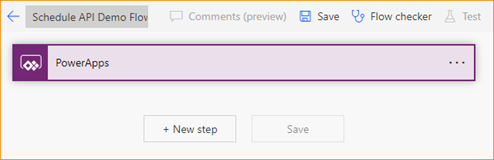
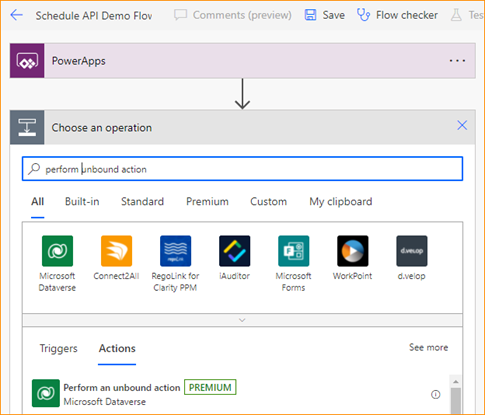
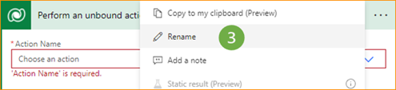

# Use V2 Project schedule APIs with Power Automate

_**Applies To:** Project Operations Integrated with ERP, Project Operations Core_

This article describes a sample flow that shows how to create a complete project plan by using Microsoft Power Automate, how to create an Operation Set, and how to update an entity. The example shows how to create a project, project team member, Operation Sets, project tasks, and resource assignments. This article also explains how to update an entity and run an Operation Set.

The example in this article uses the PssCreateV2 API. For an example that uses the PssCreateV1 API, see [Use V1 Project schedule APIs with Power Automate](scheduling-apis-powerautomate.md).

Here's a complete list of the steps that are documented in the sample flow in this article:

1. [Create a PowerApps trigger](#1)
1. [Create a project](#2)
1. [Initialize a variable for the team member](#3)
1. [Create a generic team member](#4)
1. [Create an Operation Set](#5)
1. [Create a project bucket](#6)
1. [Initialize a variable for the number of tasks](#7)
1. [Initialize a variable for the project task ID](#8)
1. [Initialize an array](#9)
1. [Do until](#10)
1. [Set a project task](#11)
1. [Add a task to the array](#12)
1. [Create a resource assignment](#13)
1. [Decrement a variable](#14)
1. [Add Tasks and Assignments to the Operation Set](#15)
1. [Run an Operation Set](#16)

## Assumptions

This article assumes that you have a basic knowledge of the Dataverse platform, cloud flows, and the Project Schedule API. For more information, see the [References](#references) section later in this article.

## Create a flow

### Select an environment

You can create the Power Automate flow in your environment.

1. Go to <https://flow.microsoft.com>, and use your administrator credentials to sign in.
2. In the upper-right corner, select **Environments**.
3. In the list, select the environment where Dynamics 365 Project Operations is installed.

### Create a solution

Follow these steps to create a [solution-aware flow](/power-automate/overview-solution-flows). By creating a solution-aware flow, you can more easily export the flow to use it later.

1. On the navigation pane, select **Solutions**.
2. On the **Solutions** page, select **New solution**.
3. In the **New solution** dialog box, set the required fields, and then select **Create**.

## <a id="1"></a>Step 1: Create a PowerApps trigger

1. On the **Solutions** page, select the solution that you created, and then select **New**.
2. In the left pane, select **Cloud flows** \> **Automation** \> **Cloud flow** \> **Instant**.
3. In the **Flow name** field, enter **Schedule API Demo Flow**.
4. In the **Choose how to trigger this flow** list, select **Power Apps**. When you create a Power Apps trigger, the logic is up to you as the author. For the example in this article, leave the input parameters blank for testing purposes.
5. Select **Create**.

## <a id="2"></a>Step 2: Create a project

Follow these steps to create a sample project.

1. In the flow that you created, select **New step**.

    

2. In the **Choose an operation** dialog box, in the search field, enter **perform unbound action**. Then, on the **Actions** tab, select the operation in the list of results.

    

3. In the new step, select the ellipsis (**&hellip;**), and then select **Rename**.

    

4. Rename the step **Create Project**.
5. In the **Action Name** field, select **msdyn\_CreateProjectV1**.
6. Under the **msdyn\_subject** field, select **Add dynamic content**.
7. On the **Expression** tab, in the function field, enter **concat('Project name - ',utcNow())**.
8. Select **OK**.

## <a id="3"></a>Step 3: Initialize a variable for the team member

1. In the flow, select **New step**.
2. In the **Choose an operation** dialog box, in the search field, enter **initialize variable**. Then, on the **Actions** tab, select the operation in the list of results.
3. In the new step, select the ellipsis (**&hellip;**), and then select **Rename**.
4. Rename the step **Init team member**.
5. In the **Name** field, enter **TeamMemberAction**.
6. In the **Type** field, select **String**.
7. In the **Value** field, enter **msdyn\_CreateTeamMemberV1**.

## <a id="4"></a>Step 4: Create a generic team member

1. In the flow, select **New step**.
2. In the **Choose an operation** dialog box, in the search field, enter **perform unbound action**. Then, on the **Actions** tab, select the operation in the list of results.
3. In the new step, select the ellipsis (**&hellip;**), and then select **Rename**.
4. Rename the step **Create Team Member**.
5. For the **Action Name** field, select **TeamMemberAction** in the **Dynamic content** dialog box.
6. In the **Action Parameters** field, enter the following parameter information.

    ```
    {
        "TeamMember": {
            "@@odata.type": "Microsoft.Dynamics.CRM.msdyn_projectteam",
            "msdyn_projectteamid": "@{guid()}",
            "msdyn_project@odata.bind": "/msdyn_projects(@{outputs('Create_Project')?['body/ProjectId']})",
            "msdyn_name": "ScheduleAPIDemoTM1"
        }
    } 
    ```

    Here's an explanation of the parameters:

    - **\@\@odata.type** – The entity name. For example, enter **"Microsoft.Dynamics.CRM.msdyn\_projectteam"**.
    - **msdyn\_projectteamid** – The primary key of the project team ID. The value is a globally unique identifier (GUID) expression. The ID is generated from the **Expression** tab.
    - **msdyn\_project\@odata.bind** – The project ID of the owning project. The value is dynamic content that comes from the response of the "Create Project" step. Make sure that you enter the full path and add dynamic content between the parentheses. Quotation marks are required. For example, enter **"/msdyn\_projects(ADD DYNAMIC CONTENT)"**.
    - **msdyn\_name** – The name of the team member. For example, enter **"ScheduleAPIDemoTM1"**.

## <a id="5"></a>Step 5: Create an Operation Set

1. In the flow, select **New step**.
2. In the **Choose an operation** dialog box, in the search field, enter **perform unbound action**. Then, on the **Actions** tab, select the operation in the list of results.
3. In the new step, select the ellipsis (**&hellip;**), and then select **Rename**.
4. Rename the step **Create Operation Set**.
5. In the **Action Name** field, select the **msdyn\_CreateOperationSetV1** Dataverse custom action.
6. In the **Description** field, enter **ScheduleAPIDemoOperationSet**.
7. For the **Project** field, select **msdyn\_CreateProjectV1Response ProjectId** in the **Dynamic content** dialog box.

## <a id="6"></a>Step 6: Create a project bucket

1. In the flow, select **New step**.
2. In the **Choose an operation** dialog box, in the search field, enter **add new row**. Then, on the **Actions** tab, select the operation in the list of results.
3. In the new step, select the ellipsis (**&hellip;**), and then select **Rename**.
4. Rename the step **Create Bucket**.
5. In the **Table Name** field, select **Project Buckets**.
6. In the **Name** field, enter **ScheduleAPIDemoBucket1**.
7. In the **Project** field, enter **/msdyn\_projects(**.
8. In the **Dynamic content** dialog box, select **msdyn\_CreateProjectV1Response ProjectId**.
9. In the **Project** field, enter **)**.

## <a id="7"></a>Step 7: Initialize a variable for the number of tasks

1. In the flow, select **New step**.
2. In the **Choose an operation** dialog box, in the search field, enter **initialize variable**. Then, on the **Actions** tab, select the operation in the list of results.
3. In the new step, select the ellipsis (**&hellip;**), and then select **Rename**.
4. Rename the step **Init Number of tasks**.
5. In the **Name** field, enter **number of tasks**.
6. In the **Type** field, select **Integer**.
7. In the **Value** field, enter **5**.

## <a id="8"></a>Step 8: Initialize a variable for the project task ID

1. In the flow, select **New step**.
2. In the **Choose an operation** dialog box, in the search field, enter **initialize variable**. Then, on the **Actions** tab, select the operation in the list of results.
3. In the new step, select the ellipsis (**&hellip;**), and then select **Rename**.
4. Rename the step **Init ProjectTaskID**.
5. In the **Name** field, enter **msdyn\_projecttaskid**.
6. In the **Type** field, select **String**.
7. For the **Value** field, enter **guid()** in the expression builder.

## <a id="9"></a>Step 9: Initialize an array

1. In the flow, select **New step**.
2. In the **Choose an operation** dialog box, in the search field, enter **initialize variable**. Then, on the **Actions** tab, select the operation in the list of results.
3. In the new step, select the ellipsis (**&hellip;**), and then select **Rename**.
4. Rename the step **Init Array**.
5. In the **Name** field, enter **Tasks and Assignments**.
6. In the **Type** field, select **Array**.

## <a id="10"></a>Step 10: Do until

1. In the flow, select **New step**.
2. In the **Choose an operation** dialog box, in the search field, enter **do until**. Then, on the **Actions** tab, select the operation in the list of results.
3. Set the first value in the conditional statement to the **number of tasks** variable from the **Dynamic content** dialog box.
4. Set the condition to **less than equal to**.
5. Set the second value in the conditional statement to **0**.

## <a id="11"></a>Step 11: Set a project task

1. In the flow, select **Add an action**.
2. In the **Choose an operation** dialog box, in the search field, enter **set variable**. Then, on the **Actions** tab, select the operation in the list of results.
3. In the new step, select the ellipsis (**&hellip;**), and then select **Rename**.
4. Rename the step **Set Project Task**.
5. In the **Name** field, select **msdyn\_projecttaskid**.
6. For the **Value** field, enter **guid()** in the expression builder.

## <a id="12"></a>Step 12: Add a task to the array

1. In the flow, select **Add an action**.
2. In the **Choose an operation** dialog box, in the search field, enter **Append to array**.
3. In the step, select the ellipsis (**&hellip;**), and then select **Rename**.
4. Rename the step **Add Task to Array**.
5. In the **Name** field, select **Tasks and Assignments**.
6. In the **Value** field, enter the following parameter information.

    ```
    {
        "@@odata.type": "Microsoft.Dynamics.CRM.msdyn_projecttask",
        "msdyn_projecttaskid": "@{variables('msdyn_projecttaskid')}",
        "msdyn_project@odata.bind": "/msdyn_projects(@{outputs('Create_Project')?['body/ProjectId']})",
        "msdyn_subject": "ScheduleAPIDemoTask1",
        "msdyn_projectbucket@odata.bind": "/msdyn_projectbuckets(@{outputs('Create_Bucket')?['body/msdyn_projectbucketid']})",
        "msdyn_start": "@{addDays(utcNow(), 1)}",
        "msdyn_scheduledstart": "@{utcNow()}",
        "msdyn_scheduledend": "@{addDays(utcNow(), 5)}",
        "msdyn_LinkStatus": "192350000"
    }
    ```

    Here's an explanation of the parameters:

    - **\@\@odata.type** – The entity name. For example, enter **"Microsoft.Dynamics.CRM.msdyn\_projecttask"**.
    - **msdyn\_projecttaskid** – The unique ID of the task. The value should be set to a dynamic variable from **msdyn\_projecttaskid**.
    - **msdyn\_project\@odata.bind** – The project ID of the owning project. The value is dynamic content that comes from the response of the "Create Project" step. Make sure that you enter the full path and add dynamic content between the parentheses. Quotation marks are required. For example, enter **"/msdyn\_projects(ADD DYNAMIC CONTENT)"**.
    - **msdyn\_subject** – Any task name.
    - **msdyn\_projectbucket\@odata.bind** – The project bucket that contains the tasks. The value is dynamic content that comes from the response of the "Create Bucket" step. Make sure that you enter the full path and add dynamic content between the parentheses. Quotation marks are required. For example, enter **"/msdyn\_projectbuckets(ADD DYNAMIC CONTENT)"**.
    - **msdyn\_start** – Dynamic content for the start date. For example, tomorrow is represented as **"addDays(utcNow(), 1)"**.
    - **msdyn\_scheduledstart** – The scheduled start date. For example, tomorrow is represented as **"addDays(utcNow(), 1)"**.
    - **msdyn\_scheduleend** – The scheduled end date. Select a date in the future. For example, specify **"addDays(utcNow(), 5)"**.
    - **msdyn\_LinkStatus** – The link to the billing setup. For example, enter **"192350000"** if there's no link to the billing setup or **"192350001"** if the billing setup is linked.

## <a id="13"></a>Step 13: Create a resource assignment

1. In the flow, select **Add an action**.
2. In the **Choose an operation** dialog box, in the search field, enter **Append to Array**.
3. In the step, select the ellipsis (**&hellip;**), and then select **Rename**.
4. Rename the step **Add Assignment to Array**.
5. In the **Name** field, select **Tasks and Assignments**.
6. In the **Value** field, enter the following parameter information.

    ```
    {
        "@@odata.type": "Microsoft.Dynamics.CRM.msdyn_resourceassignment",
        "msdyn_resourceassignmentid": "@{guid()}",
        "msdyn_name": "ScheduleAPIDemoAssign1",
        "msdyn_taskid@odata.bind": "/msdyn_projecttasks(@{variables('msdyn_projecttaskid')})",
        "msdyn_projectteamid@odata.bind": "/msdyn_projectteams(@{outputs('Create_Team_Member')?['body/TeamMemberId']})",
        "msdyn_projectid@odata.bind": "/msdyn_projects(@{outputs('Create_Project')?['body/ProjectId']})"
    }
    ```

## <a id="14"></a>Step 14: Decrement a variable

1. In the flow, select **Add an action**.
2. In the **Choose an operation** dialog box, in the search field, enter **decrement variable**. Then, on the **Actions** tab, select the operation in the list of results.
3. In the **Name** field, select **number of tasks**.
4. In the **Value** field, enter **1**.

## <a id="15"></a>Step 15: Add Tasks and Assignments to the Operation Set
1. In the flow, select **New step**.
2. In the **Choose an operation** dialog box, in the search field, enter **perform unbound action**. Then, on the **Actions** tab, select the operation in the list of results.
3. In the step, select the ellipsis (**&hellip;**), and then select **Rename**.
4. Rename the step **Add Tasks and Assignments to Operation Set**.
5. In the **Action Name** field, select **msdyn\_PssCreateV2**.
6. For the **OperationSetId** field, select **msdyn\_CreateOperationSetV1Response OperationSetId** in the **Dynamic content** dialog box.
7. In the **EntityCollection** field, select **Switch Input to Entire Array**.
8. For the **EntityCollection** field, select **Tasks and Assignments** in the **Dynamic content** dialog box.

## <a id="16"></a>Step 16: Run an Operation Set

1. In the flow, select **New step**.
2. In the **Choose an operation** dialog box, in the search field, enter **perform unbound action**. Then, on the **Actions** tab, select the operation in the list of results.
3. In the step, select the ellipsis (**&hellip;**), and then select **Rename**.
4. Rename the step **Execute Operation Set**.
5. In the **Action Name** field, select **msdyn\_ExecuteOperationSetV1**.
6. For the **OperationSetId** field, select **msdyn\_CreateOperationSetV1Response OperationSetId** in the **Dynamic content** dialog box.

## References

- [Overview of how to integrate flows with Dataverse - Power Automate](/power-automate/dataverse/overview?WT.mc_id=email)
- [Use Project schedule APIs to perform operations with Scheduling entities](schedule-api-preview.md)
- [Overview of the cloud flows - Power Automate](/power-automate/overview-cloud?WT.mc_id=email)
- [Overview of solution-aware flows - Power Automate](/power-automate/overview-solution-flows?WT.mc_id=email)
