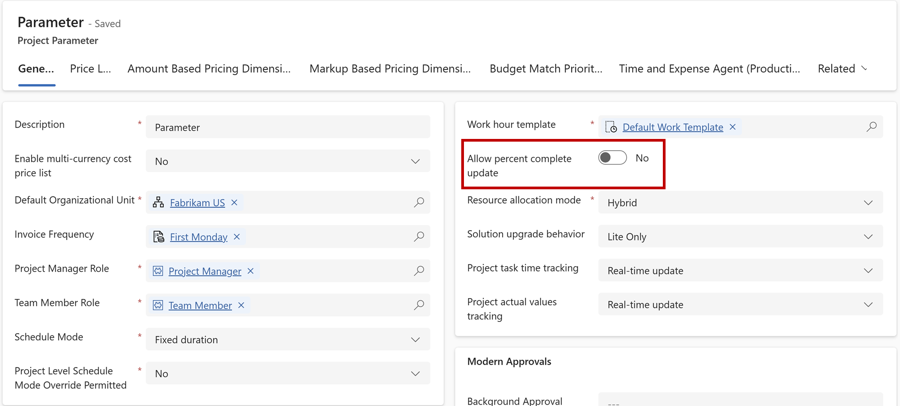
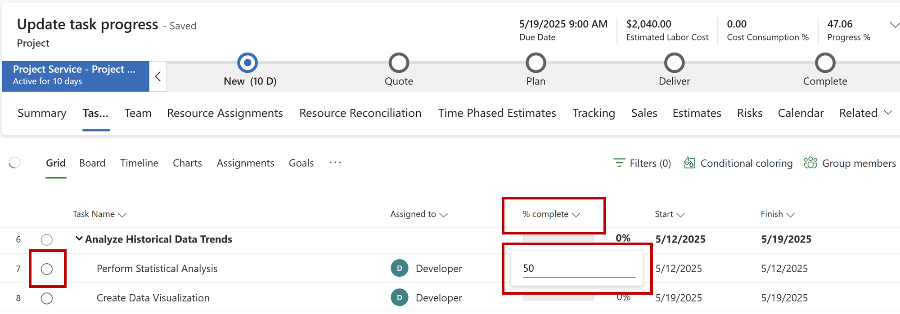

# Update progress of a task

_**Applies To:** Project Operations for resource/non-stocked based scenarios, Lite deployment - deal to proforma invoicing._

In Microsoft Dynamics 365 Project Operations, users can update the progress of a task directly from the task grid. Whether a user is allowed to update the **% Complete** depends on a field called **Allow percent complete update**. This field controls if users can make changes to the **% Complete** from the task grid. This field can have following values:

| Value            | Behavior |
|------------------|----------|
| **No**   | The **% Complete** field can't be updated directly from the task grid. Instead, users must submit their time entry, which updates the **Effort** and adjusts the **% Complete** for the task.|
| **Yes** | The **% Complete** field can be updated directly from the task grid by either entering a number in the **% Complete** column or by selecting the checkbox next to the task name to mark it complete.|

>[!IMPORTANT]
> - Tasks that don't have effort assigned can't be marked as complete.
> - If a project is associated with a contract line, the **Allow percent complete update** field is automatically set to **No**, and users can't change it to **Yes**.
> - Once **Allow percent complete update** is set to **Yes**, it can't be changed back to **No**.

This field is available from two places:
- **Project Parameter** - The value set here is the default for all projects for the selected organization. To change the **Project Parameter**, go to **Settings > Parameters**.
- **Project Summary Page** - A user can change the default value for a specific project by updating it directly at the project level.

## Scenario 1: Allow percent complete update is set to Yes
- **Update the % Complete on task grid** - The **% Complete** field on the task grid is editable. Users can enter any value between 0 and 100 to update the task's completion status. In the background, the value entered in the **% Complete field** is used to calculate and update the **Effort** field on the task grid. Alternatively, users can submit time entry, which updates the **Effort** field and, in turn, adjust the **% Complete** value.
- **Complete the task instantly** - A user can instantly mark a task as complete by checking the box next to the task name, which sets the **% Complete** field to 100%. If the box is unchecked, the task completion resets to 0%, and any previous **% Complete** value isn't saved.

## Scenario 2: Allow percent complete update is set to No
- **Update the % Complete on task grid** - The **% Complete** field can't be edited directly on the task grid. To update it, users must submit time entry, which adjusts the **Effort** field and automatically update the **% Complete** value.
- **Complete the task instantly** - A user can instantly complete a task by checking the box next to the task name. This sets the **Effort Remaining** field to 0, which marks the task as 100% complete. If the checkbox is unchecked, the **% Complete** value returns to its previous state.

[!INCLUDE[footer-include](../includes/footer-banner.md)]
