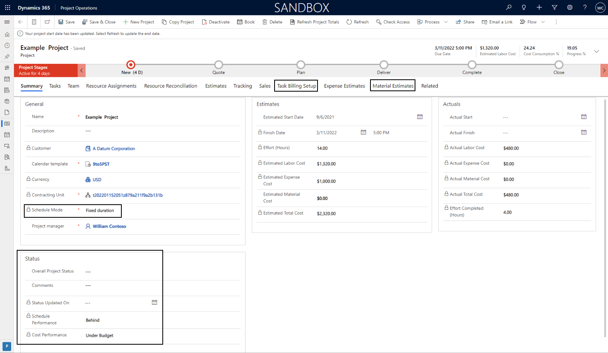

# Upgrade from Project Service Automation to Project Operations

The upgrade from Microsoft Dynamics 365 Project Service Automation to Dynamics 365 Project Operations Lite  will be delivered in three phases.  This article will outline all major changes customers can expect to see when the upgrade has completed.

| Upgrade delivery | Phase 1 (January 2022) | Phase 2 (April Wave 2022) | Phase 3 (April Wave 2022) |
|------------------|------------------------|---------------------------|---------------------------|
| No dependency on the work breakdown structure (WBS) for projects | :heavy_check_mark: | :heavy_check_mark: | :heavy_check_mark: |
| The WBS within the currently supported limits of Project Operations | | :heavy_check_mark: | :heavy_check_mark: |
| The WBS outside the currently supported limits of Project Operations, including support for the Project desktop client | | | :heavy_check_mark: |

Project Management
==================

The most significant changes in the user experience for customer will be in the
area of Project Planning. Project Operations adopts a new modern experience for
managing a work breakdown structure by leveraging the scheduling capabilities
provided by [Project for the
Web](https://support.microsoft.com/en-us/office/what-is-project-for-the-web-c19b2421-3c9d-4037-97c6-f66b6e1d2eb5).

Differences in Scheduling Experience
------------------------------------

The table below summarizes the differences in scheduling in Project Service
Automation vs Project Operations.

|                                                                                                                               | **Project Operations** | **PSA** |
|-------------------------------------------------------------------------------------------------------------------------------|------------------------|---------|
| **Project Templates**                                                                                                         |                        | :heavy_check_mark:       |
| Ability to define project templates and apply them when a project is created.                                                 |                        |         |
| **Project work breakdown structure (WBS)**                                                                                    |                        |  :heavy_check_mark:     |
| WBS integration with desktop client                                                                                           |                        |         |
| **Constraints**                                                                                                               | :heavy_check_mark:                     |         |
| Start no earlier than, finish no later than                                                                                   |                        |         |
| **Milestones**                                                                                                                | :heavy_check_mark:                   |         |
| tasks with zero duration                                                                                                      |                        |         |
| **Resource Driven tasks**                                                                                                     |:heavy_check_mark:                     |         |
| tasks will respect the availability of assigned resources                                                                     |                        |         |
| **Time-Phased Editing**                                                                                                       |                        | :heavy_check_mark:       |
| Edit plans and work on a day-by-day basis.                                                                                    |                        |         |
| **Automatic / Manual Scheduling**                                                                                             |                        | :heavy_check_mark:       |
| Use the Project scheduling engine to automatically schedule tasks, or do it manually.                                         |                        |         |
| **Edit Large Projects directly in the user interface**                                                                        | 500 task limit         | :heavy_check_mark:       |
| No limit to the size of plans that are editable.                                                                              |                        |         |
| **% Complete**                                                                                                                | :heavy_check_mark:                      |         |
| Mark task progress as a percentage of the assigned work that is complete.                                                     |                        |         |
| [Project Schedule Modes](https://docs.microsoft.com/en-us/dynamics365/project-operations/project-management/scheduling-modes) | :heavy_check_mark:                      |         |
| Define the project as fixed units, fixed effort or fixed duration                                                             |                        |         |
| **Timeline**                                                                                                                  | :heavy_check_mark:                      |         |
| Build and customize the timeline view to visualize schedule details and communicate with stakeholders.                        |                        |         |
| **Effort-Driven Tasks**                                                                                                       | :heavy_check_mark:                      |         |
| Scheduling engine support for scheduling a task as effort driven.                                                             |                        |         |
| **Task Information Dialog**                                                                                                   | :heavy_check_mark:                     |         |
| See task details by using a dialog interface.                                                                                 |                        |         |
| **Drag and Drop**                                                                                                             | :heavy_check_mark:                     |         |
| Multi-select tasks and modify their position on the WBS                                                                       |                        |         |
| **Flexible Persistent Views**                                                                                                 | :heavy_check_mark:                      |         |
| Allow users define more granular views of task attributes                                                                     |                        |         |
| **Sorting / Filtering**                                                                                                       | :heavy_check_mark:                     |         |
| Sort or filter the WBS                                                                                                        |                        |         |
| **Boards view**                                                                                                               | :heavy_check_mark:                      |         |
| Boards views for non-waterfall project delivery                                                                               |                        |         |
| **Timeline view**                                                                                                             | :heavy_check_mark:                      |         |
| Interactive gantt chart used to visualize and edit the WBS                                                                    |                        |         |
| **Keyboard Shortcuts**                                                                                                        | :heavy_check_mark:                      |         |
| Use keyboard shortcuts for common operations, such as indent or insert.                                                       |                        |         |
| **Multi-level Undo**                                                                                                          | :heavy_check_mark:                      |         |
| Perform what-if analysis and fully understand the impact of changes by reversing and reapplying an entire set of operations.  |                        |         |
| **Cut / Copy / Paste**                                                                                                        | :heavy_check_mark:                     |         |
| Collaborate on schedule development by copying/pasting schedule details between applications.                                 |                        |         |
| **Task checklists**                                                                                                           | :heavy_check_mark:                      |         |
| Add up to 20 checklist items to a task                                                                                        |                        |         |

Project Planning User Interface
-------------------------------

The default Project main form has a number of notable differences compared to
PSA as highlighted below:

The following ribbon actions have been removed as part of the Phase 1 upgrade:

-   Open in MS Project

-   Create Template

-   Unlink from MS Project

The main form now includes new tabs including:

-   Material Estimates

-   Task Billing Setup

The Status tab has been removed and the status field now appear on the summary
tab along with the project’s scheduling mode.

The schedule tab has been renamed to the Task tab and features the new project
planning experience with Project for the Web.

Scheduling Modes
----------------

Project Operations has introduced a new feature, [Scheduling
Modes](https://docs.microsoft.com/en-us/dynamics365/project-operations/project-management/scheduling-modes).
All existing PSA Projects will be defaulted to **Fixed Duration**. However,
defaulting for new projects can be managed In **Settings \> Parameters \>
Parameter \> Schedule Mode.**

Project Planning limits
-----------------------
Project Oeprations relies upon Project for the Web for all project shceduling operations.   Project for the Web manages the work breakdown structure with the limits outlined below:

| **Field**                                          | **Limit**            |
|----------------------------------------------------|----------------------|
| Maximum total tasks for a project                  | 500                  |
| Maximum total duration for a project               | 3650 days (10 years) |
| Maximum total resources for a project              | 300                  |
| Maximum total links (successor only) for a project | 600                  |
| Maximum total custom fields for a project          | 10                   |
| Maximum hierarchy level                 | 10 levels             |
| Maximum links (successor + predecessor) | 20                    |
| Maximum duration of leaf task           | 1250 days             |
| Maximum duration of a summary task      | 3650 days (10 years)  |
| Maximum resources assigned to a task    | 20 resources          |
| Supported date range for a task         | 1/1/2000 - 12/31/2149 |
| Checklist items                         | 20                    |

Project Templates
-----------------

Project Operations does not provide native support for project templates.
However, customers can replicate much of the core functionality with the use of
the [Project Copy
API](https://docs.microsoft.com/en-us/dynamics365/project-operations/project-management/dev-copy-project).

Desktop Addin support
---------------------

Support for the Microsoft Project Desktop add-in will not be available in the
first 2 phases of the upgrade. In Phase 3, customers who have projects larger
than the currently supported limits of Project for the Web will be able to use

Editing Resource Assignment Contours
------------------------------------

The ability to edit resource assignment contours will be available when Phase 2
of upgrade is available.

Project Planning Extensibility and development
----------------------------------------------

Once upgraded to Project Operations, customers will be required to leverage
Project Scheduling APIs to execute create, update and delete operations on the
following entities:

| **Entity name**         | **Entity logical name**     |
|-------------------------|-----------------------------|
| Project                 | msdyn_project               |
| Project Task            | msdyn_projecttask           |
| Project Task Dependency | msdyn_projecttaskdependency |
| Resource Assignment     | msdyn_resourceassignment    |
| Project Bucket          | msdyn_projectbucket         |
| Project Team Member     | msdyn_projectteam           |

Customers who currently have customizations involving these entities should
refer to the [Project Scheduling API
documentation](https://docs.microsoft.com/en-us/dynamics365/project-operations/project-management/schedule-api-preview)
for implementation guidance.

