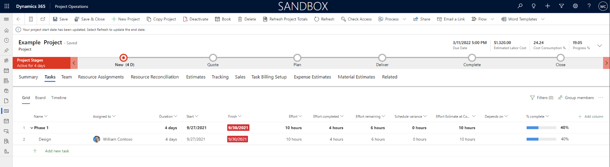
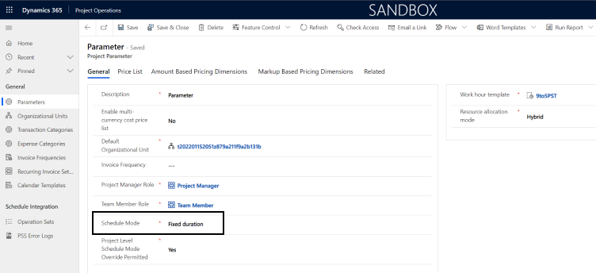

# Feature changes from Project Service Automation to Project Operations

The upgrade from Dynamics 365 Project Service Automation to Dynamics 365 Project Operations  Core will be delivered in three phases. This article provides information about the major changes that you can expect to see when the upgrade is complete.

| Upgrade delivery | Phase 1  (January 2022) | Phase 2  (November 2022) | Phase 3  |
|------------------|------------------------|---------------------------|---------------------------|
| No dependency on the work breakdown structure (WBS) for projects. | :heavy_check_mark: | :heavy_check_mark: | :heavy_check_mark: |
| The WBS is included in the currently supported limits of Project Operations. | &nbsp; | :heavy_check_mark: | :heavy_check_mark: |
| The WBS outside of the currently supported limits of Project Operations, including support for the Project desktop client. | &nbsp; | &nbsp; | :heavy_check_mark: |

## Project management

The most significant changes in the user experience will be in the area of project planning. Project Operations adopts a new modern experience for managing a work breakdown structure (WBS) by leveraging the scheduling capabilities provided by [Project for the Web](https://support.microsoft.com/en-us/office/what-is-project-for-the-web-c19b2421-3c9d-4037-97c6-f66b6e1d2eb5).

## Differences in the scheduling experience

The following table summarizes the scheduling differences between Project Service Automation and Project Operations.

|  Scheduling     |   Project Operations   |   PSA   |
|-----------------|------------------------|---------|
| Project templates - Ability to define and apply project templates when a project is created  |  &nbsp;    | :heavy_check_mark: |
| Project work breakdown structure (WBS) integration with desktop client   |    &nbsp;  | :heavy_check_mark: |
| Constraints - Start no earlier than, finish no later than  | :heavy_check_mark: |   &nbsp;  |
| Milestones - Tasks with zero duration   | :heavy_check_mark:  |  &nbsp;  |
| Resource driven tasks will respect the availability of assigned resources   | :heavy_check_mark: |  &nbsp;    |
| Time-phased editing - Edit plans and work on a day-by-day basis   |   :heavy_check_mark:  | :heavy_check_mark: |
| Automatic/manual scheduling - Use the Project scheduling engine to automatically or manually schedule tasks |  &nbsp; | :heavy_check_mark:  |
| Edit large projects directly in the user interface: There is no limit to the size of plans that are editable  | 500 task limit  | :heavy_check_mark:       |
| Percent complete - Mark task progress   | :heavy_check_mark:  |  &nbsp;  |
| [Project Schedule Modes](../project-management/scheduling-modes.md) - Define the project as fixed units, fixed effort, or fixed duration | :heavy_check_mark: | &nbsp; |
| Timeline - Build and customize the timeline view to visualize schedule details and communicate with stakeholders. | :heavy_check_mark:  | &nbsp; |
| Effort-driven tasks - Scheduling engine support for scheduling a task as effort driven  | :heavy_check_mark:  | &nbsp; |
| **Task information** dialog box - Save task details using a dialog box | :heavy_check_mark:  |  &nbsp;  |
| Drag and drop - Multi-select tasks and modify their position on the WBS | :heavy_check_mark: | &nbsp;  |
| Flexible persistent views - Define more granular views of task attributes   | :heavy_check_mark:  | &nbsp; |
| Sort and filter the WBS  | :heavy_check_mark:  | &nbsp; |
| Boards view for non-waterfall project delivery  | :heavy_check_mark:   | &nbsp; |
| Timeline view - Interactive Gantt chart used to visualize and edit the WBS   | :heavy_check_mark:  | &nbsp; |
| Keyboard Shortcuts - Use keyboard shortcuts for common operations, such as indent or insert  | :heavy_check_mark:  |  &nbsp; |
| Multi-level undo - Perform what-if analysis to fully understand the impact of changes by reversing and reapplying an entire set of operations | :heavy_check_mark: | &nbsp; |
| Cut/Copy/Paste - Collaborate on schedule development by copying and pasting schedule details between applications  | :heavy_check_mark: | &nbsp; |
| Task checklists - Add up to 20 checklist items to a task   | :heavy_check_mark: | &nbsp; |
| Task Sequence identification representation | Rendered in the UI based on msdyn_outlinelevel and msdyn_displaysequence | msdyn_wbsid |

## Project planning

The **Project** page in Project Operations has a significant number of differences compared to the **Project** page in Project Service Automation.

The following actions have been removed from the **Projects** page as part of the Phase 1 upgrade:

  - **Open in MS Project**
  - **Create Template**
  - **Unlink from MS Project**

The **Project** page in Project Operations includes the following new tabs.

- **Material Estimates**
- **Task Billing Setup**

The **Status** tab has been removed and the **Status** field is now on the **Summary** tab with the project’s scheduling mode.

The **Schedule** tab has been renamed to the **Task** tab and features the new project planning experience with Project for the Web.

   

## Scheduling modes

Project Operations has introduced a new feature, [Scheduling modes](../project-management/scheduling-modes.md). All existing Project Service Automation projects will default to **Fixed Duration** in Project Operations. However, the default for new projects can be managed by going to **Settings** > **Parameters** > **Parameter** > **Schedule Mode**.

   

## Project planning limits

Project Operations relies on Project for the Web for all project scheduling operations. Project for the Web manages the work breakdown structure using the limits in the following table.

| **Field**                                          | **Limit**             |
|----------------------------------------------------|-----------------------|
| Maximum total tasks for a project                  | 500                   |
| Maximum total duration for a project               | 3650 days (10 years)  |
| Maximum total resources for a project              | 300                   |
| Maximum total links (successor only) for a project | 600                   |
| Maximum hierarchy level                            | 10 levels             |
| Maximum links (successor + predecessor)            | 20                    |
| Maximum duration of leaf task                      | 1250 days             |
| Maximum duration of a summary task                 | 3650 days (10 years)  |
| Maximum resources assigned to a task               | 20 resources          |
| Supported date range for a task                    | 1/1/2000 - 12/31/2149 |
| Checklist items                                    | 20                    |

## Project planning extensibility and development

After you upgrade to Project Operations, you must use the Project Scheduling APIs to execute create, update, and delete operations on the following entities:

|   Entity name           |   Entity logical name       |
|-------------------------|-----------------------------|
| Project                 | msdyn_project               |
| Project Task            | msdyn_projecttask           |
| Project Task Dependency | msdyn_projecttaskdependency |
| Resource Assignment     | msdyn_resourceassignment    |
| Project Bucket          | msdyn_projectbucket         |
| Project Team Member     | msdyn_projectteam           |

If you currently have customizations that involve these entities, see [Use Project schedule APIs to perform operations with Scheduling entities](../project-management/schedule-api-preview.md) for implementation guidance.

## Data model changes

As part of Upgrade Phase 1, there are changes to the data model. These changes are primarily field changes to existing entities. In Phase 1, the entities, **msydn_project** and **msdyn_projectteam** are a refactoring of customizations. 

> [!IMPORTANT]
> This section will updated with additional entities as future upgrade phases are completed.

The following fields have been replaced with new fields.

|   Entity          |   Old logical name   |   New logical name    |
|-------------------|----------------------|-----------------------|
| msdyn_project     | msdyn_actualhours    | msdyn_effortcompleted |
| msdyn_project     | msdyn_plannedhours   | msdyn_effort          |
| msdyn_project     | msdyn_remaininghours | msdyn_effortremaining |
| msdyn_project     | msdyn_scheduledend   | msdyn_finish          |
| msdyn_project     | msdyn_wbsduration    | msdyn_duration        |
| msdyn_projectteam | msdyn_assignedhours  | msdyn_effort          |
| msdyn_projectteam | msdyn_from           | msdyn_start           |
| msdyn_projectteam | msdyn_to             | msdyn_finish          |
|msdyn\_projecttask|msdyn\_ActualEffort|msdyn\_effortcompleted|
|msdyn\_projecttask|msdyn\_RemainingHours|msdyn\_effortremaining|
|msdyn\_projecttask|msdyn\_scheduledend|msdyn\_finish|
|msdyn\_projecttask|msdyn\_scheduledstart|msdyn\_start|
|msdyn\_projecttask|msdyn\_scheduleddurationminutes| msdyn\_duration|
|msdyn\_projecttask|msdyn\_wbsid|msdyn\_OutlineLevel|
|msdyn\_projecttask|msdyn\_wbsid|msdyn\_DisplaySequence|
|msdyn\_resourceassignment|msdyn\_hours|msdyn\_effort|
|msdyn\_resourceassignment|msdyn\_todate|msdyn\_finish|
|msdyn\_resourceassignment|msdyn\_fromdate|msdyn\_start|

The following fields have been added.

|   Entity          |   Logical name                               |   Description |
|-------------------|----------------------------------------------|---------------|
| msdyn_project     | msdyn_actualfeesales                         | Shows the aggregate of actual fee sales on the project. For use in Project Service Automation only. |
| msdyn_project     | msdyn_actualmaterialcost                     | Shows the aggregate of actual material cost on the project. For use in Project Service Automation only. |
| msdyn_project     | msdyn_actualmaterialsales                    | Shows the aggregate of actual material sales on the project. For use in Project Service Automation only. |
| msdyn_project     | msdyn_businesscase                           |                |
| msdyn_project     | msdyn_contractlineproject                    | The contract line associated with this project. |
| msdyn_project     | msdyn_copyprojectcorrelationid               | This is an internal system field that's used for **Copy Project** related to the Correlation Identifier. For use in Project Service Automation only. |
| msdyn_project     | msdyn_copyprojectsessionid                   | This is an internal system field, used for **Copy Project** related to the Session Identifier. For use in Project Service Automation only. |
| msdyn_project     | msdyn_globalrevisiontoken                    | Last sync xRM Global Revision Token from the Project scheduling service. |
| msdyn_project     | msdyn_msprojectdocument                      | The Microsoft Project document that belongs to the project. |
| msdyn_project     | msdyn_plannedmaterialcost                    | The aggregate of planned material cost on the project. For use in Project Service Automation only. |
| msdyn_project     | msdyn_plannedmaterialsales                   | The aggregate of planned material sales on the project. For use in Project Service Automation only. |
| msdyn_project     | msdyn_program                                | The program this project is related to. |
| msdyn_project     | msdyn_quotelineproject                       | The Quote line associated with this project. |
| msdyn_project     | msdyn_replaylogheader                        | The header for the replay logs. |
| msdyn_project     | msdyn_schedulemode                           | The default scheduling mode used for all tasks on the project.  |
| msdyn_project     | msdyn_taskearlieststart                      | The earliest start date of any task in the project.  |
| msdyn_project     | msdyn_valuestatement                         |                |
| msdyn_projectteam | msdyn_copiedfromprojectteammember            | The project team member that this project team member was copied from. |
| msdyn_projectteam | msdyn_creategenericteammemberwithrequirement | Indicates whether to create the resource requirement for a newly created generic team member.  |
| msdyn_projectteam | msdyn_deletestatus                           | The delete status of the team member to track if there is a delete request sent to the Project scheduling service and whether it successfully sends a response back within the expected time window. |
| msdyn_projectteam | msdyn_effortcompleted                        | Tracks the effort accomplished by the team member on their assignments. |
| msdyn_projectteam | msdyn_effortremaining                        | Tracks the effort yet to be completed by the team member on their assignments. |
| msdyn_projectteam | msdyn_markedfordeletiontimer                 | The waiting period from when the team member sends a delete request to the Project scheduling service until the team member is actually deleted on Microsoft Dataverse.|
| msdyn_projectteam | msdyn_markedfordeletiontimestamp             | The timestamp to record when the team member delete request is sent to the Project scheduling service. |
| msdyn_projectteam | msdyn_copiedfromprojectteammember            | Shows the project team member that this project team member was copied from.  |
|msdyn\_projecttask|msdyn\_actualexpensecost|Shows the aggregate of actual expense cost on the task. System Field. |
|msdyn\_projecttask|msdyn\_actualexpensesales|Shows the aggregate of actual expense sales on the task. |
|msdyn\_projecttask|msdyn\_actualfeesales|Shows the aggregate of actual fee sales on the task. |
|msdyn\_projecttask|msdyn\_actualmaterialcost|Shows the aggregate of actual material cost on the task. |
|msdyn\_projecttask|msdyn\_actualmaterialsales|Shows the aggregate of actual material sales on the task. |
|msdyn\_projecttask|msdyn\_descriptionplaintext|Project task notes in plain text. |
|msdyn\_projecttask|msdyn\_displaysequence|Value that can be used to sort the task by its ID.|
|msdyn\_projecttask|msdyn\_iscritical|Indicates whether this task is in the critical path. |
|msdyn\_projecttask|msdyn\_ismanual|Indicates whether a task is manually scheduled or automatically scheduled. |
|msdyn\_projecttask|msdyn\_LinkStatus|Task Billing Setup link. |
|msdyn\_projecttask|msdyn\_outlinelevel|Indicates the place of a task in the project outline hierarchy.|
|msdyn\_projecttask|msdyn\_plannedexpensecost|Shows the aggregate of the estimated expense cost on the task. |
|msdyn\_projecttask|msdyn\_plannedexpensesales|Shows the aggregate of planned expense sales on the task. |
|msdyn\_projecttask|msdyn\_plannedmaterialcost|Shows the aggregate of estimated material cost on the task. |
|msdyn\_projecttask|msdyn\_plannedmaterialsales|Shows the aggregate of planned material sales on the task. |
|msdyn\_projecttask|msdyn\_projectbucket|The task board can be grouped by bucket so each bucket has its own column. |
|msdyn\_projecttask|msdyn\_summary|Summary Task.|
|msdyn\_projecttask|msdyn\_totalactualcost|Shows the aggregated cost from all project actuals for the task. |
|msdyn\_projecttask|msdyn\_totalactualsales|Shows aggregated sales values from all project actuals for the task. |
|msdyn\_projecttask|msdyn\_totalplannedcost|Shows the aggregate of estimated cost values on the task. |
|msdyn\_projecttask|msdyn\_totalplannedsales|Shows aggregate of estimated sales values on the task. |
|msydn\_resourceassignment|msdyn\_billingtype|Billing Type for the Resource Assignment. |
|msydn\_resourceassignment|msdyn\_effortcompleted|Effort Completed (Hours). |
|msydn\_resourceassignment|msdyn\_effortremaining|Effort Remaining (Hours). |
|msydn\_resourceassignment|msdyn\_salescontractlineid|Unique identifier for Project Contract Line associated with the Resource Assignment. |

## Project templates

Project Operations doesn't provide support for project templates. However, you can replicate much of the core functionality with the use of the [Project Copy API](../project-management/dev-copy-project.md).

## Desktop add-in support

Support for the Microsoft Project Desktop add-in will not be available in the first 2 phases of the upgrade. In Phase 3, customers who have projects larger than the currently supported limits of Project for the Web will be able to use the desktop add-in.

## Editing resource assignment contours

The ability to edit resource assignment contours will be available when Phase 2 of upgrade is available.

## Billing and pricing

The following new features have been added in Project Operations. These features are additive in nature and don't impact the Project Service Automation data model.

- [Recording material usage on projects and project tasks](../material/material-usage-log.md)
- [Subcontract management](../pro/subcontracting/managing-subcontracts-overview.md)
- [Advances and retainer-based contracts](../pro/sales/set-up-advances-retainer-based-contracts-sales.md)
- [Contract not-to-exceed status and validations](../pro/proforma-invoicing/manage-nte-status-validations-sales.md)
- [Task based billing](../pro/sales/mapping-projects-tasks-quote-line-sales.md)

## Deprecated components

The following tables document all deprecated fields that are moved to the deprecated components solution post upgrade. For more information and a link to the solution, see [Dynamics 365 Project Service Automation 3x to Project Operations 4x deprecated components](https://github.com/microsoft/Dynamics365-Project-Operations-PowerApps/tree/main/3x-4x-deprecated-solution).

### invoicedetail

| Fields                                                    |
|-----------------------------------------------------------------------------------------------|
|invoicedetail.msdyn_contractline    |

### msdyn_actual

| Fields                                                    |
|-----------------------------------------------------------------------------------------------|
| msdyn_actual.msdyn_salescontractline                                                          |

### msdyn_characteristicreqforteammember

| Fields                                                    |
|-----------------------------------------------------------------------------------------------|
| msdyn_characteristicreqforteammember.msdyn_characteristic                                     |
| msdyn_characteristicreqforteammember.msdyn_characteristicreqforteammemberid                   |
| msdyn_characteristicreqforteammember.msdyn_characteristictype                                 |
| msdyn_characteristicreqforteammember.msdyn_name                                               |
| msdyn_characteristicreqforteammember.msdyn_ratingvalue                                        |
| msdyn_characteristicreqforteammember.msdyn_resourcerequirementid                              |

### msdyn_contractlineinvoiceschedule

| Fields                                                    |
|-----------------------------------------------------------------------------------------------|
| msdyn_contractlineinvoiceschedule.msdyn_contractline                                          |
| msdyn_contractlinescheduleofvalue.msdyn_contractline                                          |
 
### msdyn_dataexport

| Fields                                                    |
|-----------------------------------------------------------------------------------------------|
| msdyn_dataexport.msdyn_dataexportid                                                           |
| msdyn_dataexport.msdyn_datatoken                                                              |
| msdyn_dataexport.msdyn_entityname                                                             |
| msdyn_dataexport.msdyn_exportedrecordcount                                                    |
| msdyn_dataexport.msdyn_exportstatus                                                           |
| msdyn_dataexport.msdyn_linkedentitydata                                                       |
| msdyn_dataexport.msdyn_name                                                                   |
| msdyn_dataexport.msdyn_pagingdata                                                             |

### msdyn_fact

| Fields                                                    |
|-----------------------------------------------------------------------------------------------|
| msdyn_fact.msdyn_salescontractline                                                            |

### msdyn_findworkevent

| Fields                                                    |
|-----------------------------------------------------------------------------------------------|
| msdyn_findworkevent.msdyn_bookableresource                                                    |
| msdyn_findworkevent.msdyn_findworkeventid                                                     |
| msdyn_findworkevent.msdyn_name                                                                |
| msdyn_findworkevent.msdyn_timestamp                                                           |
| msdyn_findworkevent.msdyn_type                                                                |
| msdyn_findworkevent.msdyn_value                                                               |
| msdyn_findworkevent.msdyn_work                                                                |

### msdyn_invoicelinetransaction

| Fields                                                    |
|-----------------------------------------------------------------------------------------------|
| msdyn_invoicelinetransaction.msdyn_invoiceline                                                |
| msdyn_invoicelinetransaction.msdyn_salescontractline                                          |

### msdyn_journalline

| Fields                                                    |
|-----------------------------------------------------------------------------------------------|
| msdyn_journalline.msdyn_salescontractline                                                     |

### msdyn_opportunitylineresourcecategory

| Fields                                                    |
|-----------------------------------------------------------------------------------------------|
| msdyn_opportunitylineresourcecategory.msdyn_billingtype                                       |
| msdyn_opportunitylineresourcecategory.msdyn_description                                       |
| msdyn_opportunitylineresourcecategory.msdyn_opportunitylineresourcecategoryid                 |
| msdyn_opportunitylineresourcecategory.msdyn_opportunitylinetransactionclassification          |
| msdyn_opportunitylineresourcecategory.msdyn_resourcecategory                                  |

### msdyn_opportunitylinetransaction

| Fields                                                    |
|-----------------------------------------------------------------------------------------------|
| msdyn_opportunitylinetransaction.msdyn_accountcustomer                                        |
| msdyn_opportunitylinetransaction.msdyn_accountingdate                                         |
| msdyn_opportunitylinetransaction.msdyn_accountvendor                                          |
| msdyn_opportunitylinetransaction.msdyn_amount                                                 |
| msdyn_opportunitylinetransaction.msdyn_amount_base                                            |
| msdyn_opportunitylinetransaction.msdyn_amountmethod                                           |
| msdyn_opportunitylinetransaction.msdyn_basisamount                                            |
| msdyn_opportunitylinetransaction.msdyn_basisamount_base                                       |
| msdyn_opportunitylinetransaction.msdyn_basisprice                                             |
| msdyn_opportunitylinetransaction.msdyn_basisprice_base                                        |
| msdyn_opportunitylinetransaction.msdyn_basisquantity                                          |
| msdyn_opportunitylinetransaction.msdyn_billingtype                                            |
| msdyn_opportunitylinetransaction.msdyn_bookableresource                                       |
| msdyn_opportunitylinetransaction.msdyn_contactcustomer                                        |
| msdyn_opportunitylinetransaction.msdyn_contactvendor                                          |
| msdyn_opportunitylinetransaction.msdyn_customertype                                           |
| msdyn_opportunitylinetransaction.msdyn_description                                            |
| msdyn_opportunitylinetransaction.msdyn_documentdate                                           |
| msdyn_opportunitylinetransaction.msdyn_enddatetime                                            |
| msdyn_opportunitylinetransaction.msdyn_exchangeratedate                                       |
| msdyn_opportunitylinetransaction.msdyn_opportunityline                                        |
| msdyn_opportunitylinetransaction.msdyn_opportunitylinetransactionid                           |
| msdyn_opportunitylinetransaction.msdyn_percent                                                |
| msdyn_opportunitylinetransaction.msdyn_price                                                  |
| msdyn_opportunitylinetransaction.msdyn_price_base                                             |
| msdyn_opportunitylinetransaction.msdyn_pricelist                                              |
| msdyn_opportunitylinetransaction.msdyn_product                                                |
| msdyn_opportunitylinetransaction.msdyn_project                                                |
| msdyn_opportunitylinetransaction.msdyn_quantity                                               |
| msdyn_opportunitylinetransaction.msdyn_resourcecategory                                       |
| msdyn_opportunitylinetransaction.msdyn_resourceorganizationalunitid                           |
| msdyn_opportunitylinetransaction.msdyn_startdatetime                                          |
| msdyn_opportunitylinetransaction.msdyn_task                                                   |
| msdyn_opportunitylinetransaction.msdyn_transactioncategory                                    |
| msdyn_opportunitylinetransaction.msdyn_transactionclassification                              |
| msdyn_opportunitylinetransaction.msdyn_transactiontypecode                                    |
| msdyn_opportunitylinetransaction.msdyn_unit                                                   |
| msdyn_opportunitylinetransaction.msdyn_unitschedule                                           |
| msdyn_opportunitylinetransaction.msdyn_vendortype                                             |

### msdyn_opportunitylinetransactioncategory

| Fields                                                    |
|-----------------------------------------------------------------------------------------------|
| msdyn_opportunitylinetransactioncategory.msdyn_billingtype                                    |
| msdyn_opportunitylinetransactioncategory.msdyn_description                                    |
| msdyn_opportunitylinetransactioncategory.msdyn_opportunitylinetransactioncategoryid           |
| msdyn_opportunitylinetransactioncategory.msdyn_opportunitylinetransactionclassification       |
| msdyn_opportunitylinetransactioncategory.msdyn_transactioncategory                            |

### msdyn_opportunitylinetransactionclassificatio

| Fields                                                    |
|-----------------------------------------------------------------------------------------------|
| msdyn_opportunitylinetransactionclassificatio.msdyn_billingtype                               |
| msdyn_opportunitylinetransactionclassificatio.msdyn_description                               |
| msdyn_opportunitylinetransactionclassificatio.msdyn_include                                   |
| msdyn_opportunitylinetransactionclassificatio.msdyn_opportunityline                           |
| msdyn_opportunitylinetransactionclassificatio.msdyn_opportunitylinetransactionclassificatioid |
| msdyn_opportunitylinetransactionclassificatio.msdyn_transactionclassification                 |

### msdyn_orderlineresourcecategory

| Fields                                                    |
|-----------------------------------------------------------------------------------------------|
| msdyn_orderlineresourcecategory.msdyn_contractline                                            |

### msdyn_orderlinetransaction

| Fields                                                    |
|-----------------------------------------------------------------------------------------------|
| msdyn_orderlinetransaction.msdyn_salescontractline                                            |
| msdyn_orderlinetransactioncategory.msdyn_contractline                                         |

### msdyn_orderlinetransactionclassification

| Fields                                                    |
|-----------------------------------------------------------------------------------------------|
| msdyn_orderlinetransactionclassification.msdyn_contractline                                   |

### msdyn_project

| Fields                                                    |
|-----------------------------------------------------------------------------------------------|
| msdyn_project.msdyn_actualdurationminutes                                                     |
| msdyn_project.msdyn_actualhours                                                               |
| msdyn_project.msdyn_istemplate                                                                |
| msdyn_project.msdyn_plannedhours                                                              |
| msdyn_project.msdyn_projecttemplate                                                           |
| msdyn_project.msdyn_remaininghours                                                            |
| msdyn_project.msdyn_scheduleddurationminutes                                                  |
| msdyn_project.msdyn_scheduledend                                                              |
| msdyn_project.msdyn_stagename                                                                 |
| msdyn_project.msdyn_wbsduration                                                               |

### msdyn_projecttask

| Fields                                                    |
|-----------------------------------------------------------------------------------------------|
| msdyn_projecttask.msdyn_actualdurationminutes                                                 |
| msdyn_projecttask.msdyn_actualeffort                                                          |
| msdyn_projecttask.msdyn_aggregationdirection                                                  |
| msdyn_projecttask.msdyn_assignedresources                                                     |
| msdyn_projecttask.msdyn_assignedteammembers                                                   |
| msdyn_projecttask.msdyn_autoscheduling                                                        |
| msdyn_projecttask.msdyn_costestimatecontour                                                   |
| msdyn_projecttask.msdyn_effortcontour                                                         |
| msdyn_projecttask.msdyn_islinetask                                                            |
| msdyn_projecttask.msdyn_numberofresources                                                     |
| msdyn_projecttask.msdyn_remaininghours                                                        |
| msdyn_projecttask.msdyn_resourceutilization                                                   |
| msdyn_projecttask.msdyn_salesestimatecontour                                                  |
| msdyn_projecttask.msdyn_scheduledhours                                                        |
| msdyn_projecttask.msdyn_wbsid                                                                 |

### msdyn_projecttaskstatususer

| Fields                                                    |
|-----------------------------------------------------------------------------------------------|
| msdyn_projecttaskstatususer.msdyn_bookableresource                                            |
| msdyn_projecttaskstatususer.msdyn_description                                                 |
| msdyn_projecttaskstatususer.msdyn_expectedcompletiondate                                      |
| msdyn_projecttaskstatususer.msdyn_expectedhourstocomplete                                     |
| msdyn_projecttaskstatususer.msdyn_iscompleted                                                 |
| msdyn_projecttaskstatususer.msdyn_name                                                        |
| msdyn_projecttaskstatususer.msdyn_percentcomplete                                             |
| msdyn_projecttaskstatususer.msdyn_projecttaskid                                               |
| msdyn_projecttaskstatususer.msdyn_projecttaskstatusindicator                                  |
| msdyn_projecttaskstatususer.msdyn_projecttaskstatususerid                                     |

### msdyn_projectteam

| Fields                                                    |
|-----------------------------------------------------------------------------------------------|
| msdyn_projectteam.msdyn_applicantcount                                                        |
| msdyn_projectteam.msdyn_applicantsavailable                                                   |
| msdyn_projectteam.msdyn_assignedhours                                                         |
| msdyn_projectteam.msdyn_description                                                           |
| msdyn_projectteam.msdyn_from                                                                  |
| msdyn_projectteam.msdyn_hoursrequested                                                        |
| msdyn_projectteam.msdyn_membershipstatus                                                      |
| msdyn_projectteam.msdyn_number                                                                |
| msdyn_projectteam.msdyn_to                                                                    |

### msdyn_projectteammembersignup

| Fields                                                    |
|-----------------------------------------------------------------------------------------------|
| msdyn_projectteammembersignup.msdyn_bookableresource                                          |
| msdyn_projectteammembersignup.msdyn_membershipstatus                                          |
| msdyn_projectteammembersignup.msdyn_name                                                      |
| msdyn_projectteammembersignup.msdyn_projectteammembersignupid                                 |
| msdyn_projectteammembersignup.msdyn_teammembership                                            |

### msdyn_projecttransactioncategory

| Fields                                                    |
|-----------------------------------------------------------------------------------------------|
| msdyn_projecttransactioncategory.msdyn_billingtype                                            |
| msdyn_projecttransactioncategory.msdyn_name                                                   |
| msdyn_projecttransactioncategory.msdyn_project                                                |
| msdyn_projecttransactioncategory.msdyn_projecttransactioncategoryid                           |
| msdyn_projecttransactioncategory.msdyn_transactioncategory                                    |

### msdyn_quotelineinvoiceschedule

| Fields                                                    |
|-----------------------------------------------------------------------------------------------|
| msdyn_quotelineinvoiceschedule.msdyn_quoteline                                                |
| msdyn_quotelineresourcecategory.msdyn_quoteline                                               |
| msdyn_quotelinescheduleofvalue.msdyn_quoteline                                                |
| msdyn_quotelinetransaction.msdyn_quoteline                                                    |
| msdyn_quotelinetransactioncategory.msdyn_quoteline                                            |
| msdyn_quotelinetransactionclassification.msdyn_quoteline                                      |

### msdyn_resourceassignment

| Fields                                                    |
|-----------------------------------------------------------------------------------------------|
| msdyn_resourceassignment.msdyn_hours                                                          |
| msdyn_resourceassignment.msdyn_fromdate                                                       |
| msdyn_resourceassignment.msdyn_msprojectclientid                                              |
| msdyn_resourceassignment.msdyn_todate                                                         |
| msdyn_resourceassignmentdetail.msdyn_duration                                                 |
| msdyn_resourceassignmentdetail.msdyn_from                                                     |
| msdyn_resourceassignmentdetail.msdyn_name                                                     |
| msdyn_resourceassignmentdetail.msdyn_resourceassignmentdetailid                               |
| msdyn_resourceassignmentdetail.msdyn_resourceassignmentid                                     |

### salesorderdetail

| Fields                                                    |
|-----------------------------------------------------------------------------------------------|
| salesorderdetail.msdyn_quoteline                                                              |

