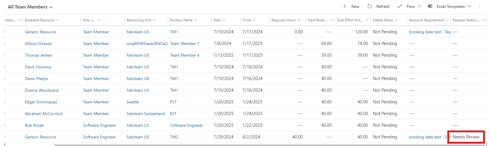
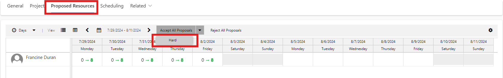

# Accept or reject a proposed project resource

_**Applies To:** Project Operations Integrated with ERP, Core deployment - deal to proforma invoicing._

This article provides information about how to approve or reject a proposed project resource.

When a Resource Manager proposes a named resource to fill the generic resource request for a project, the **Request Status** field for the generic team member is be updated to **Needs Review**. The request is sent to the project manager for approval or rejection.

The grid on the **Proposed Resources** tab on the **Project Team Member** page shows the proposed resource’s current bookings. After the proposal is accepted, the grid is updated to reflect that booking. 

To accept the proposed resource and book that resource on your team, click **Accept Proposals**.  
To reject the proposal, click **Reject Resource**.

 

Similar to directly fulfilling a generic resource request with a named resource, the generic resource is replaced and the assigned tasks is updated with the named team member.

[!INCLUDE[footer-include](../includes/footer-banner.md)]
