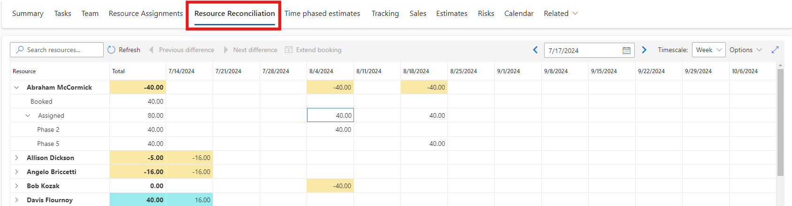

# Book named bookable resources to a project team and assign tasks 

_**Applies To:** Project Operations Integrated with ERP, Core deployment - deal to proforma invoicing_

You can  add a named resource to your project team by booking them directly onto the team. To do this, complete the following steps.

1. In  Project Operations, go to **Projects**, and select the project that you're booking for.
2. On the **Project** page, on the **Team** tab, click **New**. 

3. In the **Quick Create Project Team Member** dialog box, select the bookable resource. The **Role** field populates with the resource's default role if they have one assigned. You can change the role if needed. 
4. Select the from and to dates that the resource is needed and select the allocation method of the resource's capacity. 
5. If you want the team member to be a project approver, select **Yes** in the **Project Approver** field. This means the team member can approve submitted time and expense entries for this project. 
6. Click **Save**.

You can now assign the booked resource to tasks on the project. On the **Project** page, select the **Tasks** tab to assign tasks to the new resource. The resource picker that is launched from the **Assigned to** column in the grid view shows the team members that you can select.

In Project Operations, resource bookings and task assignments aren't tightly coupled. This means that when you use the resource picker in the schedule, you can assign tasks to team members for more hours than their bookings cover on the project. You can see the differences between team member bookings and assignments on the **Team** tab or on the **Resource Reconciliation** tab. You can also reconcile the differences between bookings and assignments for resources at a more detailed level.

You can use the **Reconciliation** tab’s extend booking capability or the **Schedule Board** to create bookings which aligns the resource's assignments and bookings for the selected time period.

After a team member is booked on your project, you can select **Maintain bookings** on the team tab or use the Schedule Board directly to manage their bookings.

[!INCLUDE[footer-include](../includes/footer-banner.md)]
