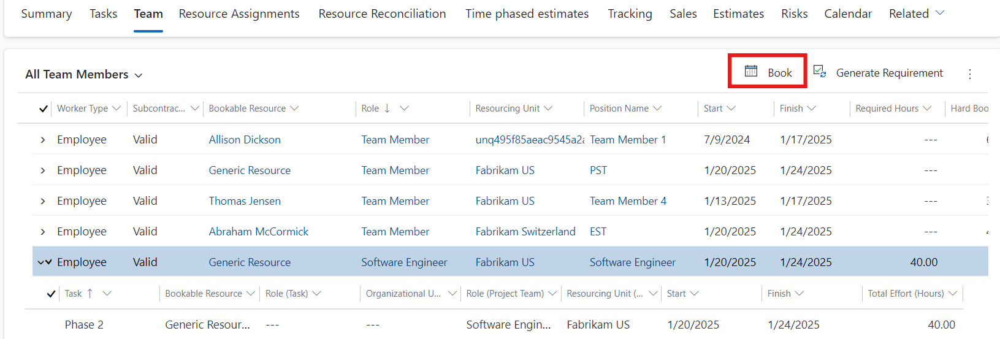
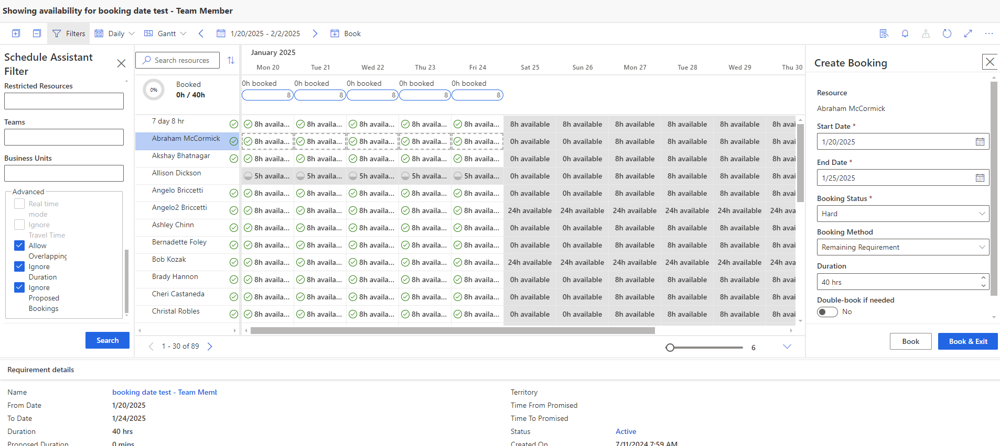
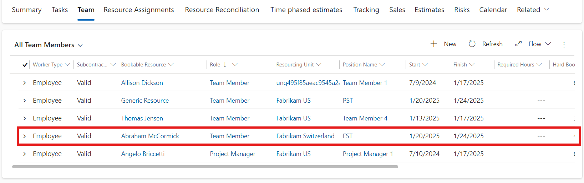
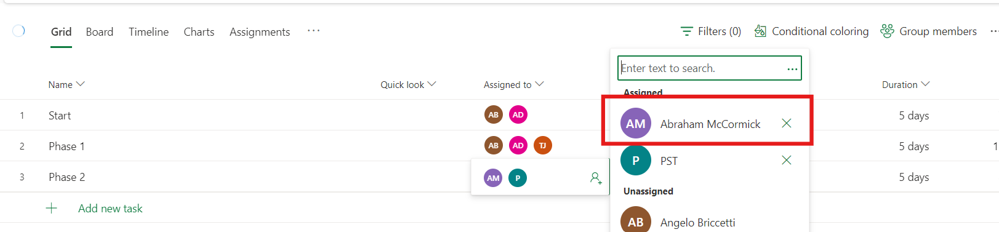
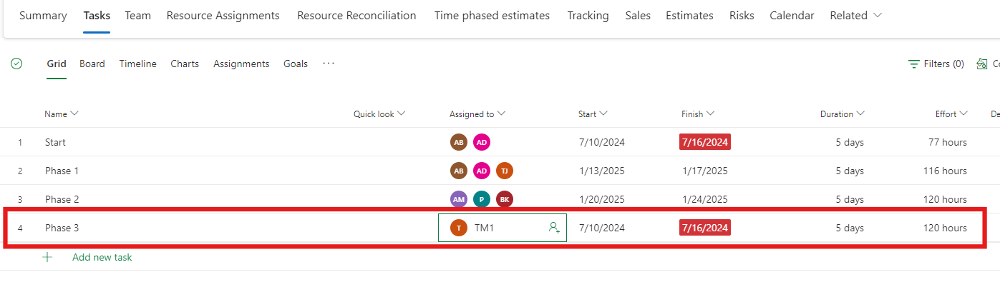
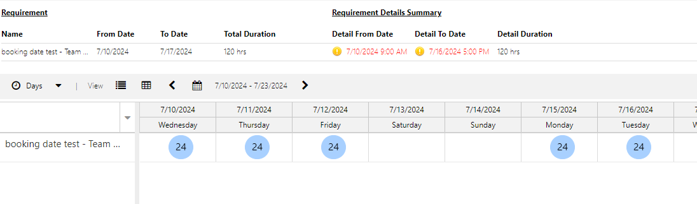
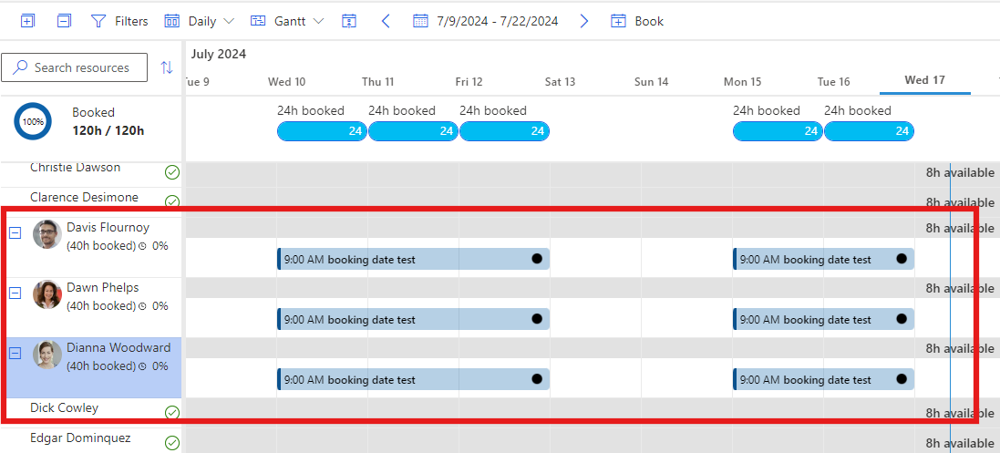

# Book named resources from resource requirements

_**Applies To:** Project Operations Integrated with ERP, Project Operations Core_

You can book a named resource to replace generic resource that has a resource requirement.

1. In Project Operations, on the **Projects** page, click the **Team** tab.
2. Select the generic resource that has a resource requirement from the list and then click **Book**. Or, open the resource requirement and then click **Book**.

3. On the **Schedule Assistant** page, select a named resource to book onto your project team and then click **Book**.

When the booking is complete and fulfilled by a named resource, the generic resource is replaced with the named resource.

The assignments on the schedule are updated with the named resource as well.

## Fulfill a generic resource with multiple named resources
Fulfilling a requirement for a generic resource with multiple named resources is similar to assigning a single named resource. For example, there's a task with a duration of five days and 120 hours of effort. This task can't be completed by one resource that works a typical eight-hour day over a five day week. 

The requirement is for 120 hours of robotics engineering over five days, which is 24 hours per day.

This is an example of when multiple named resources are needed to fulfill a generic resource request. You need to book multiple resources to fulfill the requirement.

The main difference in this scenario is that the generic resource remains on the team assigned to the task, and the booked named resource team members aren't assigned as part of the position. The project manager can assign the work as appropriate to the named resources. The **Reconciliation** view can assist a project manager in breaking up the bookings across multiple resources to task assignments. This isn't done automatically because in any scenario more complicated than the simple example above, such as where you have a bundle of tasks making up the requirement, the intent of how the project manager wants to assign, needs to be assumed by the system. Because the system can't understand intent, chances are that the assumptions are different than intended and an incorrect or unpredictable results happen. The predictable outcome is that the generic resource remains assigned until the project manager deliberately creates assignments, with the assistance of the **Reconciliation** view.

[!INCLUDE[footer-include](../includes/footer-banner.md)]
