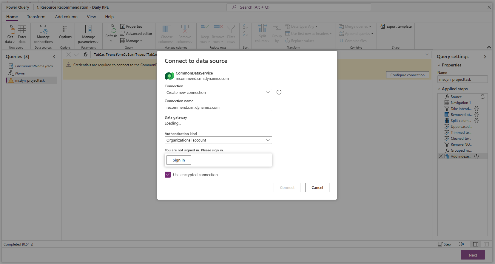
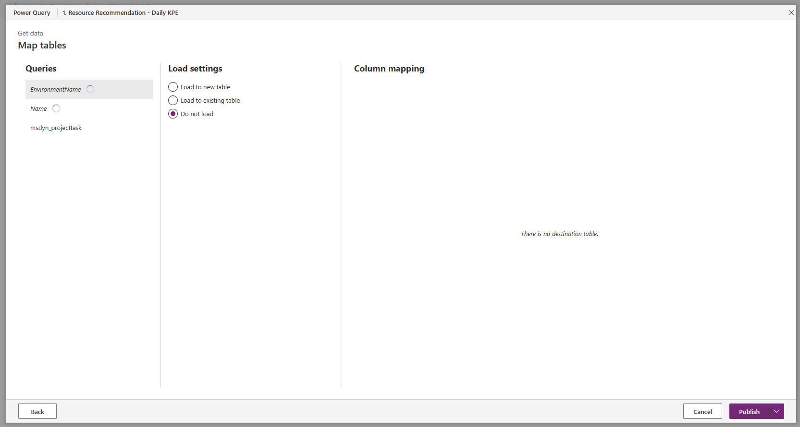
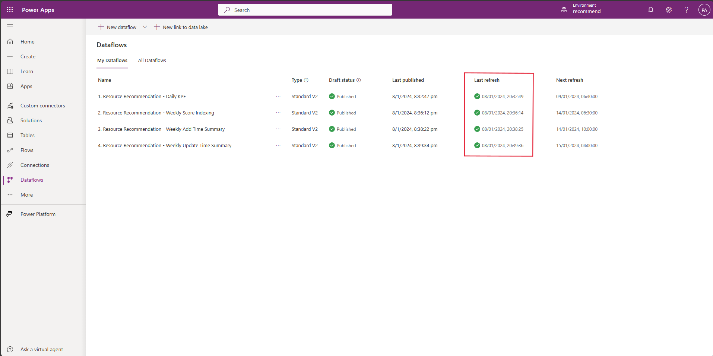

---
# required metadata

title: Enable resource recommendations for a project team member (preview)
description: This article provides information about steps to be completed to use the resource recommendations feature for the first time.
author: mohitmenon
ms.date: 1/10/2024
ms.topic: how-to
ms.custom: 
  - bap-template
ms.reviewer: johnmichalak
ms.author: mohitmenon
---

# Prerequisites to use resource recommendations (preview)

[!INCLUDE[banner](../includes/banner.md)]

_**Applies To:** Project Operations for resource/non-stocked based scenarios, Lite deployment - deal to proforma invoicing_

[!INCLUDE [preview-banner](../includes/preview-banner.md)]

## Enabling the resource recommendations feature

To enable resource recommendations, follow these steps:

1.	Sign in to Microsoft **Dynamics 365 Project Operations**.
1.	In the left navigation, change the area to **Settings**.
1.	In the **General** section, select **Parameters**.
1.	You should see a list of organization units. Double-tap (or double-click) the Organization Units row for the columns that aren't links.
1.	On the **Project Parameters** page, in the **Feature Control** field, select **Feature Control**.
1.	Select **Enable Resource Recommendation Engine Feature**, and then **OK**.

After you complete these steps, you must activate four dataflows.

## Get your System Administrator to activate dataflows 

After you enable resource recommendations, your System Administrator must activate four [dataflows](/power-apps/maker/data-platform/create-and-use-dataflows). This mandatory, one-time step must be completed for every new environment on which this feature is enabled. These workflows prepare the data infrastructure that is required to generate optimal recommendations for any new project team member.

To activate these dataflows, have your System Administrator complete the following steps:

1. Sign in to your Microsoft **Dynamics 365 Project Operations** environment as System Administrator.
1. Within the same window, open a new tab and sign in to the [**Power Apps Portal**](https://make.powerapps.com) as System Administrator. For more information on the Power Apps portal, see [this page](/power-apps/maker/canvas-apps/sign-in-to-power-apps).
1. In the **Environments** section on the top-right, ensure that the environment you're logged into is selected. 
    - To view your environment name, navigate to your environment, select the profile icon and copy the environment name from top-left of the dialog that appears.
1. On the left navigation pane, select **Dataflows**. If this option isn't directly visible, then select **More** and then **Dataflows**.
1. Select the **My Dataflows** tab, this tab should display a list of four dataflows (apart from previously existing items). These are: 
    - **1. Resource Recommendation - Daily KPE**
    - **2. Resource Recommendation - Weekly Scoring Indexing**
    - **3. Resource Recommendation - Weekly Add Time Summary**
    - **4. Resource Recommendation - Weekly Update Time Summary**
   
>[!NOTE]
> Each Dataflow has a number as prefix, to indicate the order in which they need to be activated. Ensure that they are **activated in this order** only.

## Steps to activate a dataflow

1. Start with the first dataflow, **1. Resource Recommendation - Daily KPE**. Select the overflow icon (three dots) and select **Edit**. This action navigates you to a Power Query page, with details for the selected dataflow.
1. Select the **_EnvironmentName_ parameter** and enter the URL of the environment being used **without https**, (for example, recommend.crm.dynamics.com) within the space provided for **Current Value**, replacing the placeholder text _({{envName}})_.
1. On the **Queries** pane, select the first item after _EnvironmentName_ and _Name_, this item must have a warning (exclamation) icon next to it. For the first dataflow, this item is **msdyn_projecttask**.
    -  An error appears that says **Credentials are required to connect to the CommonDataService source**. Select **Configure Connection**.
1. If you're doing this step for the first time, a dialog box appears named **Connect to a data source** with Connection as _Create a new connection_, Connection Source as the name of your environment and Authentication Kind as _Organizational account_ _(refer to the image shown for reference)_. Select **Sign in** and enter your (System Administrator) user credentials once again.
    - Once sign in is complete, select **Connect** _(if you receive any other errors at this step, hit "Refresh" from the tool bar)_
    - If it isn't the first time you're going through this step, directly select **Connect**.
  

5. Then, click **Next**. You see a new page, where the **Publish** button may take up to 2 minutes to be active.
6. Once active, click **Publish** and you're redirected back to the dataflows page _(refer to the image shown for reference)_. 

7. Repeat **Steps 1 to 6** for the remaining dataflows, in order of their numbering.

## Completing prerequisites

- Once all the workflows have a green tick in their **Last refresh** column, you completed the prerequisites to use this feature _(refer to the image shown for reference)_.   
        - _Depending on the number of projects and tasks in your environment, it could take **up to 24 hours** for all dataflows to complete their refresh_.

- If any of these dataflows fail to refresh, submit a support ticket to receive assistance.

    >[!NOTE]
    > If the System Administrator user account that was used to activate these dataflows for the first time is deleted or deactivated, these steps must be repeated again using new, active System Administrator credentials.

- For more information on how to use the feature, see [Get Recommendations for Project Team Members](./get-recommendations-for-project-team-members.md).
