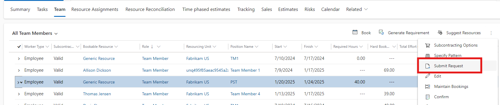

# Submitting a resource request

_**Applies To:** Project Operations Integrated with ERP, Project Operations Core_

You can submit a generated resource requirement as a resource request. The system sends the request to a Resource Manager for fulfillment.

1. In Project Operations, on the **Projects** page, select the **Team** tab to view a list of bookable resources. 
1. Select the generic resource that has a resource requirement from the list and then select **Submit Request**.

The request status of the generic team member changes to **Submitted**.

If the Resource Manager fulfills the request by booking a named resource, the generic resource is replaced by the named resource. Otherwise, the generic resource remains on the team. If the Resource Manager proposes a named resource, the request status changes to **Needs Review**.

[!INCLUDE[footer-include](../includes/footer-banner.md)]
