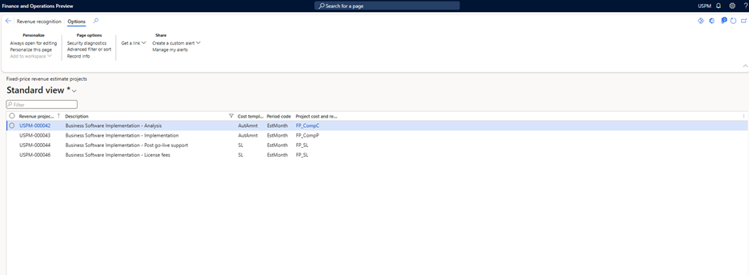
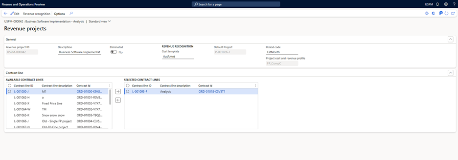

# Contract line based revenue recognition with Project operations

_**Applies To:** Project Operations for resource/non-stocked based scenarios_

To use the **Contract line-based revenue recognition with Project operations** feature, activate **Enable contract line-based revenue recognition with Project Operations for non-stocked/resource-based scenarios**. Once this feature is enabled, it can't be disabled. All of the older projects or revenue recognition projects can be managed.

When this feature is enabled, Microsoft Dynamics 365 for Finance only generates the revenue recognition for each contract line that's used as a fixed price billing method.

This feature allows you to recognize the revenue for each contract line that's associated with the contract. Contract line-based revenue recognition provides the flexibility to define different revenue recognition methods for contract line, then Dynamics 365 for Finance generates and posts the revenue recognition amounts accordingly.

## Fixed price revenue estimate project with contract line

When you create a project contract line with the following attributes in Dynamics 365 Project Operations on Microsoft Dataverse, the system automatically creates a fixed price revenue estimate project. The information in this project is based on the following:

- A fixed price billing method.
- An associated project.
- At least one milestone defined on the **Invoice schedule** tab on the **Project contract line** page.

When **Enable contract line-based revenue recognition with Project Operations for non-stocked/resource-based scenario** is activated, Dynamics 365 for Finance generates a fixed-price revenue estimate project for each contract line that utilizes a fixed-price billing method and has defined milestone.

For more information about **Project contract lines** in **Dataverse** and how contract lines are linked with project tasks, see [Project contract lines overview](../pro/sales/manage-contract-values-project-based-sales.md).

For more information about mapping projects and tasks to a project contract line, see [Map projects and tasks to a project contract line](../pro/sales/mapping-projects-tasks-contract-line-sales.md).

## Review project contracts for contract lines

To review the project contract lines or to update additional details in Dynamics 365 Finance, follow these steps.

1. In the **Dynamics 365 Finance** environment, go to **Project management and accounting** \> **Projects** \> **Project contracts**.
1. Select **Show default accounting** on the **Project contract** action pane.
1. Select the **Contract line** from the drop down for defaulting the financial dimensions applicable for the contract line.
1. Specify the **Start date** and **End date** if the **Straight line revenue recognition** principal is applied on the **Revenue recognition project** for the selected contract line. The **Start date** and **end date** is used to calculate the number of days required for **Straight line revenue recognition** principal.

## Review fixed price revenue estimates projects.

To review fixed price revenue estimates projects, follow these steps.

1. In the **Dynamics 365 Finance** environment, go to **Project management and accounting** \> **Projects** \> **Fixed price revenue estimate projects**.
1. Select the **Revenue project** that you want to view, and then double-click the **Estimate project ID** to open the record and review the details of the project.
1. Select the **Default project** on the header which is required to post the estimated revenue recognition amount. All the required financial postings are generated for the project defined at the Revenue recognition project header. Dynamics 365 for finance retrieves the financial dimensions from the project and utilizes them to record the financial transactions to revenue recognition.
1. Select the **Cost template** on the header. This template is used to do the required calculations like completed percentage, completed contract or straight line.
1. Expand the  **Contract line**  tab. You'll see one contract line in the Selected contract lines grid. This is the default contract line for which the revenue recognition project has been created.
1. To change the association, select additional contract lines and add them to the selected contract lines grid. If multiple contract lines are selected in this grid, the percentage completion and revenue estimates are calculated together for of all selected contract lines.
1. For the **Straight line revenue recognition** principal, only one contract line is applicable for one **revenue recognition project**. You can't add multiple contract lines for one revenue recognition project when using the **Straight line revenue recognition** principal.

**Project cost**, **Revenue profile**, **Cost template**, and **Period code** can be set manually. If they aren't set manually, the values default during the first estimate calculation for the project using the rules configured for project cost and revenue profiles.

### Example Scenario

Contoso systems awarded one contract to implement Business applications for one of their customers. As per the agreement, the entire implementation is divided into the following phases:

1. **License Fee** – Fixed price. Contoso finance team has decided to accrue revenue based upon straight line method.
1. **Analysis** – Fixed price. Contoso finance team has decided to accrue the revenue based upon completed contract method.
1. **Implementation** – Fixed price. Contoso finance team has decided to accrue the revenue based upon completed percentage method.
1. **Post go-live support** – Fixed Price. Contoso finance team has decided to accrue the revenue based upon straight line method.

In **Project Operations** on **Dataverse** a new project and a new project contract is created for the customer.

The following screen displays the project created in **Dataverse.** This project has multiple tasks associated with.

The following screen displays the project contract created in **Dataverse.**

The following screen displays the project contract lines created in **Dataverse** and all the contract lines are configured as billing method **Fixed price.** 
There are four contract lines created for each phase of the project and each contract line has **Fixed price** billing method.

The following screen displays the **Fixed price revenue estimate projects** in **Dynamics 365 for finance** for each contract line. 
For each contract line as per the screenshot above, there's one **Fixed price revenue estimate project** created in Dynamics 365 for Finance.

The following screen displays the **Revenue project** for implementation phase. Select the **Default project** and **Project cost and revenue profile.** 

Default project is required to post the accrued revenue amount which impact the project subledger. Project cost and revenue profile are required to identify the revenue recognition accounting rule applicable for the revenue project.

## Recommended content

[Project contract lines overview](../pro/sales/manage-contract-values-project-based-sales.md)

This article provides an overview of project contract lines.

[Map projects and tasks to a project contract line](../pro/sales/mapping-projects-tasks-contract-line-sales.md)

This article provides an overview of mapping projects and tasks to a project contract line.

[Manage revenue estimates](rev-rec-completed-contract-method.md)

This article provides an overview of managing and executing the revenue recognition estimates.
