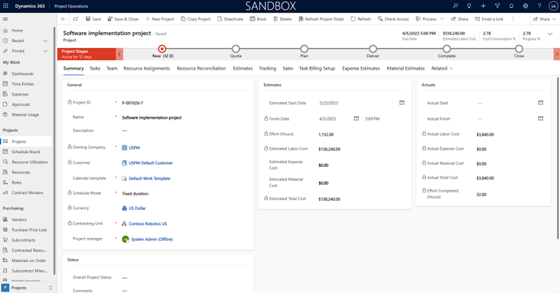
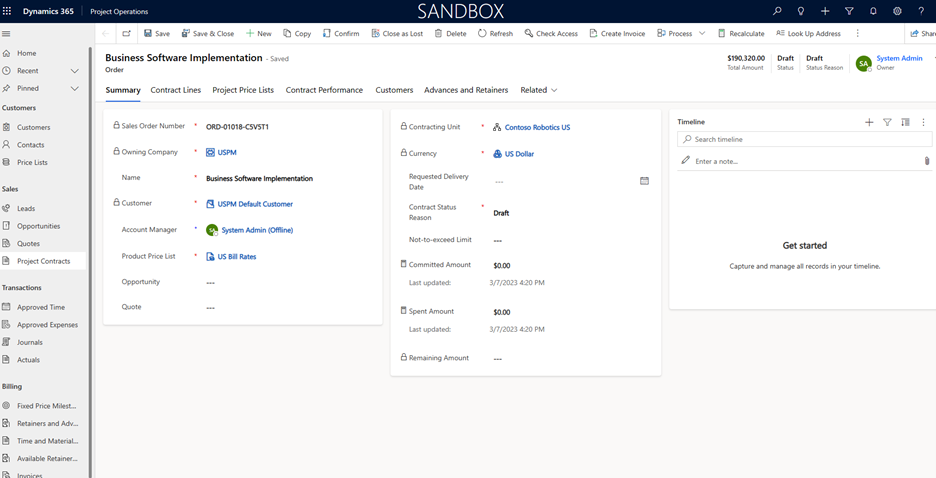
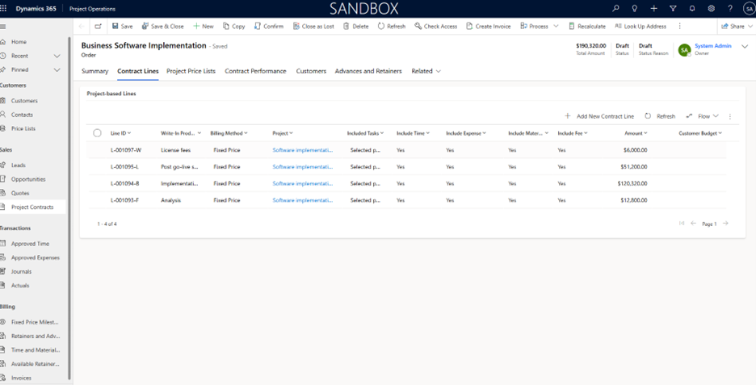
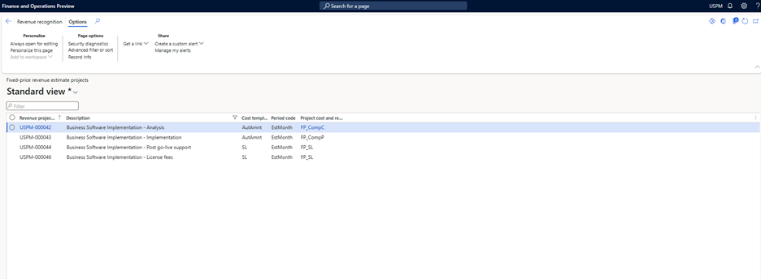
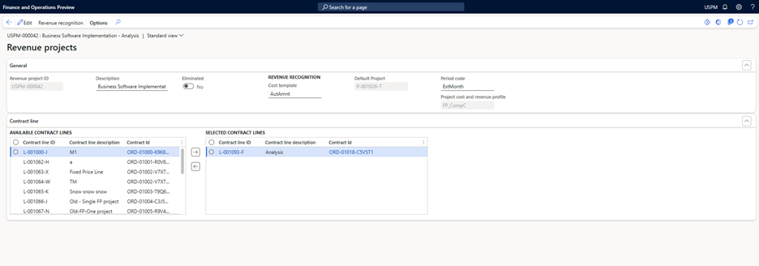

# Revenue recognition based upon contract standalone selling price

_**Applies To:** Project Operations Integrated with ERP_

In **revenue recognition**, fixed-price billing arrangements are typically defined using billing **milestones** to establish the **contract value**. However, customers may require a separate calculation 
for contract value that is **independent** of billing milestones—particularly in scenarios where **additional effort or resources** are needed to complete a fixed-price project, or when a contract line is subject to a **discount**.

This feature enables users to track the **standalone selling price** for each **contract line item**. It is utilized in the **revenue allocation** process, where revenue is distributed **proportionally** based on the ratio of each line item's **standalone selling price** to the **total contract standalone selling price**.

To use this feature, activate **Contract line based revenue recognition**, **Separate contract value from billing milestones** and provide **Contract variance account** in **Project management and accounting parameters** on the Revenue recognition tab.

> [!NOTE]
> This feature is dependent on **contract line-based revenue recognition** and is applicable only when revenue recognition is calculated exclusively in the **accounting currency**.

When this feature is enabled, **Dynamics 365 Finance** generates the revenue recognition based upon standalone selling price and propotioned revenue considering the project contract value. All older projects or revenue recognition projects can be managed.

## Prerequisite

### Versions

**Dynamics 365 Finance** - 10.0.45

**Dynamics 365 Project operations** - XXXXXXXXXX

### Dual write maps

## Project contract lines
### Standalone selling price on contract lines

To generate the revenue recognition with standalone selling price for each contract line, enter the standalone selling price for each contract line in **Dynamics 365 project operations**.

1. In **Dynamics 365 project operations**, Go to **Sales** area.
2. Open **Project contracts** form.
3. Click **New** to create a new project contract.
4. Enter Name, Customer, Product price list and other required details. Click **Save**.
5. Go to **Contract lines** tab.
6. Click **New** to create a new contract line.
7. Select **Fixed price** billing method and enter **standalone selling price** for the contract line.
8. Click **Save** to save the contract line.
9. Go to **Invoice schedule** tab and create milestones.

### Review project contracts for contract lines

To review the project contract lines or update additional details in Dynamics 365 Finance, follow these steps.

1. In the Dynamics 365 Finance environment, go to **Project management and accounting** \> **Projects** \> **Project contracts**.
1. On the Action Pane, select **Show default accounting**.
1. Select the contract line in the drop-down list view the **standalong selling price** and to enter the **default financial dimensions** that are applicable to the contract line.
1. If the **Straight line revenue recognition** principal is applied on the revenue recognition project for the selected contract line, specify the start date and end date. The start date and end date are used to calculate the number of days that are required for the **Straight line revenue recognition** principal.

## Review fixed price revenue estimate projects
When you create a project contract line that has the following attributes in **Dynamics 365 Project Operations** on Dataverse, the system automatically creates a fixed price revenue estimate project. 
The information in the project is based on these attributes.

- A fixed price billing method
- An associated project
- At least one milestone that's defined on the **Invoice schedule** tab of the **Project contract line** page

### Review estimate projects
To review **fixed price revenue estimate projects**, follow these steps.

1. In the Dynamics 365 Finance environment, go to **Project management and accounting** \> **Projects** \> **Fixed price revenue estimate projects**.
2. Select the revenue project that you want to view, and then double-tap (or double-click) the **Estimate project ID** value to open the record and review the details of the project.
3. Validate that the **Separate Contract Value from billing milestone** option is **enabled** by default. Revenue recognition is calculated using the **separate contract value allocation method**. Users may choose to disable this option; however, it must be ensured that the option is consistently disabled across all contract lines.
4. On the header, select the default project that's required to post the estimated revenue recognition amount. All the required financial postings are generated for the project that's defined on the revenue recognition project header. Dynamics 365 Finance retrieves the financial dimensions from the project and uses them to record the financial transactions to revenue recognition.
5. On the header, select the cost template. This template is used to do the required calculations, such as completed percentage, completed contract, or straight line.
6. Select the **Contract line** tab. There should be one contract line in the **Selected contract lines** grid. This line is the default contract line that the revenue recognition project has been created for.
7. To change the association, select additional contract lines, and add them to the **Selected contract lines** grid. If multiple contract lines are selected in this grid,
   the percentage completion and revenue estimates are calculated together for all selected **contract lines**.

    > [!NOTE]
    > For the **Straight line revenue recognition** principal, only one contract line is applicable to each revenue recognition project. Therefore, when you use the **Straight line revenue recognition** principal, you can't add multiple contract lines for a single revenue recognition project.

The **Project cost**, **Revenue profile**, **Cost template**, and **Period code** fields can be set manually. If they aren't set manually, default values are entered during the first estimate calculation for the project by using the rules that are configured for project cost and revenue profiles.

### Revenue recognition calculation
To calculate the revenue recognition based upon standalone selling price for contract lines, new fields **Contract standalone selling price** and **Total contract standalone selling price** are added.

1.  **Contract standalone selling price** is automatically derived from the contract lines. If multiple contract lines are associated with the revenue recognition project, the system aggregates the standalone selling prices from all lines and displays the total on the form.
2.  **Total contract standalone selling price** represents the sum of the standalone selling prices for all contract lines linked to the project contract.
3.  **Accrued revenue** is calculated by using below formula:

    **Allocated revenue** = (Contract Standalone Selling Price/Total Contract Standalone Selling Price) * Total contract value where **Total contract value** is the sum of milestones for the entire project contract.

    **Accrued revenue** = Allocated revenue * percentage complete.
    
For project contracts in **foreign currency**, the **Contract standalone selling price** and **Total contract standalone selling price** are calculated using the exchange rate applicable on the revenue calculation date. 
In contrast, the **Total Contract Value** (milestone amount) is determined using the exchange rate for each milestone if it is not yet billed, and the invoice exchange rate if it has already been billed.

Once the project contract or contract line work is **complete**, then revenue recognition project needs to be **eliminated**. During the **Elimination** process if there is a variance between the posted accrued revenue and the invoiced revenue then the differential is posted
to the **contract variance account**. Financial dimensions are fetched from the project or the contract line based upon the financial dimension configurations.

### Example scenario

Contoso systems awarded one contract to implement business applications for one of its customers. Per the agreement, the whole implementation is divided into the following phases:

1. **License Fee** – Fixed price. The Contoso Finance team decided to accrue the revenue based on the straight line method.
1. **Analysis** – Fixed price. The Contoso Finance team decided to accrue the revenue based on the completed contract method.
1. **Implementation** – Fixed price. The Contoso Finance team decided to accrue the revenue based on the completed percentage method.
1. **Post go-live support** – Fixed Price. The Contoso Finance team decided to accrue the revenue based on the straight line method.

In Project Operations on Dataverse, a new project and a new project contract are created for the customer.

The following illustration shows the project that's created in Dataverse. Multiple tasks are associated with this project.

The following illustration shows the project contract that's created in Dataverse.

The following illustration shows the project contract lines that are created in Dataverse. Four contract lines are created, one for each phase of the project. Each contract line uses the **Fixed price** billing method.

The following illustration shows the fixed price revenue estimate projects in Dynamics 365 Finance. For each project contract line that was created in Dataverse (as shown in the previous illustration), one fixed price revenue estimate project is created in Dynamics 365 Finance.

The following illustration show the **Revenue projects** page for the project's **Implementation** phase. On this page, set the **Default project** and **Project cost and revenue profile** fields. A default project is required to post the accrued revenue amounts that affect the project subledger. A project cost and revenue profile is required to identify the revenue recognition accounting rule that's applicable to the revenue project.

## Recommended content

- [Project contract lines overview](../pro/sales/manage-contract-values-project-based-sales.md) – This article provides an overview of project contract lines.
- [Map projects and tasks to a project contract line](../pro/sales/mapping-projects-tasks-contract-line-sales.md) – This article provides an overview of mapping projects and tasks to a project contract line.
- [Manage revenue estimates](rev-rec-completed-contract-method.md) – This article provides an overview of managing and running the revenue recognition estimates.
