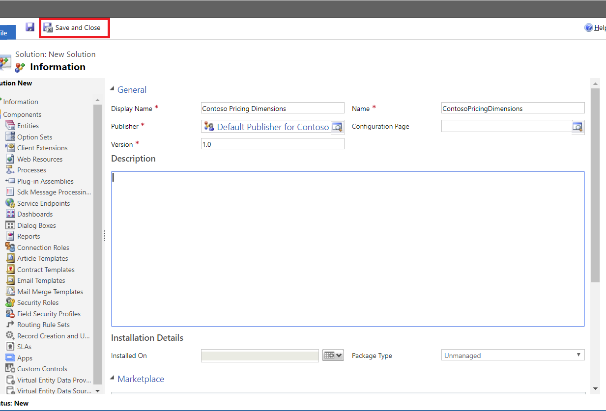

--- 
title: Create a solution for custom pricing dimensions 
description:  This article provides information about how to create solutions for custom pricing dimensions.
author: suvaidya
ms.author: suvaidya 
ms.date: 06/10/2024  
ms.topic: how-to 
ms.custom: 
  - bap-template
ms.reviewer: johnmichalak

--- 

# Create a solution for custom pricing dimensions

 _**Applies To:** Project Operations Integrated with ERP, Project Operations Core_ 

>[!IMPORTANT]
>All custom pricing dimension changes should be in a separate solution. This important best practice allows the flexibility to update or remove changes as needed, helps with re-use of your work, and makes it easier to port changes to other instances. After you make the required changes, export this solution as a **Managed** solution, and then import into other instances for reuse.

## Create a solution for custom pricing dimensions

1.	Select **Settings** > **Solutions**, and then select **New**.
2.	Name the solution, *\<your organization name\> pricing dimensions*.
3. Enter the remaining required information, and then select **Save**.

  
 
## Add all required entities and related components to the Pricing dimension solution

Add the following Project Service entities to your pricing solution to make important schema changes in the pricing solution. After you have completed this procedure, the entities will recognize the new pricing dimensions.

1.	Select **Settings** > **Solutions**, and then double-click **<*your organization name*> pricing dimensions**.
2.	In Solution Explorer, on the left navigation pane, select **Add Existing** > **Entities**.
3.	In the **Solution Components** dialog box, select the following entities:
 
   - **Actual**
   - **Bookable Resource**
   - **Estimate Line**
   - **Project Task**
   - **Invoice Line Detail**
   - **Journal Line**
   - **Project Contract Line Detail**
   - **Project Team Member**
   - **Quote Line Detail**
   - **Role Price Markup**
   - **Role Price**
   - **Time Entry**
 
   
 
 4. For each entity, review the components being added and the final list of entity assets for each entity. 

   >[!NOTE]
   > Include all forms and views for each of the selected entities.

  

5.	When prompted to include any dependent entities for the selected entities, select **No, do not include required components.**

    

[!INCLUDE[footer-include](../includes/footer-banner.md)]
