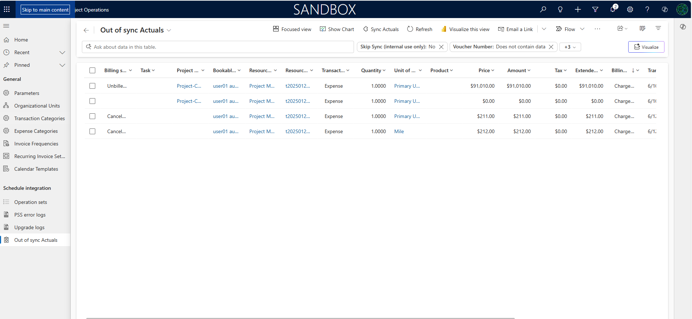

# Use actuals synchronization and reconciliation

[!INCLUDE[banner](../../includes/banner.md)]

_**Applies To:** Project Operations for resource/non-stocked based scenarios_

This article provides information about the **Project Operations Actuals Synchronization & Reconciliation** framework. The workspace that this framework provides helps you identify and address integration challenges that are related to project actuals and transaction connections. Those challenges include dual-write synchronization issues. You can also initiate a resynchronization of actuals or transaction connections. This resynchronization facilitates the generation and posting of integration journal lines.  

## Prerequisites

### Minimum versions required

To use the feature for Microsoft Dynamics 365 Project Operations for resource/non-stocked based scenarios, you must have the following versions:

- Project Operations Dataverse version 4.142.0.x or later
- Dynamics 365 Finance version 10.0.43 or later

### Dual-write maps

| Required dual-write map | Required version |
|---|---|
| Project Operations integration actuals (msdyn\_actuals) | 1.0.0.20 |
| Integrated entity for transaction relationships (msdyn\_transactionconnections) | 1.0.0.1 |

## Missing actuals

To fix synchronization issues with actuals or transaction connections that weren't previously synced, a new **Out of sync Actuals** page is available in the **Settings** section. This page shows actuals that meet either of the following conditions:

- The project integration journal or project invoices weren't posted in Finance.
- Actuals weren't synced to Finance, and project integration journal or project invoice lines weren't created for the missing records.

A filter that is applied to the **Actuals** entity shows only records where the **Skip sync** setting is true and a voucher is missing, because each actual record should have a generated and posted a voucher. Currently, the page shows only actuals that were generated at least one hour ago. In addition, it's limited to transactions from the previous month.

To view the actuals in Project Operations that aren't yet processed in Finance, follow these steps.

1. Go to **Settings**.
1. In the **Troubleshooting** area, select **Out of sync Actuals**.
1. Review the actuals on the page. These actuals represent the records that don't have a posted voucher.

> [!NOTE]
> The **Out of sync Actuals** page shows and syncs actuals that are missing or aren't yet synced for the past month. There is a one-hour delay. This delay accounts for the time that is required to complete processes such as integration journal creation, or project invoice generation and posting.

### Sync missing actuals

When the Project Operations integration journal for actuals is being generated, issues such as missing actuals or transaction connections in Finance might arise. In this case, you can resync the actuals or transaction connections to Finance. Resynchronization helps ensure that the project integration journal or project invoices are successfully created and processed.

To resync the actuals or transaction connections to Finance, use the **Sync Actuals** button on the **Out of sync actuals** page. The action that is triggered tries to reprocess all records that are shown on the page.

Because the Project Operations integration journal is posted in Finance on a recurring schedule, actuals are sometimes synced correctly, but the journal isn't yet posted. In these cases, we recommend that you wait until either the Project Operations integration journal or the project invoice is posted. Then restart the synchronization process.

