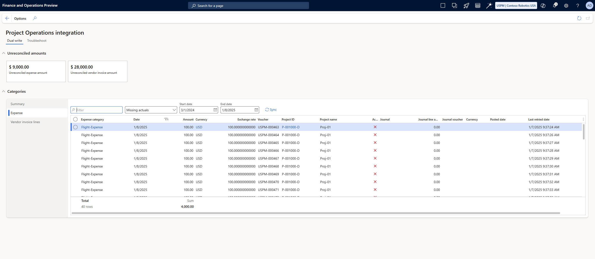

# Project Operations integration workspace

[!INCLUDE[banner](../../includes/banner.md)]

_**Applies To:** Project Operations Integrated with ERP_

This article provides information about the **Project Operations integration** workspace. This workspace helps you identify and address integration challenges that are related to vendor invoices and expenses. To help with troubleshooting, it also lets you access complete logs for the integration journal and invoice proposals.

The **Project Operations integration** workspace streamlines troubleshooting and configuration reviews by revealing errors, system issues, and other potential issues that might otherwise remain hidden in logs. The workspace is designed to help save time and enhance visibility into critical processes. For example, you can identify and fix dual-write synchronization issues that are related to vendor invoices and expenses. The workspace provides detailed insights into the root causes of errors, including the number of affected records and associated amounts. Therefore, you gain a comprehensive understanding of the scope of an issue.

Here are some of the new capabilities:

- **Enhanced dashboard for accountants** – The dashboard simplifies ledger reconciliation by highlighting pending journal postings, missing integration journal lines, and records. 
- **Batch resynchronization process** – A new batch process lets you resync data. In this way, you can effectively address and fix inconsistencies, and maintain data integrity and operational continuity.
- **Detailed document synchronization view** – You can get a comprehensive view of documents such as expense reports and vendor invoices, including the status of their synchronization between Microsoft Dataverse and the finance and operations apps infrastructure.
- **Comprehensive troubleshooting logs** – You get full access to logs for the integration journal and invoice proposals. You can use these logs to ensure that no data is truncated. In this way, the logs allow for detailed troubleshooting and analysis.

## Prerequisites

To use the functionality, activate the **Project Operations integration workspace** feature in Dynamics 365 Finance.

### Minimum versions required

To use the feature for Dynamics 365 Project Operations Integrated with ERP, you must have the following versions:

- Project Operations Dataverse version 4.124.0.690 or later
- Finance version 10.0.43 or later

## Use the Dual-write tab

When an expense or a vendor invoice is posted in Project Operations, the financials are recorded in the procurement or expense integration account. The project cost is posted by using the project integration journal. However, when accountants generate a trial balance for a period, they might encounter challenges. For example, they might find balances in the procurement or expense or integration account without a clear explanation.

The **Dual-write** tab of the **Project Operations integration** workspace helps address this issue by providing insights into the causes of discrepancies in integration balances. Issues that affect these balances are highlighted, and guidance for resolving them is offered. Therefore, it's easier to identify and correct discrepancies efficiently.

The **Unreconciled amounts** FastTab on the **Dual-write** tab shows the outstanding balances for vendor invoices and expenses that haven't yet been reconciled.

The **Categories** FastTab has three tabs: **Summary**, **Expense**, and **Vendor invoice lines**.

### Use the Summary tab

The **Summary** tab on the **Categories** FastTab provides an overview of unreconciled amounts for expenses and vendor invoices. It includes detailed information such as amounts that project integration journal lines aren't yet created or posted for, and records that aren't synced from Dataverse to Finance.

### Use the Expense tab

The **Expense** tab provides a detailed view of each expense record within the specified start and end dates. The start date is the first open ledger period, based on the current year and previous year that are associated with the company. The end date is the current date.

The following views can be validated:

- **Missing actuals** – This view shows expenses that were successfully processed in Finance, but that lack reference records from Dataverse. There are several possible reasons for this issue:

    - Expenses weren't synced from Finance to Dataverse.
    - Expenses weren't automatically approved in Dataverse.
    - Actual records weren't synced from Dataverse to Finance.

- **Missing journal lines** – This view shows expenses that were successfully processed and synced from Dataverse to Finance, but that integration journal lines aren't yet created or posted for.

    To fix this issue, you can run the **Import from Staging** process from the **Periodic** section. Alternatively, you can post the existing journals that are in draft status.

- **All expenses** – This view shows all expense records that were successfully approved in Finance, regardless of whether the project cost was updated through the project integration journal.
- **All reconciled expenses** – This view shows all expense records that were successfully processed, and that project cost was updated for through the project integration journal.

To reprocess any expenses that weren't synced earlier because of dual-write failures, you can use the **Sync** button at the top of the grid to run the synchronization batch job. This job syncs all expenses, based on the first open period of the fiscal calendar and the current date. Learn more in the [Run the synchronization batch job](#run-the-synchronization-batch-job) section.

### Use the Vendor invoice lines tab

The **Vendor invoice lines** tab provides a detailed view of each vendor invoice line record within the specified start and end dates. The start date is the first open ledger period, based on the current year and previous year that are associated with the company. The end date is the current date.

The following views can be validated:

- **Missing actuals** – This view shows vendor invoice lines that were successfully processed in Finance, but that lack reference records from Dataverse. There are several possible reasons for this issue:

    - Vendor invoices weren't synced from Finance to Dataverse.
    - Vendor invoices weren't automatically confirmed in Dataverse.
    - Actual records weren't synced from Dataverse to Finance.

- **Missing journal lines** – This view shows vendor invoices that were successfully processed and synced from Dataverse to Finance, but that integration journal lines aren't yet created or posted for.

    To fix this issue, you can run the **Import from Staging** process from the **Periodic** section. Alternatively, you can post the existing journals that are in draft status.

- **All vendor invoices** – This view shows all vendor invoice records that were successfully approved in Finance, regardless of whether the project cost was updated through the project integration journal.
- **All reconciled vendor invoices** – This view shows all vendor invoice records that were successfully processed, and that project cost were updated for through the project integration journal.

To reprocess any vendor invoices that weren't synced earlier because of dual-write failures, you can use the **Sync** button at the top of the grid to run the synchronization batch job. This job syncs all vendor invoices, based on the first open period of the fiscal calendar and the current date. Learn more in the [Run the synchronization batch job](#run-the-synchronization-batch-job) section.

### Run the synchronization batch job

In some cases, expenses and vendor invoices are successfully processed in Finance, but they aren't synced with Dataverse because of dual-write issues. This mismatch is one reason why procurement or integration accounts aren't nullified, so that a balance remains in them.

To address this issue and ensure synchronization of expenses or vendor invoices that weren't previously synced, a new batch job is added. This batch job can be run on a recurring basis at the end of each day to ensure that it processes a minimal set of records. The start date is the first open ledger period, based on the current year and previous year that are associated with the company. The end date is the current date.

To run the synchronization batch job, go to **Project management and accounting** \> **Periodic** \> **Project operations reconciliation**.

To use the batch job, you must use the following dual-write map versions.

| Required dual-write map | Required version |
|---|---|
| Project Operations integration project expenses export entity (msdyn_expenses) | 1.0.0.5 |
| Project Operations integration project vendor invoice export entity V2 (msdyn_projectvendorinvoices) | 1.0.0.1 |
| Project Operations integration project vendor invoice line export entity (msdyn_projectvendorinvoicelines) | 1.0.0.8 |

## Use the Troubleshoot tab

The **Troubleshoot** tab shows a list of error messages that users encountered during the **Import from staging** or **Project integration journal** posting processes. This tab helps you identify the root cause of any logged issues, so you can make the necessary corrections. Previously, any error messages encountered in the **Project integration journal** weren't stored anywhere other than in the **Action Center** and **Infolog**. Once the feature is enabled, errors are logged into a permanent table so they can be reviewed, filtered, grouped, and better analyzed.

Additionally, the **General journal Dataverse sync** tab indicates retries or errors with the [General journals](../../project-accounting/general-journals.md) feature. Due to the asynchronous nature of the integration, the need to retry this process is expected. The information is logged here to indicate that Dataverse might not yet be updated with the journal details yet. Users can **Sync** to retry the synchronization of journal lines and confirmation of the Dataverse journal after five attempts. Deleting the troubleshooting log results in retrying the synchronization.

> [!NOTE]
> Only a subset of errors are logged to the workspace at this time. Read further for more details on error messages that are included. This list of errors and covered scenarios will grow over time.

The **most recent errors** tab is the landing page and is filtered to the 100 most recent errors in the system. If you want to review different errors, you can filter the records by specifying the **From date** and **To date** values. 

After corrections are completed, you can use **Delete** or **Delete All** to delete messages that are no longer needed. The workspace automatically keeps only the most recent record and deletes history older than 90 days. Error messages are deleted before each process begins. Whether you're posting integration journals or importing from the staging table old error messages are deleted at the start of the process to ensure only the most recent error is captured or no error is logged if the process is successful. For example, if an error related to a closed fiscal period is received, the error is automatically removed on the next integration journal posting when the posting is successful.

A subset of error messages are added into the workspace, and more errors messages will be added over time. As of version 10.0.43, there are six errors that are supported in the workspace.  

| Error message | Error details | Resolution |
|--------------|--------------|------------|
| Project transaction hasn't been posted yet. Verify that you have posted all of the related integration journals and try again. | This issue is a common error related to the timing of postings. The error indicates there are invoice lines to be created, but the related sales lines aren't yet posted.     The cost and unbilled sales lines need to be posted before importing billed sales. | Ensure all integration journal lines are posted that are related to the transactions being invoiced. Once those unbilled sales lines are posted, the invoice lines import without error.      From **Project invoice proposals**, The relevant invoice has an amount of 0.00 and the **Troubleshoot** button is enabled in the ribbon. Use the **Error message** column to find the dates and amounts of the transactions that require posting. |
| Invoice proposal wasn't processed because of mismatched billed sales actuals with Dataverse. Please try again later. Contact your administrator if issue still exists. | The number of lines in the invoice proposal didn’t match what was expected. Either lines are missing or more lines were found than what was expected from Dataverse. Import from staging and try again later. If issue continues, a support ticket is required to determine the issue. | Wait a short time and try importing another 2-3 times to see if there's a timing issue that resolves itself with a subsequent import.     If the issue persists, log a support ticket to investigate the mismatch.  |
| Unable to import actual {FF26F5F6-2CD4-EF11-A730-0022480431D9}. Intercompany relationship has to be set up between legal entity GBSI and USPM in Project Management and Accounting Parameters| A transaction was created where an employee is in a legal entity and the project they worked against doesn't have intercompany lending configured.  | In **Project management and accounting parameters**, set up a new record for the borrowing company from the lending company.     After the relationship is established, run **Import from staging table** again. |
| No open fiscal period was found for the specified accounting date 11/20/2024. | The specified fiscal period wasn't open for posting the integration journal.   | In **Ledger calendars**, open the specified period for posting and try posting again.     Alternatively, your organization can enable a parameter in **Project management and accounting parameters** in the **Financial** tab to **Automatically set accounting date to open ledger**. This moves the posting to the next open period.|
| No open fiscal period was found in or after the specified accounting date 11/20/2024. | The specified fiscal period wasn't open for posting the integration journal and no future period was open to move the transaction into.   | In **Ledger calendars**, open the specified period or a future period for posting and try posting again. |
| Integration journal (USPM-000041): Line with RecId (12345) and Voucher (USPM-000051) failed to post due to (Reason).  |Depending on the error, this message can be specific or generic. You might see a generic error from this message but a second error more specific for the same journal line.| Look for any hints based on the reason at the end of the error message, or look for other errors.|
| Failed to sync journal header USPM-015270 to Dataverse. Manual synch required at count 5. Count 4.  |This error indicates that the journal header wasn't created in Dataverse. This can be a transient issue that will get fixed on a subsequent process automation retry but after five retries if still failed then it's likely a connection or configuration issue.  | Check for any issues with the linking of the environment to Dataverse or the IOrganization configuration. After the environment issue is resolved, use the sync button to retry again. |
| Failed to sync journal line to Dataverse. Manual synch required at count 5. Count 4. | This specific error indicates that the journal line wasn't created in Dataverse. This error can be a transient issue that will get fixed on a subsequent process automation retry but after five retries if still failed then it's likely a connection or configuration issue.  | Check for any issues with the linking of the environment to Dataverse or the IOrganization configuration. After the environment issue is resolved, use the sync button to retry again. |
| Failed to confirm journal 5541230 in Dataverse. | This error indicates that Dynamics 365 Finance isn't aware if the journal in Dataverse is confirmed yet and it will check the status and attempt again to confirm on the next retry. If you see the journal is posted already posted in Dataverse, no action is required. If the journal isn't yet confirmed in Dataverse, the process automation will attempt to sync and confirm on the next retry, but this confirmation might require multiple attempts for large journals.| After five attempts if there's no connection issue, then manually select the sync button to retry confirmation. |
| Error encountered while creating journal line entity for journal line record 5431130. Failed to retrieve data from Dataverse. | The value for one of the required fields such as currency, project, or contract line weren't found in Dataverse. This error can be a transient issue that will get fixed on a subsequent process automation retry but after five retries if still failed then it's likely a connection or configuration issue. | Verify Dataverse and Finance are synchronized and the correct values are used in the journal. |
[!INCLUDE[footer-include](../../includes/footer-banner.md)]
