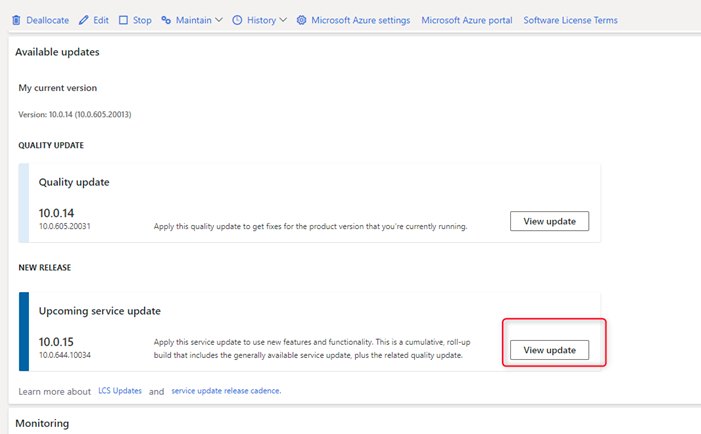
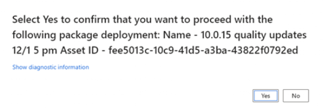
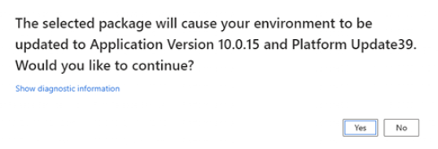
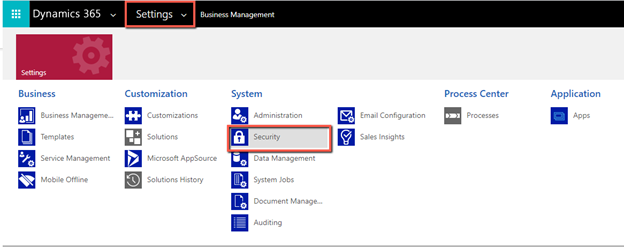
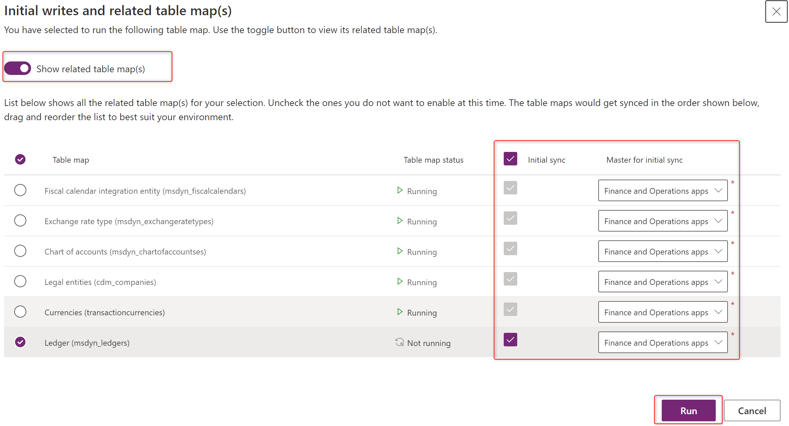

# Update Project Operations in your Finance environment

_**Applies To:** Project Operations Integrated with ERP_

This article provides information about how to update Dynamics 365 Project Operations in your Dynamics 365 Finance environment. There are three procedures that are required to update Project Operations to Update 5 (UR5):

- [Import the package into your preview project](#import)
- [Apply the update](#apply)
- [Update your Dataverse environment](#update)

## Import the package into your LCS project

1. Sign in to [Lifecycle Services (LCS)](https://lcs.dynamics.com/) as a Project Owner or Environment manager.
2. From the list of projects, select your LCS project.
3. On the **Project** page, in the **Environments** group, open the environment that you want to update.
4. Verify that the environment is running. If it isn't started, start the environment.
5. In the **New release** section under **Available updates**, select **View update** for 10.0.15.

6. On the **Binary updates** page, select **Save package**.
7. On the **Review and save updates** page, select **Save package**.
8. On the **Save package to asset library** pane that opens, enter the package name and then select **Save package**.
9. When LCS has finished saving the package, the **Done** button is enabled. Select **Done**. LCS will verify the package. Verification can take a few minutes or up to one hour.

## Apply the package update

1. In LCS, on the **Environment details** page, select **Maintain** > **Apply Updates**.
2. From the list, select the package that you saved earlier, and then select **Apply**.
3. Select **Yes** to confirm that you want to deploy the package.

4. Select **Yes** to confirm that you want to update the application.

The deployment and application update will start. 

On the **Environment details** page, in the top-right corner, the environment status will update to **Servicing**. In approximately two hours, the update will be complete. 
The application release information will update to **Microsoft Dynamics 365 for Finance and Operations 10.0.15)** and the environment status will update to **Deployed**.

## Update your Dataverse environment

1. Sign in to the [Power Platform admin center](https://admin.powerplatform.com/).
2. In the list, find and open the environment that you used to install Project Operations.
3. On the **Environments** page, select **Resource** > **Dynamics 365 apps**.
4. In the list, locate **Microsoft Dynamics 365 Project Operations**, and in the **Status** column, select **Update Available**.
5. Select the **I agree to the terms of service** check box, and then select **Update**. The latest version of the solution will be installed.

After the installation is complete, you'll have version 4.5.0.134 installed.

## Configure new features

### Enable dual-write mapping

After you complete the update on the Finance and Dataverse environments, you can enable the required dual-write mappings. Complete the following procedures to enable dual-write mappings.

- [Update security settings on Customer Engagement environment](#security)
- [Refresh data entities](#refresh)
- [Update and run the dual-write mappings](#run)

### Update security settings on the Dataverse environment

The following updates to the security privileges for entities are required as part of the update to UR5.

1. In your Dataverse environment, go to **Settings**, and in the **System** group, select **Security**.

2. Select **Security Roles**.
3. From the list of roles, select **dual-write app user** and select the **Custom Entities** tab. 
4. Verify that the role has **Read** and **Append To** permissions for:

      - **Currency Exchange Rate Type**
      - **Chart Of Accounts** 
      - **Fiscal Calendar** 
      - **Ledger**

5. After the security role is updated, go to **Settings** > **Security** > **Teams**. Verify that the **dual-write app user** role has been applied to the team. 

### Refresh data entities from the update

1. In your Finance environment, open the **Data management** workspace, and then open the **Framework parameters** page.
2. On the **Entity settings** tab, select **Refresh entity list**.
3. Select **Close** to confirm the entity refresh.

 > [!NOTE]
 > This process will take approximately 20 minutes to complete. You will be notified when the refresh is complete.

### Update dual-write mappings

1. In the **Data management** workspace, select **Dual-write**.
2. Select **Apply solutions**, select both solutions in the list, and then select **Apply**.
3. On the **Dual-write** page, select the following table maps, and then select **Stop**.

    - **Project Operations integration actuals (msdyn_actuals)**
    - **Project Operations integration project expense categories (msdyn_expensecategories)**
    - **Project Operations integration actuals project expenses export entity (msdyn_expenses)**

4. On the **Table map version** page, apply a new version of the map to each of the three entities.
5. On the **Dual-write** page, select run to restart the maps.
6. From the list of maps, select the **Ledger (msdyn_ledgers)** map with all prerequisites and select the **Initial sync** check box. 
7. In the **Master for initial sync** field, select **Finance and operations apps** and then select **Run**.
 
 
 

[!INCLUDE[footer-include](../includes/footer-banner.md)]
